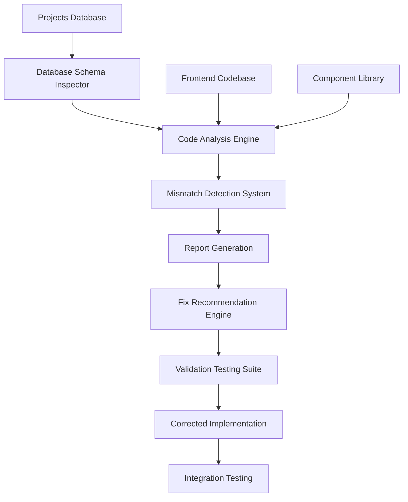

# Design Document

## Overview

This design document outlines the comprehensive audit and alignment system for Factory Pulse's project management functionality. The system will systematically examine the current codebase, identify mismatches with the database schema, and provide detailed recommendations for corrections. The design emphasizes automated detection, clear reporting, and systematic resolution of inconsistencies.

## Architecture

### High-Level Architecture



### Component Architecture

The audit system consists of six main components:

1. **Database Schema Inspector**: Analyzes the current projects table structure
2. **Code Analysis Engine**: Examines TypeScript interfaces, components, and services
3. **Mismatch Detection System**: Identifies inconsistencies between database and code
4. **Report Generation**: Creates comprehensive audit reports
5. **Fix Recommendation Engine**: Provides specific correction guidance
6. **Validation Testing Suite**: Verifies fixes and ensures system integrity

## Components and Interfaces

### Database Schema Inspector

**Purpose**: Extract and analyze the current database schema for projects and related tables.

**Key Methods**:
- `inspectProjectsTable()`: Analyze projects table structure
- `inspectWorkflowStages()`: Examine workflow_stages table
- `inspectRelatedTables()`: Check contacts, users, and other related tables
- `extractConstraints()`: Identify foreign keys, check constraints, and indexes

**Data Structure**:
```typescript
interface DatabaseSchema {
  tableName: string;
  columns: ColumnDefinition[];
  constraints: Constraint[];
  indexes: Index[];
  relationships: Relationship[];
}

interface ColumnDefinition {
  name: string;
  type: string;
  nullable: boolean;
  defaultValue?: any;
  isPrimaryKey: boolean;
  isForeignKey: boolean;
}
```

### Code Analysis Engine

**Purpose**: Parse and analyze TypeScript files for project-related interfaces, types, and implementations.

**Key Methods**:
- `analyzeTypeDefinitions()`: Parse src/types/project.ts
- `analyzeComponents()`: Examine project components
- `analyzeServices()`: Review project services and hooks
- `analyzeQueries()`: Check database queries and mutations

**Data Structure**:
```typescript
interface CodeAnalysis {
  interfaces: InterfaceDefinition[];
  components: ComponentDefinition[];
  services: ServiceDefinition[];
  queries: QueryDefinition[];
}

interface InterfaceDefinition {
  name: string;
  properties: PropertyDefinition[];
  filePath: string;
  lineNumber: number;
}
```

### Mismatch Detection System

**Purpose**: Compare database schema with code definitions to identify inconsistencies.

**Detection Rules**:
1. **Field Name Mismatches**: Database column names vs TypeScript property names
2. **Type Mismatches**: Database types vs TypeScript types
3. **Nullable Mismatches**: Database nullable constraints vs optional properties
4. **Missing Fields**: Database columns not represented in TypeScript interfaces
5. **Extra Fields**: TypeScript properties not present in database
6. **Constraint Violations**: Code that doesn't respect database constraints

**Data Structure**:
```typescript
interface MismatchReport {
  category: 'field_name' | 'type' | 'nullable' | 'missing' | 'extra' | 'constraint';
  severity: 'critical' | 'high' | 'medium' | 'low';
  description: string;
  databaseInfo: any;
  codeInfo: any;
  filePath: string;
  lineNumber?: number;
  recommendation: string;
}
```

### Report Generation

**Purpose**: Create comprehensive, actionable audit reports.

**Report Sections**:
1. **Executive Summary**: High-level findings and impact assessment
2. **Critical Issues**: Issues that prevent system functionality
3. **Schema Comparison**: Side-by-side database vs code comparison
4. **Component Analysis**: Per-component findings and recommendations
5. **Performance Impact**: Potential performance issues identified
6. **Fix Priority Matrix**: Prioritized list of required fixes

**Output Formats**:
- Markdown report for documentation
- JSON report for programmatic processing
- Console output for development workflow

### Fix Recommendation Engine

**Purpose**: Provide specific, actionable recommendations for resolving identified issues.

**Recommendation Types**:
1. **Interface Updates**: Specific TypeScript interface modifications
2. **Component Fixes**: Component-level code changes
3. **Query Corrections**: Database query adjustments
4. **Type Mapping**: Data transformation recommendations
5. **Validation Updates**: Form and input validation corrections

**Data Structure**:
```typescript
interface FixRecommendation {
  issueId: string;
  priority: number;
  category: string;
  description: string;
  codeChanges: CodeChange[];
  testingRequirements: string[];
  dependencies: string[];
}

interface CodeChange {
  filePath: string;
  lineNumber?: number;
  changeType: 'add' | 'modify' | 'remove';
  oldCode?: string;
  newCode: string;
  explanation: string;
}
```

## Data Models

### Project Data Model Alignment

**Current Database Schema** (from migration files):
```sql
CREATE TABLE projects (
    id UUID PRIMARY KEY DEFAULT uuid_generate_v4(),
    organization_id UUID REFERENCES organizations(id) ON DELETE CASCADE,
    project_id VARCHAR(50) UNIQUE NOT NULL,
    title VARCHAR(255) NOT NULL,
    description TEXT,
    customer_id UUID REFERENCES contacts(id) ON DELETE SET NULL,
    current_stage_id UUID REFERENCES workflow_stages(id) ON DELETE SET NULL,
    status VARCHAR(20) DEFAULT 'active' 
      CHECK (status IN ('active', 'on_hold', 'delayed', 'cancelled', 'completed')),
    priority_level VARCHAR(20) DEFAULT 'medium' 
      CHECK (priority_level IN ('low', 'medium', 'high', 'urgent')),
    source VARCHAR(50) DEFAULT 'portal',
    assigned_to UUID REFERENCES users(id) ON DELETE SET NULL,
    created_by UUID REFERENCES users(id) ON DELETE SET NULL,
    estimated_value DECIMAL(15,2),
    tags TEXT[],
    metadata JSONB DEFAULT '{}',
    stage_entered_at TIMESTAMPTZ,
    project_type VARCHAR(100),
    notes TEXT,
    created_at TIMESTAMPTZ DEFAULT NOW(),
    updated_at TIMESTAMPTZ DEFAULT NOW()
);
```

**Required TypeScript Interface Alignment**:
```typescript
interface Project {
  // Core fields - must match database exactly
  id: string;
  organization_id: string;
  project_id: string;
  title: string;
  description?: string;
  customer_id?: string;
  current_stage_id?: string;
  status: 'active' | 'on_hold' | 'delayed' | 'cancelled' | 'completed';
  priority_level: 'low' | 'medium' | 'high' | 'urgent';
  source: string;
  assigned_to?: string;
  created_by?: string;
  estimated_value?: number;
  tags?: string[];
  metadata?: Record<string, any>;
  stage_entered_at?: string;
  project_type?: string;
  notes?: string;
  created_at: string;
  updated_at: string;
  
  // Computed/joined fields
  customer?: Contact;
  current_stage?: WorkflowStage;
  assignee?: User;
  creator?: User;
}
```

### Workflow Integration Model

**Database Relationships**:
- `projects.current_stage_id` → `workflow_stages.id`
- `projects.customer_id` → `contacts.id`
- `projects.assigned_to` → `users.id`
- `projects.created_by` → `users.id`
- `projects.organization_id` → `organizations.id`

**Code Integration Requirements**:
- Proper foreign key handling in queries
- Consistent join patterns across components
- Proper null handling for optional relationships
- Efficient loading strategies for related data

## Error Handling

### Database Connection Errors

**Strategy**: Graceful degradation with informative feedback

**Implementation**:
```typescript
interface DatabaseError {
  type: 'connection' | 'query' | 'constraint' | 'permission';
  message: string;
  code?: string;
  details?: any;
  recoverable: boolean;
  retryStrategy?: 'immediate' | 'backoff' | 'manual';
}
```

### Data Validation Errors

**Strategy**: Field-level validation with clear user feedback

**Validation Rules**:
- Required field validation
- Type validation (string, number, date)
- Format validation (email, phone, project_id)
- Constraint validation (enum values, length limits)
- Relationship validation (foreign key existence)

### Component Error Boundaries

**Strategy**: Isolated error handling to prevent cascade failures

**Implementation**:
- Project list error boundary
- Project detail error boundary
- Form submission error handling
- Real-time update error recovery

## Testing Strategy

### Unit Testing

**Database Schema Tests**:
- Schema inspection accuracy
- Constraint detection
- Relationship mapping

**Code Analysis Tests**:
- TypeScript parsing accuracy
- Interface extraction
- Component analysis

**Mismatch Detection Tests**:
- Known mismatch scenarios
- Edge case handling
- False positive prevention

### Integration Testing

**End-to-End Workflow Tests**:
- Project creation flow
- Project update flow
- Status transition flow
- Data consistency verification

**Component Integration Tests**:
- ProjectTable with real data
- ProjectDetail with all field types
- Form validation with database constraints
- Real-time updates with concurrent changes

### Performance Testing

**Database Query Performance**:
- Project list loading times
- Detail page load performance
- Search and filter performance
- Bulk operation performance

**Component Rendering Performance**:
- Large project list rendering
- Complex project detail rendering
- Real-time update performance
- Memory usage optimization

### Validation Testing

**Data Integrity Tests**:
- Foreign key constraint validation
- Check constraint validation
- Null constraint validation
- Unique constraint validation

**Business Logic Tests**:
- Workflow transition validation
- Permission-based access validation
- Data transformation accuracy
- Error handling completeness

## Implementation Phases

### Phase 1: Database Schema Analysis
- Extract complete database schema
- Document all constraints and relationships
- Identify current data patterns
- Create schema documentation

### Phase 2: Code Analysis
- Parse all TypeScript interfaces
- Analyze component implementations
- Review service layer code
- Document current code patterns

### Phase 3: Mismatch Detection
- Compare schema with code
- Identify all inconsistencies
- Categorize by severity
- Generate detailed reports

### Phase 4: Fix Implementation
- Implement high-priority fixes
- Update TypeScript interfaces
- Correct component implementations
- Fix database queries

### Phase 5: Testing and Validation
- Run comprehensive test suite
- Validate all fixes
- Perform integration testing
- Document final state

### Phase 6: Documentation and Maintenance
- Create maintenance guidelines
- Document best practices
- Establish monitoring procedures
- Create change management process