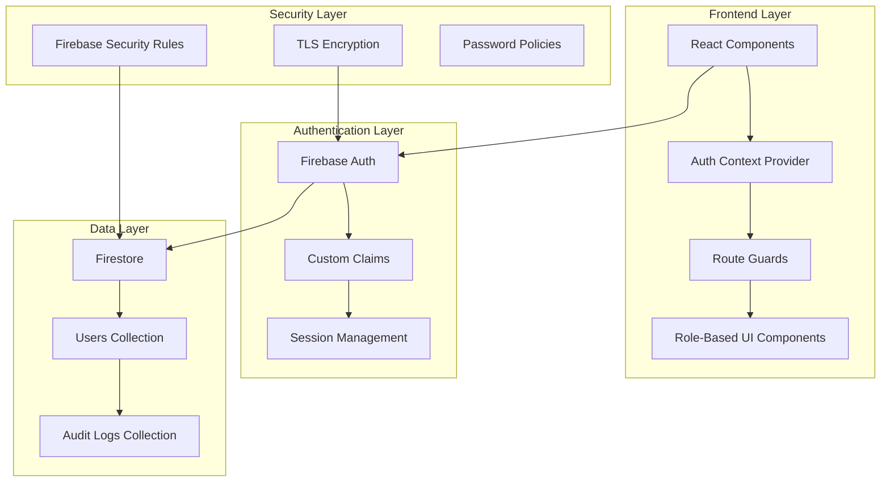

# Design Document

## Overview

The User Authentication & Role Management system is built as a foundational layer for the Manufacturing RFQ Management Platform. It leverages Firebase Authentication for secure user management, Firestore for role metadata storage, and React with TypeScript for the frontend implementation. The design emphasizes security, scalability, and seamless integration with the existing Vite + React + shadcn/ui tech stack.

## Architecture

### High-Level Architecture



### Component Architecture

The authentication system follows a layered architecture pattern:

1. **Presentation Layer**: React components with role-aware rendering
2. **Authentication Layer**: Firebase Auth with custom claims for role management
3. **Data Layer**: Firestore collections for user metadata and audit logs
4. **Security Layer**: Firebase Security Rules and encryption protocols

## Components and Interfaces

### Frontend Components

#### Core Authentication Components
- **LoginPage**: Main authentication interface with email/password and Google SSO
- **AuthProvider**: React Context provider for authentication state management
- **ProtectedRoute**: Higher-order component for route protection
- **RoleGuard**: Component wrapper for role-based content rendering

#### User Management Components
- **UserManagementPage**: Admin interface for user role management
- **UserTable**: Data table with search, filter, and bulk operations
- **RoleSelector**: Dropdown component for role assignment
- **UserProfile**: User self-service profile management interface

#### Navigation and Layout
- **AuthenticatedLayout**: Layout wrapper with role-aware navigation
- **UserMenu**: Dropdown menu with profile and logout options
- **NavigationSidebar**: Role-based navigation menu

### Backend Services

#### Firebase Authentication
- **Authentication Methods**: Email/password and Google OAuth 2.0
- **Custom Claims**: Role information encoded in JWT tokens for fast access
- **Session Management**: Automatic token refresh and expiration handling

#### Firestore Collections
- **Users Collection**: User profile data and role assignments
- **Audit Logs Collection**: Authentication events and role changes
- **User Sessions Collection**: Active session tracking for multi-device logout

#### Cloud Functions (Future Enhancement)
- **User Creation Trigger**: Automatic role assignment and welcome email
- **Role Change Trigger**: Audit logging and notification system
- **Security Monitor**: Suspicious activity detection and alerting

## Data Models

### User Document Schema
```typescript
interface User {
  uid: string;                    // Firebase Auth UID
  email: string;                  // User email address
  displayName: string;            // User display name
  role: UserRole;                 // Assigned role
  status: UserStatus;             // Account status
  department?: string;            // Optional department assignment
  lastLogin: Timestamp;           // Last successful login
  createdAt: Timestamp;           // Account creation date
  createdBy: string;              // Creator's UID (for admin-created accounts)
  updatedAt: Timestamp;           // Last profile update
  updatedBy: string;              // Last modifier's UID
  passwordLastChanged: Timestamp; // Password change tracking
  loginAttempts: number;          // Failed login attempt counter
  lockedUntil?: Timestamp;        // Account lock expiration
}

enum UserRole {
  CUSTOMER = 'Customer',
  PROCUREMENT_OWNER = 'Procurement Owner',
  ENGINEERING = 'Engineering',
  QA = 'QA',
  PRODUCTION = 'Production',
  SUPPLIER = 'Supplier',
  MANAGEMENT = 'Management'
}

enum UserStatus {
  ACTIVE = 'Active',
  INACTIVE = 'Inactive',
  PENDING = 'Pending',
  LOCKED = 'Locked',
  DORMANT = 'Dormant'
}
```

### Audit Log Schema
```typescript
interface AuditLog {
  id: string;                     // Unique log entry ID
  timestamp: Timestamp;           // Event timestamp
  eventType: AuditEventType;      // Type of event
  userId: string;                 // Subject user ID
  actorId?: string;               // Actor user ID (for admin actions)
  ipAddress: string;              // Client IP address
  userAgent: string;              // Client user agent
  success: boolean;               // Event success status
  details: Record<string, any>;   // Additional event details
  sessionId?: string;             // Session identifier
}

enum AuditEventType {
  LOGIN_SUCCESS = 'login_success',
  LOGIN_FAILURE = 'login_failure',
  LOGOUT = 'logout',
  ROLE_CHANGE = 'role_change',
  PASSWORD_CHANGE = 'password_change',
  ACCOUNT_LOCKED = 'account_locked',
  ACCOUNT_UNLOCKED = 'account_unlocked',
  PROFILE_UPDATE = 'profile_update'
}
```

### Permission Matrix
```typescript
interface Permission {
  resource: string;               // Resource identifier
  actions: string[];              // Allowed actions
}

const ROLE_PERMISSIONS: Record<UserRole, Permission[]> = {
  [UserRole.CUSTOMER]: [
    { resource: 'rfq', actions: ['create', 'read_own'] },
    { resource: 'profile', actions: ['read_own', 'update_own'] }
  ],
  [UserRole.PROCUREMENT_OWNER]: [
    { resource: 'rfq', actions: ['create', 'read', 'update', 'assign'] },
    { resource: 'supplier', actions: ['read', 'create', 'update'] },
    { resource: 'dashboard', actions: ['read'] }
  ],
  // ... additional role permissions
};
```

## Error Handling

### Authentication Errors
- **Invalid Credentials**: Generic error message to prevent user enumeration
- **Account Locked**: Clear message with unlock instructions
- **Session Expired**: Automatic redirect to login with context preservation
- **Network Errors**: Retry mechanism with exponential backoff

### Authorization Errors
- **Insufficient Permissions**: Graceful degradation with appropriate messaging
- **Role Changes**: Real-time permission updates without requiring re-login
- **Route Protection**: Automatic redirection to appropriate landing page

### Data Validation Errors
- **Profile Updates**: Field-level validation with clear error messages
- **Password Policy**: Real-time validation feedback during input
- **Email Verification**: Clear status indicators and retry mechanisms

## Testing Strategy

### Unit Testing
- **Authentication Hooks**: Test login, logout, and session management
- **Role Guards**: Verify permission checking logic
- **Form Validation**: Test password policies and profile validation
- **Utility Functions**: Test role checking and permission utilities

### Integration Testing
- **Firebase Integration**: Test authentication flows with Firebase emulator
- **Route Protection**: Verify protected routes redirect correctly
- **Role Assignment**: Test admin role management workflows
- **Audit Logging**: Verify all events are properly logged

### End-to-End Testing
- **Complete Login Flow**: Test full authentication journey for each role
- **Role-Based Navigation**: Verify users see appropriate menu items
- **Admin Workflows**: Test user management and role assignment
- **Security Scenarios**: Test account lockout and password policies

### Security Testing
- **Authentication Bypass**: Attempt to access protected resources
- **Role Escalation**: Test for privilege escalation vulnerabilities
- **Session Management**: Test session fixation and hijacking scenarios
- **Input Validation**: Test for injection attacks and XSS vulnerabilities

## Security Considerations

### Authentication Security
- **Password Hashing**: Firebase handles secure password storage
- **Multi-Factor Authentication**: Ready for future MFA implementation
- **Session Security**: Secure token storage and automatic refresh
- **Brute Force Protection**: Account lockout after failed attempts

### Authorization Security
- **Principle of Least Privilege**: Users receive minimum necessary permissions
- **Role Validation**: Server-side role verification for all operations
- **Custom Claims**: Secure role encoding in JWT tokens
- **Permission Caching**: Efficient permission checking with security

### Data Security
- **Encryption in Transit**: TLS 1.2+ for all communications
- **Encryption at Rest**: Firebase provides automatic encryption
- **Audit Trail**: Immutable logging of all security events
- **Data Minimization**: Only collect necessary user information

### Compliance Considerations
- **GDPR Compliance**: User data portability and deletion rights
- **CCPA Compliance**: California privacy rights implementation
- **SOC 2**: Security controls for service organization
- **Data Retention**: Configurable retention policies for audit logs

## Performance Considerations

### Authentication Performance
- **Token Caching**: Client-side token caching for fast access
- **Custom Claims**: Role information in tokens eliminates database lookups
- **Connection Pooling**: Efficient Firebase connection management
- **Lazy Loading**: Load user profile data only when needed

### Scalability Design
- **Horizontal Scaling**: Firebase automatically scales with usage
- **Caching Strategy**: Role permissions cached at client level
- **Database Optimization**: Efficient Firestore queries with proper indexing
- **CDN Integration**: Static assets served via CDN for global performance

## Future Enhancements

### Advanced Security Features
- **Multi-Factor Authentication**: SMS and authenticator app support
- **Single Sign-On**: SAML and OIDC integration for enterprise customers
- **Advanced Threat Detection**: AI-powered anomaly detection
- **Zero Trust Architecture**: Enhanced security model implementation

### User Experience Improvements
- **Social Login**: Additional OAuth providers (Microsoft, LinkedIn)
- **Passwordless Authentication**: Magic link and biometric authentication
- **Progressive Web App**: Offline authentication capabilities
- **Mobile App Integration**: Native mobile authentication flows

### Administrative Features
- **Bulk User Management**: CSV import/export for user data
- **Advanced Reporting**: Detailed analytics on user behavior
- **Automated Provisioning**: Integration with HR systems
- **Compliance Dashboard**: Real-time compliance monitoring