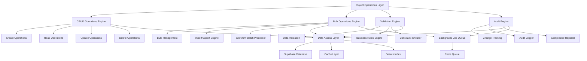

# Design Document

## Overview

This design document outlines the comprehensive enhancement of Factory Pulse project operations to provide robust CRUD functionality and efficient bulk operations. The design focuses on creating a scalable, performant, and user-friendly system that can handle large-scale project management workflows while maintaining data integrity and providing excellent user experience.

## Architecture

### High-Level Architecture



### Component Architecture

The project operations system consists of six main architectural layers:

1. **Operations Layer**: High-level operation orchestration
2. **Business Logic Layer**: CRUD and bulk operation implementations
3. **Validation Layer**: Data validation and business rule enforcement
4. **Data Access Layer**: Optimized database operations and caching
5. **Background Processing Layer**: Asynchronous job processing
6. **Audit Layer**: Change tracking and compliance logging

## Components and Interfaces

### CRUD Operations Engine

**Purpose**: Provide comprehensive Create, Read, Update, Delete operations with validation and optimization

**Key Components**:
- `ProjectCreator`: Multi-step project creation with templates
- `ProjectReader`: Advanced querying and filtering
- `ProjectUpdater`: Comprehensive update operations with conflict resolution
- `ProjectDeleter`: Safe deletion with dependency checking

**Data Structure**:
```typescript
interface CRUDOperationsEngine {
  creator: ProjectCreator;
  reader: ProjectReader;
  updater: ProjectUpdater;
  deleter: ProjectDeleter;
  validator: OperationValidator;
  auditor: OperationAuditor;
}

interface ProjectCreator {
  createProject(data: ProjectCreationData): Promise<OperationResult<Project>>;
  createFromTemplate(templateId: string, data: Partial<ProjectCreationData>): Promise<OperationResult<Project>>;
  validateCreationData(data: ProjectCreationData): ValidationResult;
  generateProjectId(organizationId: string): Promise<string>;
}

interface ProjectReader {
  getProject(id: string): Promise<Project | null>;
  getProjects(query: ProjectQuery): Promise<PaginatedResult<Project>>;
  searchProjects(searchTerm: string, filters?: ProjectFilters): Promise<SearchResult<Project>>;
  getProjectsByIds(ids: string[]): Promise<Project[]>;
}
```### Bu
lk Operations Engine

**Purpose**: Handle large-scale operations efficiently with progress tracking and error handling

**Key Components**:
- `BulkManager`: Orchestrates bulk operations with progress tracking
- `ImportExportEngine`: Handles data import/export with multiple formats
- `WorkflowBatchProcessor`: Processes workflow operations in batches
- `BulkValidator`: Validates bulk operations before execution

**Data Structure**:
```typescript
interface BulkOperationsEngine {
  manager: BulkManager;
  importExport: ImportExportEngine;
  workflowProcessor: WorkflowBatchProcessor;
  validator: BulkValidator;
  progressTracker: ProgressTracker;
}

interface BulkManager {
  bulkUpdate(projectIds: string[], updates: Partial<Project>): Promise<BulkOperationResult>;
  bulkDelete(projectIds: string[], options: BulkDeleteOptions): Promise<BulkOperationResult>;
  bulkStatusChange(projectIds: string[], newStatus: ProjectStatus): Promise<BulkOperationResult>;
  bulkAssign(projectIds: string[], assigneeId: string): Promise<BulkOperationResult>;
}

interface BulkOperationResult {
  operationId: string;
  totalRecords: number;
  successCount: number;
  failureCount: number;
  errors: OperationError[];
  warnings: OperationWarning[];
  duration: number;
  completedAt: string;
}
```

### Import/Export Engine

**Architecture**:
```typescript
interface ImportExportEngine {
  importer: DataImporter;
  exporter: DataExporter;
  formatHandlers: FormatHandler[];
  validator: ImportValidator;
  mapper: FieldMapper;
}

interface DataImporter {
  importFromFile(file: File, options: ImportOptions): Promise<ImportResult>;
  importFromUrl(url: string, options: ImportOptions): Promise<ImportResult>;
  validateImportData(data: any[], mapping: FieldMapping): ValidationResult;
  previewImport(file: File, mapping: FieldMapping): Promise<ImportPreview>;
}

interface ImportOptions {
  format: 'csv' | 'excel' | 'json';
  mapping: FieldMapping;
  conflictResolution: 'skip' | 'overwrite' | 'merge';
  batchSize: number;
  validateOnly: boolean;
}

interface ImportResult {
  operationId: string;
  totalRecords: number;
  importedRecords: number;
  skippedRecords: number;
  errors: ImportError[];
  warnings: ImportWarning[];
  summary: ImportSummary;
}
```

### Validation Engine

**Purpose**: Ensure data integrity and business rule compliance across all operations

**Key Components**:
- `DataValidator`: Field-level and record-level validation
- `BusinessRulesEngine`: Complex business logic validation
- `ConstraintChecker`: Database constraint validation
- `ValidationReporter`: Detailed validation reporting

**Data Structure**:
```typescript
interface ValidationEngine {
  dataValidator: DataValidator;
  businessRules: BusinessRulesEngine;
  constraintChecker: ConstraintChecker;
  reporter: ValidationReporter;
}

interface DataValidator {
  validateProject(project: Partial<Project>): ValidationResult;
  validateBulkOperation(operation: BulkOperation): BulkValidationResult;
  validateImportData(data: ImportData): ImportValidationResult;
  validateWorkflowTransition(projectId: string, newStage: string): ValidationResult;
}

interface ValidationResult {
  isValid: boolean;
  errors: ValidationError[];
  warnings: ValidationWarning[];
  fieldErrors: Record<string, string[]>;
  businessRuleViolations: BusinessRuleViolation[];
}
```

### Audit Engine

**Purpose**: Track all changes and operations for compliance and debugging

**Key Components**:
- `ChangeTracker`: Tracks all data changes with before/after states
- `AuditLogger`: Logs operations with context and metadata
- `ComplianceReporter`: Generates compliance reports
- `AuditQueryEngine`: Queries audit data efficiently

**Data Structure**:
```typescript
interface AuditEngine {
  changeTracker: ChangeTracker;
  logger: AuditLogger;
  complianceReporter: ComplianceReporter;
  queryEngine: AuditQueryEngine;
}

interface ChangeTracker {
  trackChange(operation: AuditableOperation): Promise<void>;
  trackBulkOperation(operation: BulkAuditableOperation): Promise<void>;
  getChangeHistory(entityId: string): Promise<ChangeHistory[]>;
  getChangesByUser(userId: string, dateRange: DateRange): Promise<ChangeHistory[]>;
}

interface AuditableOperation {
  operationType: 'create' | 'update' | 'delete' | 'bulk';
  entityType: 'project' | 'document' | 'message';
  entityId: string;
  userId: string;
  timestamp: string;
  beforeState?: any;
  afterState?: any;
  metadata: Record<string, any>;
}
```

## Data Models

### Enhanced Project Operations Model

```typescript
interface ProjectOperationsModel {
  // Core project data
  project: Project;
  
  // Operation metadata
  operationHistory: OperationHistory[];
  validationState: ValidationState;
  auditTrail: AuditEntry[];
  
  // Bulk operation support
  bulkOperationStatus?: BulkOperationStatus;
  importExportHistory: ImportExportHistory[];
  
  // Performance optimization
  cacheMetadata: CacheMetadata;
  indexingStatus: IndexingStatus;
}

interface OperationHistory {
  id: string;
  operationType: OperationType;
  performedBy: string;
  performedAt: string;
  duration: number;
  status: 'success' | 'failure' | 'partial';
  affectedRecords: number;
  errorDetails?: OperationError[];
}

interface ValidationState {
  lastValidated: string;
  validationVersion: string;
  isValid: boolean;
  validationErrors: ValidationError[];
  businessRuleStatus: BusinessRuleStatus[];
}
```

### Bulk Operations Model

```typescript
interface BulkOperationModel {
  id: string;
  type: BulkOperationType;
  status: 'pending' | 'running' | 'completed' | 'failed' | 'cancelled';
  initiatedBy: string;
  initiatedAt: string;
  completedAt?: string;
  
  // Operation details
  targetRecords: string[];
  operationData: any;
  options: BulkOperationOptions;
  
  // Progress tracking
  progress: ProgressInfo;
  results: BulkOperationResult;
  
  // Error handling
  errors: BulkOperationError[];
  retryCount: number;
  maxRetries: number;
}

interface ProgressInfo {
  totalRecords: number;
  processedRecords: number;
  successfulRecords: number;
  failedRecords: number;
  currentBatch: number;
  totalBatches: number;
  estimatedTimeRemaining: number;
}
```

### Import/Export Model

```typescript
interface ImportExportModel {
  id: string;
  type: 'import' | 'export';
  format: 'csv' | 'excel' | 'json';
  status: ImportExportStatus;
  
  // File information
  fileName: string;
  fileSize: number;
  filePath: string;
  
  // Mapping and configuration
  fieldMapping: FieldMapping;
  importOptions: ImportOptions;
  exportOptions: ExportOptions;
  
  // Results
  results: ImportExportResult;
  validationResults: ValidationResult[];
  
  // Metadata
  createdBy: string;
  createdAt: string;
  completedAt?: string;
}

interface FieldMapping {
  sourceFields: string[];
  targetFields: string[];
  mappings: Record<string, string>;
  transformations: FieldTransformation[];
  defaultValues: Record<string, any>;
}
```

## Error Handling

### Comprehensive Error Management Strategy

**Error Categories**:
1. **Validation Errors**: Data validation failures, business rule violations
2. **Operation Errors**: CRUD operation failures, constraint violations
3. **Bulk Operation Errors**: Batch processing failures, partial successes
4. **Import/Export Errors**: File format issues, mapping errors
5. **System Errors**: Database failures, network issues, performance problems

**Error Handling Architecture**:
```typescript
interface ErrorHandlingStrategy {
  errorClassifier: ErrorClassifier;
  errorRecovery: ErrorRecoveryManager;
  errorReporting: ErrorReportingSystem;
  userNotification: UserNotificationManager;
}

interface ErrorClassifier {
  classifyError(error: Error): ErrorClassification;
  determineRecoveryStrategy(error: ErrorClassification): RecoveryStrategy;
  assessErrorSeverity(error: ErrorClassification): ErrorSeverity;
}

interface ErrorRecoveryManager {
  retryOperation(operationId: string, retryOptions: RetryOptions): Promise<OperationResult>;
  rollbackOperation(operationId: string): Promise<RollbackResult>;
  partialRecovery(operationId: string, recoveryOptions: RecoveryOptions): Promise<RecoveryResult>;
}
```

**Recovery Mechanisms**:
- Automatic retry with exponential backoff for transient errors
- Partial operation recovery for bulk operations
- Transaction rollback for data consistency
- Graceful degradation for system errors
- User-guided recovery for validation errors

## Testing Strategy

### Multi-Layer Testing Approach

**Unit Testing**:
- CRUD operation testing with comprehensive edge cases
- Validation engine testing with various data scenarios
- Bulk operation testing with different batch sizes
- Import/export testing with multiple file formats

**Integration Testing**:
- Database integration testing with real Supabase connections
- Background job processing testing with Redis queues
- File upload/download testing with storage systems
- Real-time update testing with WebSocket connections

**Performance Testing**:
- Load testing with large datasets (10,000+ projects)
- Concurrent operation testing with multiple users
- Bulk operation performance testing with various batch sizes
- Memory usage testing for large import/export operations

**End-to-End Testing**:
- Complete CRUD workflow testing
- Bulk operation scenarios with error handling
- Import/export workflows with validation
- Multi-user collaboration scenarios

### Testing Infrastructure

```typescript
interface TestingInfrastructure {
  unitTests: UnitTestSuite;
  integrationTests: IntegrationTestSuite;
  performanceTests: PerformanceTestSuite;
  e2eTests: E2ETestSuite;
  loadTests: LoadTestSuite;
}

interface PerformanceTestSuite {
  crudPerformanceTests: CRUDPerformanceTest[];
  bulkOperationTests: BulkOperationTest[];
  importExportTests: ImportExportTest[];
  concurrencyTests: ConcurrencyTest[];
  memoryTests: MemoryTest[];
}
```

## Implementation Phases

### Phase 1: Core CRUD Enhancement (Weeks 1-3)
- Enhanced project creation with templates and validation
- Advanced project reading with filtering and search
- Comprehensive project updates with conflict resolution
- Safe project deletion with dependency checking

### Phase 2: Bulk Operations Foundation (Weeks 4-6)
- Bulk project management with selection and progress tracking
- Basic import/export functionality with CSV and Excel support
- Bulk validation engine with detailed error reporting
- Background job processing infrastructure

### Phase 3: Advanced Bulk Features (Weeks 7-9)
- Advanced import/export with field mapping and transformations
- Bulk workflow operations with batch processing
- Conflict resolution and merge strategies
- Performance optimization for large datasets

### Phase 4: Validation and Audit (Weeks 10-12)
- Comprehensive validation engine with business rules
- Complete audit trail system with change tracking
- Compliance reporting and audit queries
- Data integrity monitoring and alerts

### Phase 5: Performance and Scalability (Weeks 13-15)
- Performance optimization and caching strategies
- Scalable architecture with load balancing
- Advanced error handling and recovery mechanisms
- Monitoring and alerting systems

### Phase 6: Testing and Documentation (Weeks 16-18)
- Comprehensive testing suite implementation
- Performance benchmarking and optimization
- User documentation and training materials
- Final integration and deployment preparation