# Design Document

## Overview

This design document outlines the comprehensive project communication system for Factory Pulse that will serve as the central hub for all project-related communications. The system is designed to facilitate seamless collaboration between internal teams and external stakeholders while providing intelligent communication management, real-time messaging, and comprehensive integration capabilities.

## Architecture

### High-Level Architecture

```mermaid
graph TB
    A[Communication System] --> B[Real-time Messaging Engine]
    A --> C[File Sharing Service]
    A --> D[Notification Manager]
    A --> E[Integration Layer]
    
    B --> B1[Message Router]
    B --> B2[Conversation Manager]
    B --> B3[Presence Service]
    B --> B4[WebSocket Handler]
    
    C --> C1[File Upload Service]
    C --> C2[Preview Generator]
    C --> C3[Version Control]
    C --> C4[Access Control]
    
    D --> D1[Notification Engine]
    D --> D2[Template Manager]
    D --> D3[Delivery Service]
    D --> D4[Preference Manager]
    
    E --> E1[Email Integration]
    E --> E2[External Portals]
    E --> E3[Mobile API]
    E --> E4[Voice/Video Service]
    
    F[Analytics Engine] --> G[Communication Analytics]
    F --> H[Performance Metrics]
    F --> I[Compliance Tracking]
    
    J[Data Layer] --> K[Message Database]
    J --> L[File Storage]
    J --> M[Cache Layer]
    J --> N[Search Index]
    
    B --> J
    C --> L
    D --> J
    E --> J
    F --> K
    
    O[Security Layer] --> P[Authentication]
    O --> Q[Authorization]
    O --> R[Encryption]
    O --> S[Audit Logger]
```



### Component Architecture

The communication system consists of eight main architectural layers:

1. **Real-time Messaging Engine**: Core messaging functionality with WebSocket support
2. **File Sharing Service**: Document and media sharing with version control
3. **Notification Manager**: Multi-channel notification delivery and management
4. **Integration Layer**: External system integrations and API management
5. **Analytics Engine**: Communication analytics and performance monitoring
6. **Data Layer**: Persistent storage, caching, and search capabilities
7. **Security Layer**: Authentication, authorization, and data protection
8. **Mobile and Web Clients**: Cross-platform user interfaces

## Components and Interfaces

### Real-time Messaging Engine

**Purpose**: Provide instant messaging capabilities with real-time delivery and conversation management

**Key Components**:
- `MessageRouter`: Routes messages to appropriate recipients and channels
- `ConversationManager`: Manages conversation threads and participant lists
- `PresenceService`: Tracks user online status and activity
- `WebSocketHandler`: Manages real-time connections and message delivery

**Data Structure**:
```typescript
interface MessagingEngine {
  messageRouter: MessageRouter;
  conversationManager: ConversationManager;
  presenceService: PresenceService;
  webSocketHandler: WebSocketHandler;
  messageValidator: MessageValidator;
}

interface Message {
  id: string;
  conversationId: string;
  senderId: string;
  content: MessageContent;
  type: 'text' | 'file' | 'system' | 'voice' | 'video';
  threadId?: string;
  replyToId?: string;
  mentions: string[];
  reactions: MessageReaction[];
  status: 'sending' | 'sent' | 'delivered' | 'read' | 'failed';
  createdAt: string;
  updatedAt: string;
  metadata: MessageMetadata;
}

interface Conversation {
  id: string;
  projectId: string;
  type: 'direct' | 'group' | 'project' | 'external';
  name?: string;
  description?: string;
  participants: ConversationParticipant[];
  settings: ConversationSettings;
  lastMessage?: Message;
  unreadCount: Record<string, number>;
  createdAt: string;
  updatedAt: string;
}
```### File 
Sharing Service

**Purpose**: Handle file uploads, sharing, and collaboration with version control and access management

**Key Components**:
- `FileUploadService`: Manages file uploads with progress tracking and validation
- `PreviewGenerator`: Generates previews and thumbnails for various file types
- `VersionControl`: Tracks file versions and manages version history
- `AccessControl`: Enforces file access permissions and sharing rules

**Data Structure**:
```typescript
interface FileShareService {
  uploadService: FileUploadService;
  previewGenerator: PreviewGenerator;
  versionControl: VersionControl;
  accessControl: AccessControl;
  storageManager: StorageManager;
}

interface SharedFile {
  id: string;
  messageId: string;
  originalName: string;
  fileName: string;
  fileSize: number;
  mimeType: string;
  fileType: FileType;
  storageUrl: string;
  previewUrl?: string;
  thumbnailUrl?: string;
  uploadedBy: string;
  uploadedAt: string;
  versions: FileVersion[];
  accessPermissions: FilePermission[];
  downloadCount: number;
  metadata: FileMetadata;
}

interface FileVersion {
  id: string;
  version: string;
  fileName: string;
  fileSize: number;
  storageUrl: string;
  uploadedBy: string;
  uploadedAt: string;
  changeDescription?: string;
  isLatest: boolean;
}
```

### Notification Manager

**Purpose**: Manage multi-channel notifications with intelligent delivery and user preferences

**Key Components**:
- `NotificationEngine`: Core notification processing and routing
- `TemplateManager`: Manages notification templates and formatting
- `DeliveryService`: Handles delivery across multiple channels
- `PreferenceManager`: Manages user notification preferences

**Data Structure**:
```typescript
interface NotificationManager {
  engine: NotificationEngine;
  templateManager: TemplateManager;
  deliveryService: DeliveryService;
  preferenceManager: PreferenceManager;
  analyticsTracker: NotificationAnalytics;
}

interface Notification {
  id: string;
  type: NotificationType;
  priority: 'low' | 'medium' | 'high' | 'urgent';
  recipientId: string;
  senderId?: string;
  title: string;
  content: string;
  data: NotificationData;
  channels: NotificationChannel[];
  status: NotificationStatus;
  scheduledAt?: string;
  sentAt?: string;
  readAt?: string;
  expiresAt?: string;
  metadata: NotificationMetadata;
}

interface NotificationPreferences {
  userId: string;
  channels: ChannelPreference[];
  quietHours: QuietHoursConfig;
  projectSettings: ProjectNotificationSettings[];
  globalSettings: GlobalNotificationSettings;
  updatedAt: string;
}
```

### Integration Layer

**Purpose**: Provide seamless integration with external systems and communication platforms

**Key Components**:
- `EmailIntegration`: Bidirectional email integration with threading
- `ExternalPortals`: Customer and supplier communication portals
- `MobileAPI`: Mobile-optimized API endpoints
- `VoiceVideoService`: Voice and video calling integration

**Data Structure**:
```typescript
interface IntegrationLayer {
  emailIntegration: EmailIntegration;
  externalPortals: ExternalPortalManager;
  mobileAPI: MobileAPIService;
  voiceVideoService: VoiceVideoService;
  webhookManager: WebhookManager;
}

interface EmailIntegration {
  inboundProcessor: InboundEmailProcessor;
  outboundSender: OutboundEmailSender;
  threadManager: EmailThreadManager;
  templateEngine: EmailTemplateEngine;
  deliveryTracker: EmailDeliveryTracker;
}

interface ExternalPortal {
  id: string;
  type: 'customer' | 'supplier';
  organizationId: string;
  projectIds: string[];
  accessConfig: PortalAccessConfig;
  branding: PortalBranding;
  features: PortalFeature[];
  users: PortalUser[];
  isActive: boolean;
  createdAt: string;
  expiresAt?: string;
}
```

### Analytics Engine

**Purpose**: Provide comprehensive communication analytics and performance insights

**Key Components**:
- `CommunicationAnalytics`: Analyzes communication patterns and effectiveness
- `PerformanceMetrics`: Tracks system performance and user engagement
- `ComplianceTracking`: Monitors compliance and audit requirements
- `ReportingEngine`: Generates customizable reports and dashboards

**Data Structure**:
```typescript
interface AnalyticsEngine {
  communicationAnalytics: CommunicationAnalytics;
  performanceMetrics: PerformanceMetrics;
  complianceTracking: ComplianceTracking;
  reportingEngine: ReportingEngine;
  dataCollector: AnalyticsDataCollector;
}

interface CommunicationMetrics {
  projectId: string;
  timeRange: DateRange;
  messageVolume: MessageVolumeMetrics;
  responseTime: ResponseTimeMetrics;
  participation: ParticipationMetrics;
  engagement: EngagementMetrics;
  trends: TrendAnalysis[];
  insights: CommunicationInsight[];
}

interface MessageVolumeMetrics {
  totalMessages: number;
  messagesByType: Record<string, number>;
  messagesByChannel: Record<string, number>;
  peakHours: HourlyDistribution[];
  dailyAverage: number;
  weeklyTrend: number;
}
```

## Data Models

### Enhanced Communication Model

```typescript
interface EnhancedCommunication {
  // Core conversation data
  conversation: Conversation;
  messages: Message[];
  participants: ConversationParticipant[];
  
  // File sharing
  sharedFiles: SharedFile[];
  filePermissions: FilePermission[];
  
  // Analytics and insights
  metrics: CommunicationMetrics;
  insights: CommunicationInsight[];
  
  // Integration data
  emailThreads: EmailThread[];
  externalConnections: ExternalConnection[];
  
  // Compliance and audit
  auditTrail: CommunicationAuditEntry[];
  complianceStatus: ComplianceStatus;
}

interface ConversationParticipant {
  userId: string;
  role: 'owner' | 'admin' | 'member' | 'guest';
  permissions: ParticipantPermission[];
  joinedAt: string;
  lastReadAt: string;
  notificationSettings: ParticipantNotificationSettings;
  isActive: boolean;
  metadata: ParticipantMetadata;
}

interface MessageContent {
  text?: string;
  html?: string;
  attachments: MessageAttachment[];
  embeds: MessageEmbed[];
  formatting: MessageFormatting;
}
```

### Voice and Video Integration Model

```typescript
interface VoiceVideoCall {
  id: string;
  conversationId: string;
  type: 'voice' | 'video' | 'screen_share';
  initiatedBy: string;
  participants: CallParticipant[];
  status: 'initiating' | 'ringing' | 'active' | 'ended' | 'failed';
  startedAt?: string;
  endedAt?: string;
  duration?: number;
  recordingUrl?: string;
  transcription?: CallTranscription;
  quality: CallQuality;
  metadata: CallMetadata;
}

interface CallParticipant {
  userId: string;
  joinedAt?: string;
  leftAt?: string;
  role: 'host' | 'participant';
  permissions: CallPermission[];
  audioEnabled: boolean;
  videoEnabled: boolean;
  screenSharing: boolean;
}

interface CallTranscription {
  id: string;
  callId: string;
  content: TranscriptionSegment[];
  language: string;
  confidence: number;
  generatedAt: string;
  isSearchable: boolean;
}
```

### External Portal Model

```typescript
interface ExternalPortalModel {
  portal: ExternalPortal;
  users: PortalUser[];
  conversations: PortalConversation[];
  permissions: PortalPermission[];
  analytics: PortalAnalytics;
  
  // Security and compliance
  accessLogs: PortalAccessLog[];
  securitySettings: PortalSecuritySettings;
  complianceConfig: PortalComplianceConfig;
}

interface PortalUser {
  id: string;
  portalId: string;
  email: string;
  name: string;
  role: 'primary' | 'secondary' | 'viewer';
  permissions: PortalUserPermission[];
  lastLoginAt?: string;
  isActive: boolean;
  invitedAt: string;
  invitedBy: string;
  metadata: PortalUserMetadata;
}

interface PortalConversation {
  id: string;
  portalId: string;
  projectId: string;
  internalParticipants: string[];
  externalParticipants: string[];
  subject: string;
  status: 'active' | 'closed' | 'archived';
  priority: 'low' | 'medium' | 'high' | 'urgent';
  createdAt: string;
  lastActivityAt: string;
}
```

## Error Handling

### Comprehensive Error Management Strategy

**Error Categories**:
1. **Connection Errors**: WebSocket failures, network timeouts, connectivity issues
2. **Message Delivery Errors**: Failed message delivery, recipient unavailable
3. **File Sharing Errors**: Upload failures, storage issues, access denied
4. **Integration Errors**: Email delivery failures, external API errors
5. **Performance Errors**: High latency, system overload, resource exhaustion

**Error Handling Architecture**:
```typescript
interface CommunicationErrorHandling {
  errorClassifier: CommunicationErrorClassifier;
  recoveryManager: CommunicationRecoveryManager;
  fallbackService: CommunicationFallbackService;
  errorReporting: CommunicationErrorReporting;
}

interface CommunicationErrorClassifier {
  classifyError(error: CommunicationError): ErrorClassification;
  determineRetryStrategy(error: ErrorClassification): RetryStrategy;
  assessUserImpact(error: ErrorClassification): UserImpactAssessment;
}

interface CommunicationRecoveryManager {
  retryMessageDelivery(messageId: string, retryOptions: RetryOptions): Promise<DeliveryResult>;
  fallbackToEmail(conversationId: string, messageId: string): Promise<EmailFallbackResult>;
  queueOfflineMessages(userId: string, messages: Message[]): Promise<QueueResult>;
  syncWhenOnline(userId: string): Promise<SyncResult>;
}
```

**Recovery Mechanisms**:
- Automatic message retry with exponential backoff
- Offline message queuing with sync when online
- Email fallback for critical communications
- Alternative delivery channels for failed notifications
- Graceful degradation for system overload

## Testing Strategy

### Multi-Layer Testing Approach

**Unit Testing**:
- Message routing and delivery testing with various scenarios
- File upload and sharing testing with different file types
- Notification engine testing with multiple channels
- Integration component testing with mock external services

**Integration Testing**:
- Real-time messaging testing with WebSocket connections
- Email integration testing with actual email services
- External portal testing with authentication and permissions
- Voice/video integration testing with media services

**Performance Testing**:
- High-volume messaging testing with thousands of concurrent users
- File sharing performance testing with large files and concurrent uploads
- Notification delivery performance testing with bulk notifications
- Real-time connection testing with connection drops and reconnections

**End-to-End Testing**:
- Complete communication workflows from message to delivery
- Cross-platform testing (web, mobile, email integration)
- External stakeholder communication testing
- Compliance and audit trail testing

### Testing Infrastructure

```typescript
interface CommunicationTestingInfrastructure {
  unitTests: CommunicationUnitTestSuite;
  integrationTests: CommunicationIntegrationTestSuite;
  performanceTests: CommunicationPerformanceTestSuite;
  e2eTests: CommunicationE2ETestSuite;
  loadTests: CommunicationLoadTestSuite;
}

interface CommunicationPerformanceTestSuite {
  messagingPerformanceTests: MessagingPerformanceTest[];
  fileSharePerformanceTests: FileSharePerformanceTest[];
  notificationPerformanceTests: NotificationPerformanceTest[];
  integrationPerformanceTests: IntegrationPerformanceTest[];
  scalabilityTests: ScalabilityTest[];
}
```

## Implementation Phases

### Phase 1: Core Messaging Infrastructure (Weeks 1-4)
- Real-time messaging engine with WebSocket support
- Basic conversation management and threading
- File sharing with upload and preview capabilities
- Fundamental notification system

### Phase 2: Advanced Communication Features (Weeks 5-8)
- @Mentions and notification preferences
- Message reactions and acknowledgments
- Advanced search and message history
- Voice and video integration setup

### Phase 3: External Integration (Weeks 9-12)
- Email integration with bidirectional threading
- Customer and supplier portal development
- Mobile API and push notifications
- External authentication and access control

### Phase 4: Analytics and Intelligence (Weeks 13-16)
- Communication analytics and reporting
- Automated workflow integration
- Performance monitoring and optimization
- Compliance and audit trail implementation

### Phase 5: Advanced Features and Optimization (Weeks 17-20)
- Advanced file collaboration features
- Communication templates and standardization
- Predictive analytics and insights
- Security enhancements and encryption

### Phase 6: Testing and Production Readiness (Weeks 21-24)
- Comprehensive testing suite implementation
- Performance optimization and scalability testing
- User training and documentation
- Production deployment and monitoring setup