# Design Document

## Overview

This design document outlines the comprehensive analytics and reporting system for Factory Pulse that will provide deep business intelligence, real-time insights, and advanced data visualization capabilities. The system is designed to handle large-scale data processing, support complex analytical queries, and deliver actionable insights through intuitive dashboards and automated reporting while maintaining high performance and security.

## Architecture

### High-Level Architecture

```mermaid
graph TB
    A[Analytics and Reporting System] --> B[Real-time Analytics Engine]
    A --> C[Data Processing Layer]
    A --> D[Visualization Engine]
    A --> E[Reporting Engine]
    
    B --> B1[Stream Processor]
    B --> B2[Real-time Aggregator]
    B --> B3[Live Dashboard Service]
    B --> B4[Alert Engine]
    
    C --> C1[ETL Pipeline]
    C --> C2[Data Warehouse]
    C --> C3[OLAP Cube Engine]
    C --> C4[ML Pipeline]
    
    D --> D1[Chart Engine]
    D --> D2[Dashboard Builder]
    D --> D3[Interactive Widgets]
    D --> D4[Mobile Renderer]
    
    E --> E1[Report Generator]
    E --> E2[Template Engine]
    E --> E3[Scheduler]
    E --> E4[Distribution Service]
    
    F[Data Sources] --> G[Operational Database]
    F --> H[External APIs]
    F --> I[File Systems]
    F --> J[Cloud Services]
    
    K[Analytics Database] --> L[Time Series DB]
    K --> M[Data Warehouse]
    K --> N[Cache Layer]
    K --> O[Search Index]
    
    F --> C
    C --> K
    K --> B
    K --> D
    K --> E
    
    P[ML/AI Services] --> Q[Prediction Engine]
    P --> R[Anomaly Detection]
    P --> S[Pattern Recognition]
    P --> T[Recommendation Engine]
    
    C --> P
    P --> B
```



### Component Architecture

The analytics and reporting system consists of nine main architectural layers:

1. **Real-time Analytics Engine**: Live data processing and real-time insights
2. **Data Processing Layer**: ETL, data warehousing, and ML pipeline
3. **Visualization Engine**: Interactive charts, dashboards, and widgets
4. **Reporting Engine**: Automated report generation and distribution
5. **ML/AI Services**: Predictive analytics and intelligent insights
6. **Data Storage Layer**: Optimized storage for analytical workloads
7. **Security and Governance**: Data protection and access control
8. **API Layer**: RESTful and GraphQL APIs for data access
9. **User Interface**: Web and mobile interfaces for analytics consumption

## Components and Interfaces

### Real-time Analytics Engine

**Purpose**: Provide real-time data processing and live analytics capabilities

**Key Components**:
- `StreamProcessor`: Processes real-time data streams with low latency
- `RealTimeAggregator`: Performs real-time aggregations and calculations
- `LiveDashboardService`: Serves live data to dashboards and widgets
- `AlertEngine`: Monitors metrics and triggers alerts based on conditions

**Data Structure**:
```typescript
interface RealTimeAnalyticsEngine {
  streamProcessor: StreamProcessor;
  aggregator: RealTimeAggregator;
  dashboardService: LiveDashboardService;
  alertEngine: AlertEngine;
  metricsCollector: MetricsCollector;
}

interface StreamProcessor {
  processEvent(event: AnalyticsEvent): Promise<ProcessingResult>;
  registerProcessor(processor: EventProcessor): void;
  getProcessingStats(): ProcessingStats;
  handleBackpressure(strategy: BackpressureStrategy): void;
}

interface AnalyticsEvent {
  id: string;
  type: EventType;
  source: string;
  timestamp: string;
  data: Record<string, any>;
  metadata: EventMetadata;
  correlationId?: string;
}

interface RealTimeMetric {
  id: string;
  name: string;
  value: number;
  unit: string;
  timestamp: string;
  dimensions: Record<string, string>;
  aggregationType: 'sum' | 'avg' | 'count' | 'min' | 'max';
  windowSize: number;
}
```###
 Data Processing Layer

**Purpose**: Handle ETL operations, data warehousing, and machine learning pipeline

**Key Components**:
- `ETLPipeline`: Extracts, transforms, and loads data from various sources
- `DataWarehouse`: Centralized repository for analytical data
- `OLAPCubeEngine`: Provides multi-dimensional data analysis capabilities
- `MLPipeline`: Machine learning model training and inference

**Data Structure**:
```typescript
interface DataProcessingLayer {
  etlPipeline: ETLPipeline;
  dataWarehouse: DataWarehouse;
  olapEngine: OLAPCubeEngine;
  mlPipeline: MLPipeline;
  dataQualityManager: DataQualityManager;
}

interface ETLPipeline {
  extractData(source: DataSource): Promise<RawData>;
  transformData(data: RawData, rules: TransformationRule[]): Promise<TransformedData>;
  loadData(data: TransformedData, target: DataTarget): Promise<LoadResult>;
  scheduleJob(job: ETLJob): Promise<JobScheduleResult>;
  monitorJob(jobId: string): Promise<JobStatus>;
}

interface DataWarehouse {
  createSchema(schema: WarehouseSchema): Promise<SchemaResult>;
  queryData(query: AnalyticalQuery): Promise<QueryResult>;
  optimizeQuery(query: AnalyticalQuery): Promise<OptimizedQuery>;
  managePartitions(strategy: PartitionStrategy): Promise<PartitionResult>;
  archiveData(criteria: ArchiveCriteria): Promise<ArchiveResult>;
}

interface OLAPCube {
  id: string;
  name: string;
  dimensions: CubeDimension[];
  measures: CubeMeasure[];
  hierarchies: CubeHierarchy[];
  aggregations: CubeAggregation[];
  refreshSchedule: RefreshSchedule;
  lastRefresh: string;
  size: number;
}
```

### Visualization Engine

**Purpose**: Provide interactive data visualization and dashboard capabilities

**Key Components**:
- `ChartEngine`: Renders various chart types with customization options
- `DashboardBuilder`: Drag-and-drop dashboard creation interface
- `InteractiveWidgets`: Interactive components for data exploration
- `MobileRenderer`: Optimized rendering for mobile devices

**Data Structure**:
```typescript
interface VisualizationEngine {
  chartEngine: ChartEngine;
  dashboardBuilder: DashboardBuilder;
  widgetLibrary: InteractiveWidgets;
  mobileRenderer: MobileRenderer;
  themeManager: ThemeManager;
}

interface Dashboard {
  id: string;
  name: string;
  description: string;
  layout: DashboardLayout;
  widgets: DashboardWidget[];
  filters: DashboardFilter[];
  permissions: DashboardPermission[];
  settings: DashboardSettings;
  createdBy: string;
  createdAt: string;
  lastModified: string;
}

interface DashboardWidget {
  id: string;
  type: WidgetType;
  title: string;
  position: WidgetPosition;
  size: WidgetSize;
  dataSource: WidgetDataSource;
  configuration: WidgetConfiguration;
  interactions: WidgetInteraction[];
  refreshInterval?: number;
  cacheSettings: CacheSettings;
}

interface ChartConfiguration {
  chartType: ChartType;
  xAxis: AxisConfiguration;
  yAxis: AxisConfiguration;
  series: SeriesConfiguration[];
  colors: ColorConfiguration;
  legend: LegendConfiguration;
  tooltip: TooltipConfiguration;
  animations: AnimationConfiguration;
}
```

### Reporting Engine

**Purpose**: Generate and distribute automated reports with flexible scheduling

**Key Components**:
- `ReportGenerator`: Creates reports in various formats
- `TemplateEngine`: Manages report templates and layouts
- `Scheduler`: Handles report scheduling and automation
- `DistributionService`: Distributes reports via multiple channels

**Data Structure**:
```typescript
interface ReportingEngine {
  generator: ReportGenerator;
  templateEngine: TemplateEngine;
  scheduler: ReportScheduler;
  distributionService: DistributionService;
  formatManager: ReportFormatManager;
}

interface Report {
  id: string;
  name: string;
  description: string;
  templateId: string;
  parameters: ReportParameter[];
  schedule: ReportSchedule;
  distribution: DistributionConfig;
  format: ReportFormat[];
  status: ReportStatus;
  lastGenerated: string;
  nextGeneration: string;
  recipients: ReportRecipient[];
}

interface ReportTemplate {
  id: string;
  name: string;
  category: string;
  layout: ReportLayout;
  sections: ReportSection[];
  parameters: TemplateParameter[];
  styling: ReportStyling;
  version: string;
  isActive: boolean;
  createdBy: string;
  createdAt: string;
}

interface ReportSchedule {
  frequency: 'daily' | 'weekly' | 'monthly' | 'quarterly' | 'custom';
  interval: number;
  dayOfWeek?: number;
  dayOfMonth?: number;
  time: string;
  timezone: string;
  startDate: string;
  endDate?: string;
  isActive: boolean;
}
```

### ML/AI Services

**Purpose**: Provide predictive analytics and intelligent insights

**Key Components**:
- `PredictionEngine`: Generates forecasts and predictions
- `AnomalyDetection`: Identifies unusual patterns and outliers
- `PatternRecognition`: Discovers patterns in data
- `RecommendationEngine`: Provides actionable recommendations

**Data Structure**:
```typescript
interface MLAIServices {
  predictionEngine: PredictionEngine;
  anomalyDetection: AnomalyDetection;
  patternRecognition: PatternRecognition;
  recommendationEngine: RecommendationEngine;
  modelManager: MLModelManager;
}

interface PredictionModel {
  id: string;
  name: string;
  type: ModelType;
  algorithm: string;
  features: ModelFeature[];
  target: string;
  accuracy: number;
  confidence: number;
  trainingData: TrainingDataInfo;
  lastTrained: string;
  version: string;
  status: ModelStatus;
}

interface Prediction {
  id: string;
  modelId: string;
  inputData: Record<string, any>;
  prediction: PredictionResult;
  confidence: number;
  explanation: PredictionExplanation;
  timestamp: string;
  validUntil?: string;
  metadata: PredictionMetadata;
}

interface Anomaly {
  id: string;
  type: AnomalyType;
  severity: 'low' | 'medium' | 'high' | 'critical';
  description: string;
  detectedAt: string;
  affectedMetrics: string[];
  context: AnomalyContext;
  recommendations: string[];
  status: 'new' | 'investigating' | 'resolved' | 'false_positive';
}
```

## Data Models

### Enhanced Analytics Data Model

```typescript
interface AnalyticsDataModel {
  // Core data structures
  facts: FactTable[];
  dimensions: DimensionTable[];
  measures: Measure[];
  
  // Time-based data
  timeSeries: TimeSeriesData[];
  snapshots: DataSnapshot[];
  
  // Aggregated data
  aggregations: AggregatedData[];
  cubes: OLAPCube[];
  
  // Metadata
  schema: DataSchema;
  lineage: DataLineage;
  quality: DataQualityMetrics;
}

interface FactTable {
  id: string;
  name: string;
  description: string;
  measures: FactMeasure[];
  dimensions: FactDimension[];
  granularity: string;
  partitioning: PartitioningStrategy;
  indexing: IndexingStrategy;
  retention: RetentionPolicy;
}

interface DimensionTable {
  id: string;
  name: string;
  description: string;
  attributes: DimensionAttribute[];
  hierarchies: DimensionHierarchy[];
  type: 'slowly_changing' | 'rapidly_changing' | 'static';
  changeTracking: ChangeTrackingStrategy;
}
```

### Dashboard and Visualization Model

```typescript
interface DashboardModel {
  dashboard: Dashboard;
  widgets: DashboardWidget[];
  layout: DashboardLayout;
  interactions: DashboardInteraction[];
  
  // Performance optimization
  cacheStrategy: CacheStrategy;
  refreshPolicy: RefreshPolicy;
  
  // User experience
  responsiveConfig: ResponsiveConfiguration;
  accessibility: AccessibilitySettings;
  
  // Analytics
  usageMetrics: DashboardUsageMetrics;
  performanceMetrics: DashboardPerformanceMetrics;
}

interface WidgetDataBinding {
  widgetId: string;
  dataSource: DataSourceConfiguration;
  query: AnalyticalQuery;
  transformations: DataTransformation[];
  filters: DataFilter[];
  parameters: QueryParameter[];
  caching: CachingConfiguration;
  refreshTriggers: RefreshTrigger[];
}

interface InteractiveDashboard {
  baseConfig: Dashboard;
  interactionMap: InteractionMapping[];
  filterPropagation: FilterPropagationRule[];
  drillDownPaths: DrillDownPath[];
  crossFiltering: CrossFilterConfiguration;
  globalFilters: GlobalFilter[];
}
```

### Reporting Model

```typescript
interface ReportingModel {
  report: Report;
  template: ReportTemplate;
  generation: ReportGeneration;
  distribution: ReportDistribution;
  
  // Content
  sections: ReportSection[];
  visualizations: ReportVisualization[];
  data: ReportData[];
  
  // Automation
  schedule: ReportSchedule;
  triggers: ReportTrigger[];
  conditions: ReportCondition[];
  
  // Analytics
  metrics: ReportMetrics;
  feedback: ReportFeedback[];
}

interface ReportGeneration {
  id: string;
  reportId: string;
  status: GenerationStatus;
  startedAt: string;
  completedAt?: string;
  duration?: number;
  dataRange: DateRange;
  parameters: GenerationParameter[];
  outputs: ReportOutput[];
  errors: GenerationError[];
  metrics: GenerationMetrics;
}

interface ReportOutput {
  id: string;
  format: ReportFormat;
  filePath: string;
  fileSize: number;
  checksum: string;
  generatedAt: string;
  expiresAt?: string;
  downloadCount: number;
  accessLog: OutputAccessLog[];
}
```

## Error Handling

### Comprehensive Error Management Strategy

**Error Categories**:
1. **Data Processing Errors**: ETL failures, data quality issues, transformation errors
2. **Query Performance Errors**: Slow queries, timeout errors, resource exhaustion
3. **Visualization Errors**: Rendering failures, data binding errors, interaction issues
4. **Report Generation Errors**: Template errors, formatting issues, distribution failures
5. **ML/AI Errors**: Model training failures, prediction errors, anomaly detection issues

**Error Handling Architecture**:
```typescript
interface AnalyticsErrorHandling {
  errorClassifier: AnalyticsErrorClassifier;
  recoveryManager: AnalyticsRecoveryManager;
  performanceOptimizer: PerformanceOptimizer;
  errorReporting: AnalyticsErrorReporting;
}

interface AnalyticsErrorClassifier {
  classifyError(error: AnalyticsError): ErrorClassification;
  assessImpact(error: ErrorClassification): ImpactAssessment;
  determineRecoveryStrategy(error: ErrorClassification): RecoveryStrategy;
}

interface AnalyticsRecoveryManager {
  retryDataProcessing(jobId: string, retryOptions: RetryOptions): Promise<ProcessingResult>;
  fallbackToCache(queryId: string): Promise<CachedResult>;
  degradeVisualization(widgetId: string, degradationLevel: DegradationLevel): Promise<DegradedWidget>;
  rescheduleReport(reportId: string, newSchedule: ReportSchedule): Promise<ScheduleResult>;
}
```

**Recovery Mechanisms**:
- Automatic retry with exponential backoff for transient errors
- Fallback to cached data for query failures
- Graceful degradation for visualization rendering issues
- Alternative data sources for missing or corrupted data
- Performance optimization for slow queries

## Testing Strategy

### Multi-Layer Testing Approach

**Unit Testing**:
- Data processing pipeline testing with various data scenarios
- Visualization component testing with different chart types
- Report generation testing with multiple formats
- ML model testing with validation datasets

**Integration Testing**:
- End-to-end data flow testing from source to visualization
- Dashboard interaction testing with real-time data updates
- Report distribution testing with multiple channels
- External data source integration testing

**Performance Testing**:
- Large dataset processing testing with terabytes of data
- Concurrent user testing with hundreds of simultaneous dashboard users
- Query performance testing with complex analytical queries
- Real-time processing testing with high-volume data streams

**Analytics Testing**:
- Data accuracy testing with known datasets
- Visualization rendering testing across different browsers and devices
- Report generation testing with various templates and parameters
- ML model accuracy testing with validation datasets

### Testing Infrastructure

```typescript
interface AnalyticsTestingInfrastructure {
  unitTests: AnalyticsUnitTestSuite;
  integrationTests: AnalyticsIntegrationTestSuite;
  performanceTests: AnalyticsPerformanceTestSuite;
  dataTests: DataValidationTestSuite;
  visualTests: VisualizationTestSuite;
}

interface AnalyticsPerformanceTestSuite {
  dataProcessingTests: DataProcessingPerformanceTest[];
  queryPerformanceTests: QueryPerformanceTest[];
  visualizationTests: VisualizationPerformanceTest[];
  concurrencyTests: ConcurrencyTest[];
  scalabilityTests: ScalabilityTest[];
}
```

## Implementation Phases

### Phase 1: Core Analytics Infrastructure (Weeks 1-6)
- Real-time analytics engine with stream processing
- Basic data warehouse and ETL pipeline
- Fundamental visualization components
- Core dashboard functionality

### Phase 2: Advanced Visualization and Reporting (Weeks 7-12)
- Interactive dashboard builder with drag-and-drop
- Advanced chart types and customization
- Automated report generation and scheduling
- Report template management system

### Phase 3: Business Intelligence and ML (Weeks 13-18)
- Predictive analytics and forecasting models
- Anomaly detection and pattern recognition
- KPI tracking and monitoring system
- Automated insight generation

### Phase 4: Specialized Analytics (Weeks 19-24)
- Project performance analytics with success factor analysis
- Resource utilization analytics with optimization
- Financial analytics with profitability tracking
- Industry-specific analytical modules

### Phase 5: Data Management and Governance (Weeks 25-30)
- Data quality management and monitoring
- Advanced ETL with complex transformations
- Data governance and compliance features
- Security and access control implementation

### Phase 6: Performance and Production (Weeks 31-36)
- Performance optimization and scalability enhancements
- Production deployment and monitoring
- User training and documentation
- Continuous improvement and maintenance setup