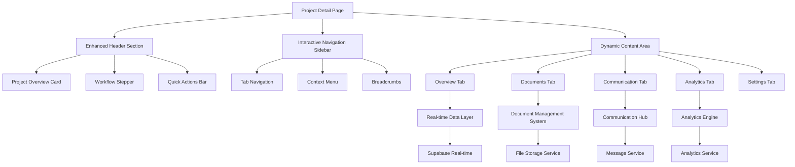

# Design Document

## Overview

This design document outlines the comprehensive enhancement of the Factory Pulse project detail page to create a modern, efficient, and user-friendly interface for project management. The design focuses on improving information architecture, user experience, performance, and accessibility while maintaining consistency with the existing Factory Pulse design system.

## Architecture

### High-Level Architecture



### Component Architecture

The enhanced project detail page consists of five main architectural layers:

1. **Presentation Layer**: React components with responsive design
2. **State Management Layer**: TanStack Query + React Context for real-time updates
3. **Business Logic Layer**: Custom hooks and services
4. **Data Access Layer**: Supabase integration with optimized queries
5. **Real-time Layer**: WebSocket connections for live updates

## Components and Interfaces

### Enhanced Header Section

**Purpose**: Provide immediate project context and quick actions

**Key Components**:
- `ProjectOverviewCard`: Consolidated project information display
- `WorkflowStepper`: Interactive stage progression indicator
- `QuickActionsBar`: Contextual action buttons
- `ProjectAlerts`: Critical issue notifications

**Data Structure**:
```typescript
interface ProjectHeader {
  project: Project;
  currentStage: WorkflowStage;
  alerts: ProjectAlert[];
  quickActions: QuickAction[];
  realTimeStatus: 'connected' | 'disconnected' | 'reconnecting';
}

interface ProjectAlert {
  id: string;
  type: 'warning' | 'error' | 'info' | 'success';
  title: string;
  message: string;
  actionable: boolean;
  action?: () => void;
  dismissible: boolean;
}
```

### Interactive Navigation Sidebar

**Purpose**: Provide intuitive navigation between different project views

**Key Components**:
- `TabNavigation`: Primary navigation tabs
- `ContextualMenu`: Secondary actions based on current tab
- `NavigationBreadcrumbs`: Hierarchical navigation context
- `TabIndicators`: Visual indicators for tab states (loading, errors, notifications)

**Navigation Structure**:
```typescript
interface NavigationTab {
  id: string;
  label: string;
  icon: React.ComponentType;
  badge?: number;
  disabled?: boolean;
  loading?: boolean;
  error?: boolean;
}

const NAVIGATION_TABS: NavigationTab[] = [
  { id: 'overview', label: 'Overview', icon: LayoutDashboard },
  { id: 'documents', label: 'Documents', icon: FileText },
  { id: 'communication', label: 'Communication', icon: MessageSquare },
  { id: 'analytics', label: 'Analytics', icon: BarChart3 },
  { id: 'settings', label: 'Settings', icon: Settings }
];
```#
## Dynamic Content Area

**Purpose**: Display tab-specific content with optimized loading and caching

**Key Components**:
- `OverviewDashboard`: Comprehensive project information display
- `DocumentManager`: Advanced document management interface
- `CommunicationHub`: Centralized communication interface
- `AnalyticsDashboard`: Project analytics and reporting
- `ProjectSettings`: Configuration and preferences

### Overview Dashboard

**Layout Structure**:
```typescript
interface OverviewLayout {
  projectSummary: ProjectSummaryCard;
  keyMetrics: MetricsGrid;
  recentActivity: ActivityTimeline;
  upcomingTasks: TaskList;
  teamMembers: TeamMemberList;
  criticalAlerts: AlertPanel;
}

interface ProjectSummaryCard {
  basicInfo: ProjectBasicInfo;
  financialInfo: ProjectFinancials;
  timelineInfo: ProjectTimeline;
  statusIndicators: StatusIndicator[];
}
```

**Visual Design**:
- Card-based layout with consistent spacing
- Color-coded status indicators
- Progressive disclosure for detailed information
- Responsive grid system for different screen sizes

### Document Management Interface

**Architecture**:
```typescript
interface DocumentManagerState {
  documents: ProjectDocument[];
  selectedDocuments: string[];
  viewMode: 'grid' | 'list' | 'timeline';
  filters: DocumentFilters;
  uploadQueue: FileUpload[];
  previewDocument: ProjectDocument | null;
}

interface DocumentFilters {
  type: DocumentType[];
  dateRange: DateRange;
  accessLevel: AccessLevel[];
  searchQuery: string;
  tags: string[];
}
```

**Key Features**:
- Drag-and-drop upload with progress indicators
- Document preview with annotation capabilities
- Version control with diff visualization
- Bulk operations (download, delete, move)
- Advanced search and filtering

### Communication Hub

**Architecture**:
```typescript
interface CommunicationHubState {
  conversations: Conversation[];
  activeConversation: string | null;
  participants: Participant[];
  messageFilters: MessageFilters;
  notificationSettings: NotificationSettings;
}

interface Conversation {
  id: string;
  type: 'internal' | 'customer' | 'supplier' | 'system';
  participants: Participant[];
  messages: Message[];
  lastActivity: string;
  unreadCount: number;
  priority: 'low' | 'medium' | 'high' | 'urgent';
}
```

**Key Features**:
- Threaded conversations with real-time updates
- Rich text editor with file attachments
- @mentions with notification system
- Message search and filtering
- Integration with email and external systems

### Analytics Dashboard

**Architecture**:
```typescript
interface AnalyticsDashboardState {
  timeRange: TimeRange;
  selectedMetrics: AnalyticsMetric[];
  chartConfigurations: ChartConfig[];
  exportOptions: ExportOption[];
  comparisonProjects: Project[];
}

interface AnalyticsMetric {
  id: string;
  name: string;
  type: 'duration' | 'cost' | 'quality' | 'efficiency';
  value: number;
  trend: 'up' | 'down' | 'stable';
  benchmark: number;
  unit: string;
}
```

**Key Features**:
- Interactive charts with drill-down capabilities
- Customizable dashboard layouts
- Automated report generation
- Benchmark comparisons
- Predictive analytics and recommendations

## Data Models

### Enhanced Project Model

```typescript
interface EnhancedProject extends Project {
  // Computed fields
  stageProgress: StageProgress;
  healthScore: ProjectHealthScore;
  riskFactors: RiskFactor[];
  performanceMetrics: PerformanceMetric[];
  
  // Real-time fields
  activeUsers: ActiveUser[];
  lastActivity: ActivityLog;
  notificationCount: number;
}

interface StageProgress {
  currentStage: WorkflowStage;
  completedStages: WorkflowStage[];
  upcomingStages: WorkflowStage[];
  stageHistory: StageTransition[];
  estimatedCompletion: string;
  actualProgress: number; // 0-100
}

interface ProjectHealthScore {
  overall: number; // 0-100
  timeline: number;
  budget: number;
  quality: number;
  risk: number;
  factors: HealthFactor[];
}
```

### Document Management Model

```typescript
interface EnhancedProjectDocument extends ProjectDocument {
  // Enhanced metadata
  thumbnail?: string;
  previewUrl?: string;
  annotations: DocumentAnnotation[];
  approvalStatus: ApprovalStatus;
  
  // Collaboration features
  comments: DocumentComment[];
  sharedWith: SharePermission[];
  downloadHistory: DownloadLog[];
  
  // Version control
  versions: DocumentVersion[];
  parentDocument?: string;
  isLatestVersion: boolean;
}

interface DocumentAnnotation {
  id: string;
  type: 'highlight' | 'note' | 'drawing' | 'stamp';
  position: AnnotationPosition;
  content: string;
  author: string;
  createdAt: string;
  resolved: boolean;
}
```

### Communication Model

```typescript
interface EnhancedMessage {
  id: string;
  conversationId: string;
  content: string;
  type: 'text' | 'file' | 'system' | 'email';
  sender: MessageSender;
  recipients: MessageRecipient[];
  attachments: MessageAttachment[];
  mentions: MessageMention[];
  reactions: MessageReaction[];
  threadId?: string;
  priority: MessagePriority;
  readStatus: ReadStatus[];
  createdAt: string;
  updatedAt: string;
}

interface MessageSender {
  id: string;
  name: string;
  email: string;
  role: string;
  avatar?: string;
  isExternal: boolean;
}
```

## Error Handling

### Comprehensive Error Management

**Error Categories**:
1. **Network Errors**: Connection failures, timeouts, API errors
2. **Data Errors**: Invalid data, missing fields, constraint violations
3. **Permission Errors**: Unauthorized access, insufficient privileges
4. **System Errors**: Server errors, database failures, service unavailability
5. **User Errors**: Invalid input, workflow violations, business rule violations

**Error Handling Strategy**:
```typescript
interface ErrorHandlingStrategy {
  errorBoundaries: ErrorBoundaryConfig[];
  retryPolicies: RetryPolicy[];
  fallbackMechanisms: FallbackMechanism[];
  userNotifications: NotificationStrategy[];
  errorReporting: ErrorReportingConfig;
}

interface ErrorBoundaryConfig {
  component: string;
  fallbackComponent: React.ComponentType;
  errorTypes: ErrorType[];
  recoveryActions: RecoveryAction[];
  reportingEnabled: boolean;
}
```

**Recovery Mechanisms**:
- Automatic retry with exponential backoff
- Graceful degradation to cached data
- Alternative data sources and endpoints
- User-initiated recovery actions
- Offline mode with sync capabilities

## Testing Strategy

### Multi-Layer Testing Approach

**Unit Testing**:
- Component testing with React Testing Library
- Hook testing with custom test utilities
- Service layer testing with mocked dependencies
- Utility function testing with comprehensive edge cases

**Integration Testing**:
- API integration testing with real Supabase connections
- Real-time functionality testing with WebSocket mocks
- File upload/download testing with storage integration
- Cross-component interaction testing

**End-to-End Testing**:
- Complete user workflows with Playwright
- Multi-user collaboration scenarios
- Performance testing under load
- Accessibility testing with automated tools

**Performance Testing**:
- Component rendering performance
- Large dataset handling
- Real-time update performance
- Memory usage optimization

### Testing Infrastructure

```typescript
interface TestingInfrastructure {
  unitTests: UnitTestConfig;
  integrationTests: IntegrationTestConfig;
  e2eTests: E2ETestConfig;
  performanceTests: PerformanceTestConfig;
  accessibilityTests: A11yTestConfig;
}

interface UnitTestConfig {
  framework: 'vitest';
  coverage: CoverageConfig;
  mocks: MockConfig[];
  fixtures: TestFixture[];
}
```

## Implementation Phases

### Phase 1: Foundation Enhancement (Weeks 1-2)
- Enhanced header section with project overview
- Improved navigation sidebar
- Basic real-time updates
- Performance optimizations

### Phase 2: Content Management (Weeks 3-4)
- Advanced document management interface
- Document preview and annotation
- Version control system
- Bulk operations

### Phase 3: Communication Hub (Weeks 5-6)
- Threaded conversation interface
- Real-time messaging
- Notification system
- External integration setup

### Phase 4: Analytics Dashboard (Weeks 7-8)
- Interactive charts and visualizations
- Custom dashboard layouts
- Report generation
- Benchmark comparisons

### Phase 5: Mobile & Accessibility (Weeks 9-10)
- Mobile-responsive design
- Touch interaction optimization
- Accessibility compliance
- Offline functionality

### Phase 6: Testing & Polish (Weeks 11-12)
- Comprehensive testing suite
- Performance optimization
- User acceptance testing
- Documentation and training