# Design Document

## Overview

This design document outlines the comprehensive enhancement of Factory Pulse workflow management system to provide intelligent, automated, and scalable workflow processing capabilities. The design focuses on creating a flexible workflow engine that can handle complex manufacturing processes, provide predictive analytics, and integrate seamlessly with external systems while maintaining high performance and reliability.

## Architecture

### High-Level Architecture

```mermaid
graph TB
    A[Workflow Management System] --> B[Workflow Engine]
    A --> C[Stage Transition Manager]
    A --> D[Automation Engine]
    A --> E[Analytics Engine]
    
    B --> B1[Workflow Designer]
    B --> B2[Rule Engine]
    B --> B3[State Manager]
    B --> B4[Version Control]
    
    C --> C1[Transition Validator]
    C --> C2[Dependency Manager]
    C --> C3[Exception Handler]
    C --> C4[Approval Manager]
    
    D --> D1[Auto-Advance Engine]
    D --> D2[Condition Evaluator]
    D --> D3[Scheduler]
    D --> D4[Event Processor]
    
    E --> E1[Performance Analyzer]
    E --> E2[Bottleneck Detector]
    E --> E3[Predictive Engine]
    E --> E4[Reporting Engine]
    
    F[Integration Layer] --> G[External APIs]
    F --> H[Notification Services]
    F --> I[Data Sync Services]
    
    J[Data Layer] --> K[Workflow Database]
    J --> L[Analytics Database]
    J --> M[Cache Layer]
    
    B --> J
    C --> J
    D --> J
    E --> L
    
    N[Background Processing] --> O[Job Queue]
    N --> P[Event Bus]
    D --> N
    E --> N
```



### Component Architecture

The workflow management system consists of seven main architectural layers:

1. **Workflow Engine**: Core workflow definition and execution
2. **Stage Transition Manager**: Handles stage transitions and validations
3. **Automation Engine**: Automated workflow processing and scheduling
4. **Analytics Engine**: Performance analysis and predictive intelligence
5. **Integration Layer**: External system integration and notifications
6. **Data Layer**: Persistent storage and caching
7. **Background Processing**: Asynchronous job processing and event handling

## Components and Interfaces

### Workflow Engine

**Purpose**: Provide comprehensive workflow definition, execution, and management capabilities

**Key Components**:
- `WorkflowDesigner`: Visual workflow creation and modification
- `RuleEngine`: Business rule evaluation and enforcement
- `StateManager`: Workflow state tracking and management
- `VersionControl`: Workflow versioning and migration

**Data Structure**:
```typescript
interface WorkflowEngine {
  designer: WorkflowDesigner;
  ruleEngine: RuleEngine;
  stateManager: StateManager;
  versionControl: VersionControl;
  validator: WorkflowValidator;
}

interface WorkflowDefinition {
  id: string;
  name: string;
  version: string;
  description: string;
  stages: WorkflowStage[];
  transitions: WorkflowTransition[];
  rules: BusinessRule[];
  configuration: WorkflowConfiguration;
  metadata: WorkflowMetadata;
}

interface WorkflowStage {
  id: string;
  name: string;
  type: 'start' | 'process' | 'decision' | 'parallel' | 'merge' | 'end';
  position: StagePosition;
  configuration: StageConfiguration;
  approvals: ApprovalRequirement[];
  conditions: StageCondition[];
  actions: StageAction[];
}
```#
## Stage Transition Manager

**Purpose**: Handle all aspects of stage transitions including validation, dependencies, and exception management

**Key Components**:
- `TransitionValidator`: Validates transition rules and prerequisites
- `DependencyManager`: Manages stage dependencies and prerequisites
- `ExceptionHandler`: Handles workflow exceptions and deviations
- `ApprovalManager`: Manages approval workflows and authorization

**Data Structure**:
```typescript
interface StageTransitionManager {
  validator: TransitionValidator;
  dependencyManager: DependencyManager;
  exceptionHandler: ExceptionHandler;
  approvalManager: ApprovalManager;
  transitionLogger: TransitionLogger;
}

interface TransitionRequest {
  projectId: string;
  fromStageId: string;
  toStageId: string;
  requestedBy: string;
  requestedAt: string;
  reason?: string;
  metadata: Record<string, any>;
  bypassValidation?: boolean;
  approvalOverride?: boolean;
}

interface TransitionResult {
  success: boolean;
  transitionId: string;
  fromStage: WorkflowStage;
  toStage: WorkflowStage;
  validationResults: ValidationResult[];
  approvalStatus: ApprovalStatus;
  executedAt: string;
  duration: number;
  errors: TransitionError[];
  warnings: TransitionWarning[];
}
```

### Automation Engine

**Purpose**: Provide intelligent automation for workflow processing and stage advancement

**Key Components**:
- `AutoAdvanceEngine`: Automatically advances projects based on conditions
- `ConditionEvaluator`: Evaluates complex business conditions
- `Scheduler`: Schedules automated workflow operations
- `EventProcessor`: Processes workflow events and triggers

**Data Structure**:
```typescript
interface AutomationEngine {
  autoAdvance: AutoAdvanceEngine;
  conditionEvaluator: ConditionEvaluator;
  scheduler: Scheduler;
  eventProcessor: EventProcessor;
  ruleManager: AutomationRuleManager;
}

interface AutoAdvanceRule {
  id: string;
  name: string;
  workflowId: string;
  fromStageId: string;
  toStageId: string;
  conditions: AutoAdvanceCondition[];
  schedule: ScheduleConfiguration;
  isActive: boolean;
  priority: number;
  metadata: Record<string, any>;
}

interface AutoAdvanceCondition {
  type: 'time' | 'data' | 'approval' | 'external' | 'custom';
  field?: string;
  operator: 'equals' | 'greater' | 'less' | 'contains' | 'exists';
  value: any;
  logicalOperator?: 'AND' | 'OR';
}
```

### Analytics Engine

**Purpose**: Provide comprehensive workflow analytics, performance monitoring, and predictive intelligence

**Key Components**:
- `PerformanceAnalyzer`: Analyzes workflow performance and efficiency
- `BottleneckDetector`: Identifies workflow bottlenecks and delays
- `PredictiveEngine`: Provides predictive analytics and forecasting
- `ReportingEngine`: Generates comprehensive workflow reports

**Data Structure**:
```typescript
interface AnalyticsEngine {
  performanceAnalyzer: PerformanceAnalyzer;
  bottleneckDetector: BottleneckDetector;
  predictiveEngine: PredictiveEngine;
  reportingEngine: ReportingEngine;
  metricsCollector: MetricsCollector;
}

interface WorkflowMetrics {
  workflowId: string;
  timeRange: DateRange;
  totalProjects: number;
  completedProjects: number;
  averageDuration: number;
  stageMetrics: StageMetrics[];
  bottlenecks: BottleneckInfo[];
  trends: TrendAnalysis[];
  predictions: PredictionResult[];
}

interface StageMetrics {
  stageId: string;
  stageName: string;
  averageDuration: number;
  minDuration: number;
  maxDuration: number;
  projectCount: number;
  completionRate: number;
  bottleneckScore: number;
}
```

### Integration Layer

**Purpose**: Provide seamless integration with external systems and services

**Key Components**:
- `APIGateway`: Manages external API integrations
- `NotificationService`: Handles workflow notifications and alerts
- `DataSyncService`: Synchronizes data with external systems
- `WebhookManager`: Manages incoming and outgoing webhooks

**Data Structure**:
```typescript
interface IntegrationLayer {
  apiGateway: APIGateway;
  notificationService: NotificationService;
  dataSyncService: DataSyncService;
  webhookManager: WebhookManager;
  authenticationManager: AuthenticationManager;
}

interface ExternalIntegration {
  id: string;
  name: string;
  type: 'api' | 'webhook' | 'database' | 'file' | 'message_queue';
  configuration: IntegrationConfiguration;
  authentication: AuthenticationConfig;
  mappings: DataMapping[];
  isActive: boolean;
  lastSync: string;
  errorCount: number;
}

interface WorkflowNotification {
  id: string;
  workflowId: string;
  projectId: string;
  eventType: 'stage_transition' | 'approval_required' | 'exception' | 'completion';
  recipients: NotificationRecipient[];
  channels: NotificationChannel[];
  template: NotificationTemplate;
  scheduledAt?: string;
  sentAt?: string;
  status: 'pending' | 'sent' | 'failed' | 'cancelled';
}
```

## Data Models

### Enhanced Workflow Model

```typescript
interface EnhancedWorkflow {
  // Core workflow definition
  definition: WorkflowDefinition;
  
  // Runtime state
  activeProjects: WorkflowInstance[];
  currentVersion: string;
  previousVersions: WorkflowVersion[];
  
  // Performance data
  metrics: WorkflowMetrics;
  analytics: WorkflowAnalytics;
  
  // Configuration
  automationRules: AutoAdvanceRule[];
  integrations: ExternalIntegration[];
  notifications: NotificationConfiguration[];
  
  // Audit and compliance
  auditTrail: WorkflowAuditEntry[];
  complianceStatus: ComplianceStatus;
}

interface WorkflowInstance {
  id: string;
  projectId: string;
  workflowId: string;
  currentStageId: string;
  status: 'active' | 'paused' | 'completed' | 'cancelled' | 'error';
  startedAt: string;
  completedAt?: string;
  stageHistory: StageTransitionHistory[];
  exceptions: WorkflowException[];
  metadata: Record<string, any>;
}

interface StageTransitionHistory {
  id: string;
  fromStageId?: string;
  toStageId: string;
  transitionedAt: string;
  transitionedBy: string;
  duration?: number;
  method: 'manual' | 'automatic' | 'exception';
  approvals: ApprovalRecord[];
  metadata: Record<string, any>;
}
```

### Workflow Analytics Model

```typescript
interface WorkflowAnalytics {
  workflowId: string;
  analysisDate: string;
  
  // Performance metrics
  throughput: ThroughputMetrics;
  efficiency: EfficiencyMetrics;
  quality: QualityMetrics;
  
  // Bottleneck analysis
  bottlenecks: BottleneckAnalysis[];
  recommendations: OptimizationRecommendation[];
  
  // Predictive analytics
  forecasts: WorkflowForecast[];
  riskAssessment: RiskAssessment;
  
  // Trend analysis
  trends: TrendAnalysis[];
  comparisons: BenchmarkComparison[];
}

interface BottleneckAnalysis {
  stageId: string;
  stageName: string;
  severity: 'low' | 'medium' | 'high' | 'critical';
  impact: BottleneckImpact;
  rootCauses: RootCause[];
  recommendations: string[];
  estimatedImprovement: number;
}

interface WorkflowForecast {
  type: 'completion_time' | 'throughput' | 'bottleneck' | 'resource_demand';
  timeHorizon: number; // days
  confidence: number; // 0-100
  prediction: any;
  factors: ForecastFactor[];
  lastUpdated: string;
}
```

### Exception Handling Model

```typescript
interface WorkflowException {
  id: string;
  workflowInstanceId: string;
  type: 'validation_failure' | 'approval_timeout' | 'system_error' | 'business_rule_violation';
  severity: 'low' | 'medium' | 'high' | 'critical';
  description: string;
  context: ExceptionContext;
  
  // Resolution
  status: 'open' | 'in_progress' | 'resolved' | 'escalated';
  resolutionOptions: ResolutionOption[];
  selectedResolution?: ResolutionOption;
  resolvedBy?: string;
  resolvedAt?: string;
  
  // Audit
  createdAt: string;
  updatedAt: string;
  escalationHistory: EscalationRecord[];
}

interface ResolutionOption {
  id: string;
  type: 'bypass' | 'rollback' | 'alternative_route' | 'manual_intervention';
  description: string;
  impact: ResolutionImpact;
  requiredApprovals: ApprovalRequirement[];
  estimatedDuration: number;
  riskLevel: 'low' | 'medium' | 'high';
}
```

## Error Handling

### Comprehensive Error Management Strategy

**Error Categories**:
1. **Workflow Errors**: Invalid transitions, rule violations, configuration errors
2. **Automation Errors**: Auto-advance failures, condition evaluation errors
3. **Integration Errors**: External system failures, API timeouts, data sync issues
4. **Performance Errors**: Timeout errors, resource exhaustion, scaling issues
5. **Security Errors**: Authorization failures, data access violations

**Error Handling Architecture**:
```typescript
interface WorkflowErrorHandling {
  errorClassifier: WorkflowErrorClassifier;
  recoveryManager: WorkflowRecoveryManager;
  escalationEngine: EscalationEngine;
  errorReporting: WorkflowErrorReporting;
}

interface WorkflowErrorClassifier {
  classifyError(error: WorkflowError): ErrorClassification;
  determineImpact(error: ErrorClassification): ErrorImpact;
  assessRecoverability(error: ErrorClassification): RecoverabilityAssessment;
}

interface WorkflowRecoveryManager {
  attemptAutoRecovery(error: WorkflowError): Promise<RecoveryResult>;
  rollbackWorkflow(instanceId: string, targetStageId: string): Promise<RollbackResult>;
  createAlternativeRoute(instanceId: string, options: RouteOptions): Promise<RouteResult>;
  escalateToManual(error: WorkflowError, escalationLevel: number): Promise<EscalationResult>;
}
```

**Recovery Mechanisms**:
- Automatic retry with exponential backoff for transient errors
- Workflow rollback to previous stable state
- Alternative routing for blocked workflows
- Manual intervention with guided resolution
- Graceful degradation for system errors

## Testing Strategy

### Multi-Layer Testing Approach

**Unit Testing**:
- Workflow engine component testing with comprehensive rule coverage
- Stage transition testing with various scenarios and edge cases
- Automation engine testing with complex condition evaluation
- Analytics engine testing with performance metrics validation

**Integration Testing**:
- End-to-end workflow execution testing with real data
- External system integration testing with mock services
- Database integration testing with transaction handling
- Real-time notification testing with message queues

**Performance Testing**:
- High-volume workflow processing with thousands of concurrent instances
- Complex workflow testing with multiple parallel branches
- Automation engine performance with large rule sets
- Analytics processing performance with historical data

**Workflow Testing**:
- Complete workflow lifecycle testing from start to finish
- Exception handling testing with various error scenarios
- Approval workflow testing with multiple approval levels
- Parallel workflow testing with synchronization points

### Testing Infrastructure

```typescript
interface WorkflowTestingInfrastructure {
  unitTests: WorkflowUnitTestSuite;
  integrationTests: WorkflowIntegrationTestSuite;
  performanceTests: WorkflowPerformanceTestSuite;
  workflowTests: WorkflowScenarioTestSuite;
  automationTests: AutomationTestSuite;
}

interface WorkflowScenarioTestSuite {
  basicWorkflowTests: BasicWorkflowTest[];
  complexWorkflowTests: ComplexWorkflowTest[];
  exceptionTests: ExceptionHandlingTest[];
  parallelWorkflowTests: ParallelWorkflowTest[];
  automationTests: AutomationTest[];
}
```

## Implementation Phases

### Phase 1: Core Workflow Engine (Weeks 1-4)
- Enhanced stage transition system with validation
- Basic workflow automation with simple conditions
- Exception handling framework with manual resolution
- Workflow configuration interface

### Phase 2: Advanced Workflow Features (Weeks 5-8)
- Dynamic workflow configuration with visual designer
- Conditional workflow routing with complex rules
- Parallel workflow processing with synchronization
- Advanced exception handling with automated resolution

### Phase 3: Analytics and Intelligence (Weeks 9-12)
- Workflow performance analytics with bottleneck detection
- Predictive workflow intelligence with forecasting
- Comprehensive reporting with customizable dashboards
- Optimization recommendations based on analytics

### Phase 4: Integration and Automation (Weeks 13-16)
- External system integration with API management
- Advanced automation with complex scheduling
- Notification system with multi-channel delivery
- Data synchronization with external systems

### Phase 5: Scalability and Performance (Weeks 17-20)
- Scalable workflow processing with load balancing
- Performance optimization with caching and indexing
- Mobile workflow management with responsive design
- Security and compliance features

### Phase 6: Testing and Deployment (Weeks 21-24)
- Comprehensive testing suite implementation
- Performance benchmarking and optimization
- User training and documentation
- Production deployment and monitoring setup