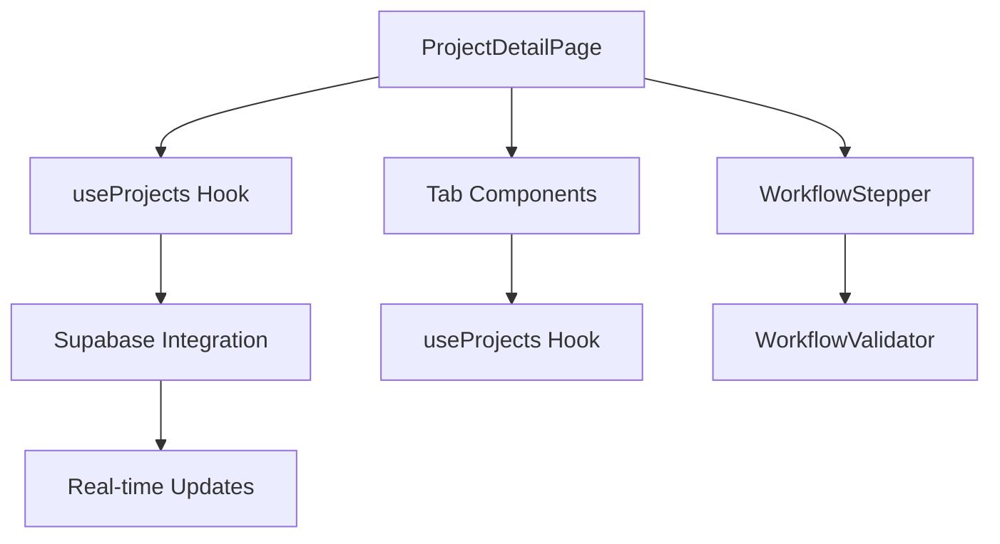

# Project Details Page Enhancement with Workflow Stepper

## 1. Overview

This document outlines the design for enhancing the Project Details Page to include a workflow stepper component that visualizes the project's current position in the workflow process. The enhancement will also improve data interaction capabilities, allowing users to update project information, reviews, documents, and communications in real-time.

### 1.1 Goals
- Implement a visual workflow stepper to show project progression through workflow stages
- Enable real-time data updates for project information, reviews, documents, and communications
- Improve UI/UX with consistent styling and intuitive navigation
- Maintain compatibility with existing Supabase data integration

### 11.2 Current State
The current Project Details Page displays project information using mock data in several tabs (Overview, Documents, Reviews, Supplier, Communication, Timeline, Analytics, Settings). The page needs to be enhanced to:
- Fetch and display real data from Supabase
- Enable interactive updates to project information
- Add a workflow stepper component to visualize project progression

## 2. Architecture

### 2.1 Component Structure
```
ProjectDetailPage
├── ProjectHeader
├── WorkflowStepper
├── NavigationSidebar
└── ContentArea
    ├── OverviewTab
    ├── DocumentsTab
    ├── ReviewsTab
    ├── SupplierTab
    ├── CommunicationTab
    ├── TimelineTab
    ├── AnalyticsTab
    └── SettingsTab
```

### 2.2 Data Flow


## 3. Workflow Stepper Component

### 3.1 Component Design
The WorkflowStepper will be a horizontal component displayed prominently at the top of the Project Details Page, showing all 8 workflow stages with visual indicators for:
- Current stage
- Completed stages
- Upcoming stages
- Validation status

### 3.2 Workflow Stages
Based on the database schema and existing implementation, the 8 workflow stages are:
1. Inquiry Received
2. Technical Review
3. Supplier RFQ Sent
4. Quoted
5. Order Confirmed
6. Procurement & Planning
7. In Production
8. Shipped & Closed

### 3.3 Visual Design
```tsx
// WorkflowStepper component structure
<WorkflowStepper>
  <Step 
    status="completed" 
    title="Inquiry Received" 
    icon={CheckCircle} 
  />
  <Step 
    status="current" 
    title="Technical Review" 
    icon={Play} 
  />
  <Step 
    status="pending" 
    title="Supplier RFQ Sent" 
    icon={Clock} 
  />
  {/* Additional steps... */}
</WorkflowStepper>
```

### 3.4 Interactive Features
- Click to view details of any stage
- Hover tooltips with stage descriptions
- Visual indicators for validation status
- Progress percentage indicator

## 4. Data Integration & Real-time Updates

### 4.1 Project Data
- Fetch real project data using the existing `useProjects` hook
- Replace mock data with actual Supabase data
- Implement real-time updates using Supabase subscriptions

### 4.2 Documents Management
- Integrate with `ProjectDocument` type from `@/types/project`
- Enable document upload, download, and deletion
- Implement document versioning controls

### 4.3 Reviews System
- Connect to review data using appropriate hooks
- Enable review status updates
- Allow adding comments to reviews

### 4.4 Communication System
- Integrate with existing `ProjectCommunication` component
- Enable real-time messaging
- Implement message threading

## 5. UI/UX Enhancements

### 5.1 Workflow Stepper Placement
- Positioned at the top of the page, below the header
- Full-width component with consistent styling
- Responsive design for different screen sizes

### 5.2 Visual Indicators
- Color-coded stages (using existing color scheme)
- Icons for different statuses (completed, current, pending)
- Progress bar showing overall completion

### 5.3 Navigation Improvements
- Maintain existing sidebar navigation
- Add quick navigation to relevant tabs from stepper
- Breadcrumbs for improved orientation

## 6. Implementation Plan

### 6.1 Phase 1: Core Component Development
1. Create `WorkflowStepper` component
2. Implement `Step` sub-component
3. Add status indicators and visual styling
4. Integrate with project data

### 6.2 Phase 2: Data Integration
1. Replace mock data with real Supabase data
2. Implement real-time updates
3. Connect to existing hooks (`useProjects`, etc.)
4. Add error handling and loading states

### 6.3 Phase 3: Interactive Features
1. Enable status updates through stepper
2. Implement validation using `WorkflowValidator`
3. Add tooltips and detailed stage information
4. Create stage transition controls

### 6.4 Phase 4: UI/UX Refinements
1. Implement responsive design
2. Add animations and transitions
3. Ensure accessibility compliance
4. Conduct cross-browser testing

## 7. API Endpoints & Hooks

### 7.1 Existing Hooks to Utilize
- `useProjects` - For project data and updates
- `useProjectUpdate` - For status updates
- `WorkflowValidator` - For validation logic

### 7.2 New Components
- `WorkflowStepper` - Main stepper component
- `Step` - Individual step component
- `StageDetails` - Detailed stage information panel

## 8. State Management

### 8.1 Component State
- `activeStage` - Currently selected stage
- `hoveredStage` - Stage being hovered over
- `expandedStage` - Stage with expanded details

### 8.2 Data Flow
- Project data flows from `useProjects` hook
- Updates are sent through `updateProjectStatusOptimistic`
- Validation results are handled through `WorkflowValidator`

## 9. Error Handling & Validation

### 9.1 Workflow Validation
- Use existing `WorkflowValidator` for status transitions
- Display validation errors in UI
- Prevent invalid status changes

### 9.2 Data Loading States
- Show loading indicators during data fetch
- Display error messages for failed operations
- Implement retry mechanisms

### 9.3 User Feedback
- Toast notifications for successful operations
- Inline error messages for form validation
- Visual feedback for interactive elements

## 10. Testing Strategy

### 10.1 Unit Tests
- Test `WorkflowStepper` component rendering
- Validate step status calculations
- Test interaction handlers

### 10.2 Integration Tests
- Test data flow between components
- Validate Supabase integration
- Test real-time update functionality

### 10.3 UI Tests
- Verify responsive design
- Test cross-browser compatibility
- Validate accessibility compliance

## 11. Performance Considerations

### 11.1 Data Fetching
- Implement efficient data fetching with caching
- Use pagination for large datasets
- Optimize real-time subscriptions

### 11.2 Rendering
- Implement virtualization for large lists
- Optimize component re-renders
- Use React.memo for performance

### 11.3 Bundle Size
- Code-split non-critical components
- Lazy load tab content
- Optimize image and asset loading