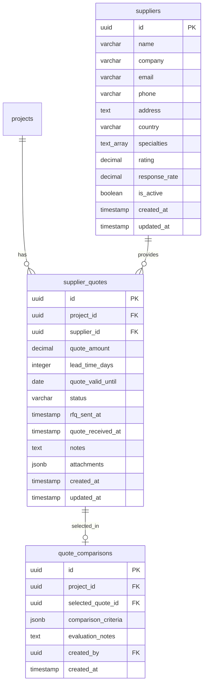
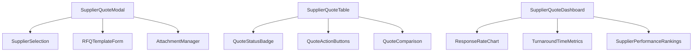
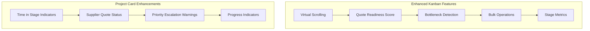
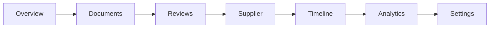
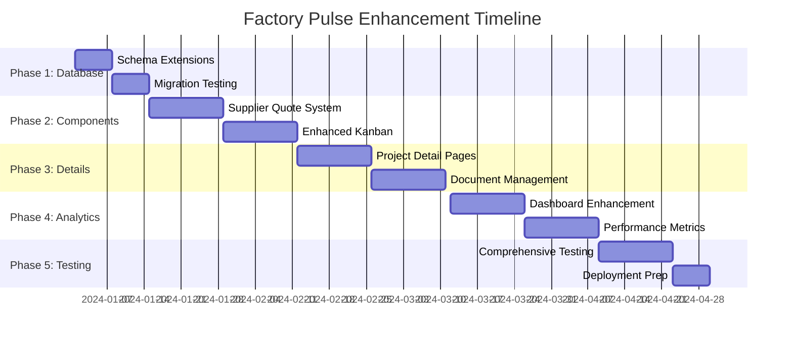

# Factory Pulse Enhancement Implementation Design

## Overview

This design document outlines the implementation strategy for enhancing the Factory Pulse manufacturing management system according to the specification. The implementation will transform the existing React + TypeScript + Supabase architecture into a comprehensive supplier RFQ tracking and workflow management platform while maintaining 100% backward compatibility.

## Technology Stack Analysis

### Current Foundation
- **Frontend**: React 18.3.1, TypeScript 5.8.3, Tailwind CSS 3.4.17
- **Backend**: Supabase (PostgreSQL database, Authentication, Real-time)
- **UI Components**: shadcn-ui components with custom enhancements
- **State Management**: React Context API with custom hooks
- **Build Tool**: Vite 5.4.19

### Architecture Strengths
- Existing 8-stage workflow system: `inquiry_received → technical_review → supplier_rfq_sent → quoted → order_confirmed → procurement_planning → in_production → shipped_closed`
- Robust role-based access control (RBAC) system
- Real-time data synchronization capabilities
- Drag & drop kanban functionality with @dnd-kit/core
- Existing document management system
- Legacy RFQ compatibility layer already implemented

## Implementation Strategy

### Phase 1: Database Schema Extensions (Week 1-2)

#### 1.1 Supplier Management System

**New Tables Design:**



**Database Migration Strategy:**
```sql
-- Additive-only schema changes - no existing tables modified
CREATE TABLE public.suppliers (
  id UUID PRIMARY KEY DEFAULT gen_random_uuid(),
  name VARCHAR(255) NOT NULL,
  company VARCHAR(255),
  email VARCHAR(255),
  phone VARCHAR(50),
  address TEXT,
  country VARCHAR(100),
  specialties TEXT[],
  rating DECIMAL(3,2) DEFAULT 0.0,
  response_rate DECIMAL(5,2) DEFAULT 0.0,
  is_active BOOLEAN DEFAULT true,
  created_at TIMESTAMP WITH TIME ZONE DEFAULT NOW(),
  updated_at TIMESTAMP WITH TIME ZONE DEFAULT NOW()
);

-- Enable Row Level Security following existing patterns
ALTER TABLE public.suppliers ENABLE ROW LEVEL SECURITY;

CREATE POLICY "Users can manage suppliers based on role" ON public.suppliers
  FOR ALL USING (
    has_role(auth.uid(), 'Management'::user_role) OR 
    has_role(auth.uid(), 'Procurement'::user_role)
  );
```

#### 1.2 Backward Compatibility Preservation

**RFQ to Project Compatibility:**
- Maintain existing `projects` table as primary data source
- Create database views for RFQ compatibility
- Preserve all existing status enum values
- Keep legacy status mapping functions intact

### Phase 2: Enhanced Frontend Components (Week 3-4)

#### 2.1 Supplier Quote Management Interface

**Component Architecture:**



**SupplierQuoteModal Component:**
```typescript
interface SupplierQuoteModalProps {
  project: Project;
  isOpen: boolean;
  onClose: () => void;
  onSuccess: () => void;
}

interface SupplierQuoteModalFeatures {
  multiSupplierSelection: boolean;
  rfqTemplateGeneration: boolean;
  emailNotificationSending: boolean;
  attachmentManagement: boolean;
  dueDateSetting: boolean;
}
```

**Enhanced Data Models:**
```typescript
interface SupplierQuote {
  id: string;
  projectId: string;
  supplierId: string;
  supplier: Supplier;
  quoteAmount: number;
  leadTimeDays: number;
  quoteValidUntil: string;
  status: 'sent' | 'received' | 'rejected' | 'accepted' | 'expired';
  rfqSentAt: string;
  quoteReceivedAt?: string;
  notes?: string;
  attachments: QuoteAttachment[];
  createdAt: string;
  updatedAt: string;
}

interface Supplier {
  id: string;
  name: string;
  company: string;
  email: string;
  phone?: string;
  address?: string;
  country?: string;
  specialties: string[];
  rating: number;
  responseRate: number;
  isActive: boolean;
}
```

#### 2.2 Enhanced Kanban Board System

**WorkflowKanban Enhancement Design:**



**Enhanced Project Card Features:**
```typescript
interface EnhancedProjectCard {
  // Existing features preserved
  projectId: string;        // P-25082001 format
  title: string;
  priority: ProjectPriority;
  daysInStage: number;
  customer: string;
  assignee: string;
  estimatedValue?: number;
  
  // New enhanced features
  quoteReadinessScore?: string;    // "3/5 quotes in – 2 pending"
  bottleneckWarning?: boolean;     // Show 🔥 icon if stuck
  riskCount?: number;              // Show ⚠️ 2 risks logged
  approvalStatus?: {
    engineering?: 'approved' | 'pending' | 'rejected';
    qa?: 'approved' | 'pending' | 'rejected';
    production?: 'approved' | 'pending' | 'rejected';
  };
  fileCount?: number;              // Show 📁 4 files
}
```

**Quote Readiness Scoring System:**
```typescript
interface QuoteReadinessIndicator {
  totalSuppliers: number;     // 5 suppliers contacted
  receivedQuotes: number;     // 3 quotes received  
  pendingQuotes: number;      // 2 pending
  overdueQuotes: number;      // 0 overdue
  
  // Visual: "3/5 quotes in – 2 pending" with progress bar
  // Color coding: 🟢 Green (ready), 🟡 Yellow (waiting), 🔴 Red (overdue)
}
```

### Phase 3: Enhanced Project Detail Interface (Week 5-6)

#### 3.1 Project Detail Page Architecture

**Navigation Structure:**


**Enhanced Supplier RFQ Tracking Section:**
```typescript
interface SupplierRFQTrackingSection {
  rfqSentDate: string;
  deadline: string;
  suppliers: SupplierQuoteStatus[];
  quoteReadinessScore: QuoteReadinessMetrics;
  
  // Action capabilities
  actions: [
    'resendRFQ',
    'addSupplier', 
    'setDeadline',
    'compareQuotes',
    'acceptQuote'
  ];
}

interface SupplierQuoteStatus {
  supplierId: string;
  name: string;                    // "Precision Metals Co."
  email: string;                   // "joe@precimetals.com"
  status: 'sent' | 'received' | 'overdue' | 'declined';
  quoteAmount?: number;            // $7.80/unit
  leadTime?: number;               // weeks
  responseDate?: string;
  deadline: string;                // "Due: Aug 25"
}
```

**Enhanced Document Management:**
```typescript
interface ProjectDocument {
  // Existing fields preserved
  id: string;
  filename: string;
  version: number;
  uploadedBy: string;
  uploadedAt: string;
  fileSize: number;
  
  // New enhanced features
  accessLevel: 'public' | 'internal_only' | 'confidential';
  documentType: 'drawing' | 'bom' | 'specification' | 'quote' | 'other';
  isLatestVersion: boolean;
  approvalStatus?: 'pending' | 'approved' | 'rejected';
  linkedToStage?: ProjectStatus;
}
```

### Phase 4: Analytics Dashboard Enhancement (Week 7-8)

#### 4.1 Dashboard Layout Design

**Analytics Dashboard Architecture:**

```mermaid
graph TB
    subgraph "KPI Cards"
        A[Avg RFQ Cycle Time] --> B[Win Rate]
        B --> C[Supplier Response Rate]
        C --> D[On-Time Delivery Rate]
    end
    
    subgraph "Analytics Panels"
        E[Lead Time Breakdown] --> F[Bottleneck Detection]
        F --> G[Supplier Performance Table]
        G --> H[Win/Loss Analysis]
    end
    
    subgraph "Visual Components"
        I[Timeline Charts] --> J[Bar Charts]
        J --> K[Pie Charts] 
        K --> L[Heatmaps]
    end
```


**Key Performance Indicators:**
```typescript
interface AnalyticsMetrics {
  // Core KPIs from wireframe specifications
  supplierResponseRate: number;     // Target: 90%
  averageCycleTime: number;         // 6.8 days
  winRate: number;                  // 48%
  onTimeDeliveryRate: number;       // 92%
  
  // Enhanced metrics
  rfqConversionRate: number;        // RFQ to won projects
  bottleneckStages: StageBottleneck[];
  costSavings: number;
  intakePortalMetrics: IntakePortalStats;
  
  // Lead time breakdown by phase
  leadTimeByPhase: {
    inquiry: number;              // 1.2 days
    review: number;               // 2.1 days
    supplierRFQ: number;          // 2.8 days (exceeds SLA)
    quoted: number;               // 0.7 days
    order: number;                // 0.0 days
  };
}
```

**Bottleneck Detection System:**
```typescript
interface BottleneckAlert {
  type: '🔥 Bottlenecks Detected';
  issues: string[];               // ['Supplier RFQ phase exceeds SLA', '3 RFQs delayed due to missing drawings']
  severity: 'warning' | 'critical';
  affectedProjects: string[];
  recommendedActions: string[];
}
```

### Phase 5: Custom Hooks Enhancement (Week 9-10)

#### 5.1 Enhanced Data Management Hooks

**useSupplierQuotes Hook:**
```typescript
interface UseSupplierQuotesReturn {
  quotes: SupplierQuote[];
  loading: boolean;
  error: string | null;
  
  // CRUD operations
  createQuote: (quoteData: CreateSupplierQuoteRequest) => Promise<SupplierQuote>;
  updateQuote: (quoteId: string, updates: Partial<SupplierQuote>) => Promise<SupplierQuote>;
  deleteQuote: (quoteId: string) => Promise<boolean>;
  
  // Quote management
  sendRFQToSuppliers: (projectId: string, supplierIds: string[]) => Promise<boolean>;
  acceptQuote: (quoteId: string) => Promise<boolean>;
  compareQuotes: (projectId: string) => Promise<QuoteComparison>;
  
  // Real-time subscriptions
  subscribeToQuoteUpdates: (projectId: string) => () => void;
}
```

**useSuppliers Hook:**
```typescript
interface UseSuppliersReturn {
  suppliers: Supplier[];
  loading: boolean;
  error: string | null;
  
  // Supplier management
  createSupplier: (supplierData: CreateSupplierRequest) => Promise<Supplier>;
  updateSupplier: (supplierId: string, updates: Partial<Supplier>) => Promise<Supplier>;
  
  // Performance tracking
  getSupplierPerformance: (supplierId: string) => Promise<SupplierPerformanceMetrics>;
  searchSuppliers: (criteria: SupplierSearchCriteria) => Promise<Supplier[]>;
  
  // Analytics
  getSupplierAnalytics: () => Promise<SupplierAnalytics>;
}
```

#### 5.2 Enhanced Project Management Hook

**Extended useProjects Hook:**
```typescript
interface UseProjectsEnhanced extends UseProjectsExisting {
  // Existing functionality preserved
  projects: Project[];
  loading: boolean;
  error: string | null;
  updateProjectStatus: (projectId: string, newStatus: ProjectStatus) => Promise<boolean>;
  
  // New supplier quote integration
  getProjectQuotes: (projectId: string) => Promise<SupplierQuote[]>;
  getQuoteReadinessScore: (projectId: string) => Promise<QuoteReadinessIndicator>;
  
  // Enhanced analytics
  getProjectAnalytics: (projectId: string) => Promise<ProjectAnalytics>;
  detectBottlenecks: () => Promise<BottleneckAlert[]>;
  
  // Workflow optimization
  getProjectTimeline: (projectId: string) => Promise<ProjectTimeline>;
  getCriticalPath: (projectId: string) => Promise<string[]>;
}
```

### Phase 6: Theme System Implementation (Week 11-12)

#### 6.1 Dark/Light Mode Theme System

**Theme Configuration:**
```typescript
interface ThemeSystemConfiguration {
  lightTheme: {
    '--bg-primary': '#ffffff';
    '--bg-card': '#f8f9fa';
    '--text-primary': '#1a1a1a';
    '--text-secondary': '#6b7280';
    '--accent-primary': '#3b82f6';
    '--accent-secondary': '#10b981';
    '--border': '#e5e7eb';
    '--shadow': '0 1px 3px rgba(0, 0, 0, 0.1)';
  };
  
  darkTheme: {
    '--bg-primary': '#121212';
    '--bg-card': '#1e1e1e';
    '--text-primary': '#e0e0e0';
    '--text-secondary': '#9ca3af';
    '--accent-primary': '#03dac6';
    '--accent-secondary': '#bb86fc';
    '--border': '#374151';
    '--shadow': '0 2px 4px rgba(0, 0, 0, 0.3)';
  };
}
```

**Enhanced Priority Color System:**
```typescript
interface PriorityColorEnhancements {
  urgent: {
    light: { bg: '#fee2e2', text: '#dc2626', border: '#fca5a5' };
    dark: { bg: '#7f1d1d', text: '#fca5a5', glow: true };
  };
  high: {
    light: { bg: '#fef3c7', text: '#d97706', border: '#fbbf24' };
    dark: { bg: '#78350f', text: '#fbbf24', glow: true };
  };
  medium: {
    light: { bg: '#dbeafe', text: '#2563eb', border: '#93c5fd' };
    dark: { bg: '#1e3a8a', text: '#93c5fd', glow: false };
  };
  low: {
    light: { bg: '#dcfce7', text: '#16a34a', border: '#86efac' };
    dark: { bg: '#14532d', text: '#86efac', glow: false };
  };
}
```

## API Design

### Supplier Quote Management Endpoints

```typescript
// RESTful API design following existing patterns
interface SupplierQuoteEndpoints {
  // Project quote management
  'GET /api/projects/:id/quotes': GetProjectQuotesResponse;
  'POST /api/projects/:id/quotes': CreateSupplierQuotesRequest;
  'PUT /api/quotes/:id': UpdateSupplierQuoteRequest;
  'POST /api/quotes/:id/accept': AcceptQuoteRequest;
  
  // Supplier management  
  'GET /api/suppliers': GetSuppliersResponse;
  'POST /api/suppliers': CreateSupplierRequest;
  'PUT /api/suppliers/:id': UpdateSupplierRequest;
  'GET /api/suppliers/:id/performance': GetSupplierPerformanceResponse;
  
  // Analytics endpoints
  'GET /api/analytics/dashboard': GetAnalyticsDashboardResponse;
  'GET /api/analytics/suppliers': GetSupplierAnalyticsResponse;
  'GET /api/analytics/workflow': GetWorkflowAnalyticsResponse;
}
```

### Real-time Update System

```typescript
interface RealTimeUpdates {
  // Project updates (existing pattern extended)
  projectUpdates: {
    channel: 'project_updates';
    events: ['INSERT', 'UPDATE', 'DELETE'];
    tables: ['projects', 'supplier_quotes'];
  };
  
  // Supplier quote updates (new)
  supplierQuoteUpdates: {
    channel: 'supplier_quote_updates';
    events: ['quote_received', 'quote_expired', 'rfq_sent'];
    payload: SupplierQuoteUpdate;
  };
  
  // Notification system (new)
  notifications: {
    channel: 'user_notifications';
    events: ['new_notification', 'notification_read'];
    payload: NotificationUpdate;
  };
}
```

## Performance Optimization Strategy

### Database Optimization

```sql
-- Additive-only performance indexes
CREATE INDEX CONCURRENTLY IF NOT EXISTS idx_projects_status_enhanced 
  ON public.projects(status, created_at);
  
CREATE INDEX CONCURRENTLY IF NOT EXISTS idx_supplier_quotes_project_status 
  ON public.supplier_quotes(project_id, status);
  
CREATE INDEX CONCURRENTLY IF NOT EXISTS idx_supplier_quotes_deadline 
  ON public.supplier_quotes(quote_valid_until) 
  WHERE status IN ('sent', 'received');

-- Materialized views for analytics
CREATE MATERIALIZED VIEW project_analytics_summary AS
SELECT 
  status,
  COUNT(*) as project_count,
  AVG(days_in_stage) as avg_days_in_stage,
  AVG(estimated_value) as avg_value,
  COUNT(*) FILTER (WHERE days_in_stage > 14) as bottleneck_count
FROM projects 
WHERE created_at >= NOW() - INTERVAL '90 days'
GROUP BY status;
```

### Frontend Performance

```typescript
interface FrontendOptimization {
  // Virtual scrolling for large datasets
  virtualScrolling: {
    kanbanColumns: '@tanstack/react-virtual';
    projectTables: 'windowing';
    supplierLists: 'lazy-loading';
  };
  
  // React optimization patterns
  memoization: {
    expensiveCalculations: 'useMemo';
    componentRender: 'React.memo';
    callbackStability: 'useCallback';
  };
  
  // Data fetching optimization
  queryOptimization: {
    batching: 'dataloader-pattern';
    caching: 'react-query';
    prefetching: 'background-updates';
  };
}
```

## Security Implementation

### Row Level Security Enhancements

```sql
-- Enhanced RLS policies for new tables
CREATE POLICY "supplier_access_policy" ON public.suppliers
  FOR ALL TO authenticated
  USING (
    has_role(auth.uid(), 'Management'::user_role) OR
    has_role(auth.uid(), 'Procurement'::user_role) OR
    has_role(auth.uid(), 'Procurement_Owner'::user_role)
  );

CREATE POLICY "supplier_quote_access_policy" ON public.supplier_quotes
  FOR ALL TO authenticated
  USING (
    EXISTS (
      SELECT 1 FROM public.projects p
      WHERE p.id = supplier_quotes.project_id 
      AND (
        has_role(auth.uid(), 'Management'::user_role) OR 
        has_role(auth.uid(), 'Procurement'::user_role) OR 
        p.assignee_id = auth.uid()
      )
    )
  );
```

### Data Validation

```typescript
interface DataValidationStrategy {
  // Input sanitization
  inputValidation: {
    supplierData: 'zod-schema';
    quoteData: 'strict-typing';
    fileUploads: 'type-checking';
  };
  
  // API security
  apiSecurity: {
    authentication: 'supabase-jwt';
    authorization: 'role-based';
    rateLimiting: 'request-throttling';
  };
  
  // Data integrity
  dataIntegrity: {
    foreignKeys: 'database-constraints';
    enumValidation: 'type-safety';
    nullChecks: 'non-null-assertions';
  };
}
```

## Testing Strategy

### Test Coverage Plan

```typescript
interface TestingStrategy {
  // Unit testing (>80% coverage target)
  unitTests: {
    components: 'react-testing-library';
    hooks: 'react-hooks-testing-library';
    utilities: 'jest';
    types: 'typescript-compiler';
  };
  
  // Integration testing (>70% coverage target)
  integrationTests: {
    apiEndpoints: 'supertest';
    databaseOperations: 'pg-test';
    authenticationFlow: 'supabase-test-client';
    realTimeUpdates: 'websocket-testing';
  };
  
  // End-to-end testing
  e2eTests: {
    criticalUserJourneys: 'cypress';
    crossBrowserTesting: 'browserstack';
    performanceTesting: 'lighthouse';
    accessibilityTesting: 'axe-core';
  };
  
  // Backward compatibility validation
  regressionTests: {
    existingWorkflows: 'cypress-regression-suite';
    apiCompatibility: 'contract-testing';
    dataIntegrity: 'database-testing';
  };
}
```

### Validation Checklist

```typescript
interface ValidationChecklist {
  backwardCompatibility: {
    ✅: 'All existing RFQ workflows continue working';
    ✅: 'Legacy status mapping preserved';
    ✅: 'Existing API endpoints remain functional';
    ✅: 'Database schema backwards compatible';
    ✅: 'Component interfaces unchanged';
  };
  
  performance: {
    ✅: 'Page load times <2s maintained';
    ✅: 'Database queries optimized';
    ✅: 'Real-time updates performance preserved';
    ✅: 'Memory usage within acceptable limits';
  };
  
  security: {
    ✅: 'RLS policies properly configured';
    ✅: 'Input validation comprehensive';
    ✅: 'Authentication flow secure';
    ✅: 'Data encryption maintained';
  };
}
```

## Implementation Timeline

### 14-Week Development Plan



### Success Metrics

```typescript
interface SuccessMetrics {
  // Operational improvements
  supplierResponseRate: {
    current: '60%';
    target: '90%';
    measurement: 'weekly-tracking';
  };
  
  projectCycleTime: {
    current: '9.0 days';
    target: '6.8 days';
    improvement: '25% reduction';
  };
  
  // User adoption
  featureAdoption: {
    procurementTeam: '80% daily usage target';
    supplierQuoteSystem: '100% RFQ workflows';
    enhancedKanban: '90% project tracking';
  };
  
  // Technical performance
  systemPerformance: {
    pageLoadTime: '<2s maintained';
    dataAccuracy: '99%+ project status accuracy';
    uptimeTarget: '99.9% availability';
  };
  
  // Backward compatibility
  compatibilityValidation: {
    existingWorkflows: '100% functional';
    dataIntegrity: '0% data loss';
    performanceRegression: '0% degradation';
  };
}
```

This implementation design maintains the existing codebase strengths while systematically adding the enhanced features specified in the Factory Pulse Enhancement plan. The phased approach ensures minimal disruption to current operations while providing immediate value through improved supplier quote management and workflow optimization.