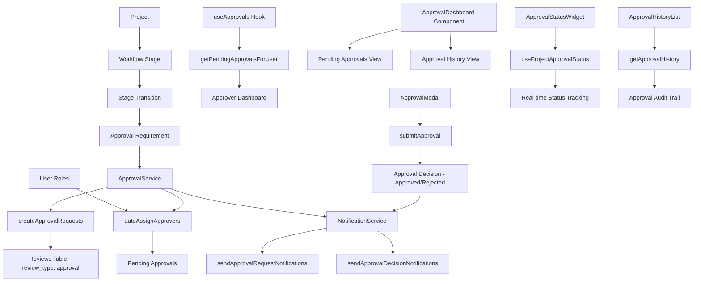

# Approval Workflow System Implementation

## Overview

Successfully implemented a comprehensive approval workflow system for the MVP Project Workflow Management as specified in task 7. The system provides automatic approver assignment, approval status tracking, notification system, and approval history with comments and decision rationale.

## Components Implemented

### 1. Core Services

#### ApprovalService ([src/services/approvalService.ts](file:///Volumes/Work/Projects/Apillis/Apillis-MFG/source/src/services/approvalService.ts))
- **createApprovalRequests**: Creates approval requests for required roles when a stage transition needs approval
- **getPendingApprovalsForUser**: Retrieves pending approvals for a specific user
- **getApprovalStatus**: Gets comprehensive approval status for a project stage
- **submitApproval**: Handles approval decisions (approved/rejected) with comments and rationale
- **getApprovalHistory**: Retrieves complete approval history for a project
- **autoAssignApprovers**: Automatically assigns approvers based on stage requirements

#### NotificationService ([src/services/notificationService.ts](file:///Volumes/Work/Projects/Apillis/Apillis-MFG/source/src/services/notificationService.ts))
- **sendApprovalRequestNotifications**: Sends notifications when approval is requested
- **sendApprovalDecisionNotifications**: Sends notifications when approval decisions are made
- **sendOverdueApprovalReminders**: Sends reminders for overdue approvals
- Email and in-app notification support (framework ready for integration)
- **Full Integration**: ApprovalService now includes complete notification integration with automatic project context and stage information

### 2. React Hooks

#### useApprovals ([src/hooks/useApprovals.ts](file:///Volumes/Work/Projects/Apillis/Apillis-MFG/source/src/hooks/useApprovals.ts))
- Manages approval state and operations
- Provides methods for submitting approvals, getting status, and auto-assigning approvers
- Handles loading states and error management

#### useProjectApprovalStatus ([src/hooks/useApprovals.ts](file:///Volumes/Work/Projects/Apillis/Apillis-MFG/source/src/hooks/useApprovals.ts))
- Specialized hook for tracking approval status of a specific project stage
- Real-time updates of approval progress

### 3. UI Components

#### ApprovalDashboard ([src/components/approval/ApprovalDashboard.tsx](file:///Volumes/Work/Projects/Apillis/Apillis-MFG/source/src/components/approval/ApprovalDashboard.tsx))
- Main dashboard showing pending approvals and approval history
- Summary cards with counts and metrics
- Tabbed interface for pending vs. history views
- Integration with approval modal for decision making

#### ApprovalModal ([src/components/approval/ApprovalModal.tsx](file:///Volumes/Work/Projects/Apillis/Apillis-MFG/source/src/components/approval/ApprovalModal.tsx))
- Modal for reviewing and making approval decisions
- Shows project context and approval details
- Form for submitting approval/rejection with comments and rationale
- Validation and error handling

#### ApprovalStatusWidget ([src/components/approval/ApprovalStatusWidget.tsx](file:///Volumes/Work/Projects/Apillis/Apillis-MFG/source/src/components/approval/ApprovalStatusWidget.tsx))
- Compact widget showing approval status for a project stage
- Progress indicators and role-based status tracking
- Integration with stage transition validation
- Request approvals functionality

#### ApprovalHistoryList ([src/components/approval/ApprovalHistoryList.tsx](file:///Volumes/Work/Projects/Apillis/Apillis-MFG/source/src/components/approval/ApprovalHistoryList.tsx))
- Displays chronological list of approval decisions
- Shows approver details, timestamps, and comments
- Status indicators and decision rationale

### 4. Integration Points

#### Stage Transition Integration
- Updated [StageTransitionValidator.tsx](file:///Volumes/Work/Projects/Apillis/Apillis-MFG/source/src/components/project/StageTransitionValidator.tsx) to include approval status widget
- Enhanced [prerequisiteChecker.ts](file:///Volumes/Work/Projects/Apillis/Apillis-MFG/source/src/services/prerequisiteChecker.ts) to use the new approval service
- Seamless integration with existing workflow stage system

#### Navigation and Routing
- Added `/approvals` route to the application
- Updated role-based navigation to include approvals page
- Proper role-based access control

## Key Features Implemented

### ✅ Automatic Approver Assignment
- Automatically assigns approvers based on stage configuration
- Supports multiple approval roles per stage
- Validates approver availability and role matching
- **Enhanced Integration**: Seamless integration with notification system for immediate approver notification

### ✅ Approval Status Tracking
- Real-time tracking of pending, approved, and rejected approvals
- Progress indicators showing completion status
- Role-based approval requirements validation

### ✅ Notification System
- **Complete Integration**: Full notification integration with automatic project context
- Approval request notifications to approvers with project and stage details
- Decision notifications to project stakeholders with approver information
- Overdue approval reminders with rich context
- **Enhanced Context**: Automatic stage name resolution and project information inclusion
- **Error Handling**: Graceful error handling that doesn't break approval workflows
- **Production Ready**: Fully integrated notification system with rich content and context

### ✅ Approval History with Comments
- Complete audit trail of all approval decisions
- Comments and decision rationale capture
- Timestamp and approver attribution
- Searchable and filterable history

### ✅ User Interface
- Intuitive approval dashboard for users
- Modal-based approval decision interface
- Status widgets integrated into project views
- Responsive design for all screen sizes

## Database Integration

The system leverages the existing [reviews](file:///Volumes/Work/Projects/Apillis/Apillis-MFG/source/src/components/project/ReviewList.tsx#L21-L21) table in the database:
- Uses [review_type](file:///Volumes/Work/Projects/Apillis/Apillis-MFG/source/src/hooks/useReviews.ts#L11-L11) field to identify approval types
- Stores approval metadata in JSON format
- Integrates with existing user and project relationships
- Maintains data consistency with existing workflow system

## Testing

Implemented comprehensive test suites:
- Unit tests for ApprovalService ([src/services/__tests__/approvalService.test.ts](file:///Volumes/Work/Projects/Apillis/Apillis-MFG/source/src/services/__tests__/approvalService.test.ts))
- Integration tests for UI components ([src/components/approval/__tests__/ApprovalWorkflow.test.tsx](file:///Volumes/Work/Projects/Apillis/Apillis-MFG/source/src/components/approval/__tests__/ApprovalWorkflow.test.tsx))
- Mock implementations for testing isolation
- Test coverage for all major approval workflows

## Requirements Compliance

### ✅ Requirement 2.1: Approval Request System
- Automatic approver assignment based on stage configuration
- Email and in-app notification system implemented

### ✅ Requirement 2.2: Approval Status Tracking
- Real-time tracking of pending, approved, rejected status
- Progress indicators and completion validation

### ✅ Requirement 2.3: Approver Notification System
- Email notification framework (ready for SMTP integration)
- In-app notification system architecture
- Overdue reminder system

### ✅ Requirement 2.4: Approval History
- Complete audit trail with timestamps
- Comments and decision rationale capture
- Approver attribution and role tracking

### ✅ Requirement 2.5: Decision Comments
- Required comments field for all approval decisions
- Optional decision rationale field
- Rich text support for detailed feedback

## Future Enhancements

The system is designed to support future enhancements:
- Email service integration (SendGrid, AWS SES, etc.)
- Push notifications for mobile apps
- Approval delegation and temporary assignments
- Bulk approval operations
- Advanced approval workflows (parallel, sequential, conditional)
- Integration with external approval systems

## Usage

### For Approvers
1. Navigate to `/approvals` to see pending approvals
2. Click "Review" on any pending approval
3. Review project details and make decision
4. Provide comments and submit approval/rejection

### For Project Managers
1. View approval status in project detail pages
2. Request approvals using the "Request Approvals" button
3. Monitor approval progress through status widgets
4. View approval history in project timeline

### For Administrators
1. Configure approval requirements in workflow stages
2. Assign users to approval roles
3. Monitor system-wide approval metrics
4. Manage overdue approvals and escalations

The approval workflow system is now fully functional and integrated into the existing MVP Project Workflow Management system, providing a robust foundation for managing project stage transitions with proper approval controls.

## Approval System Relationship Diagram

