# Factory Pulse Architecture Diagrams

**Generated:** September 2, 2025  
**Version:** 1.0  
**System:** Factory Pulse Manufacturing Execution System (MES)

---

## Table of Contents

1. [System Overview](#system-overview)
2. [Database Schema Relationships](#database-schema-relationships)
3. [Component Architecture](#component-architecture)
4. [Data Flow Patterns](#data-flow-patterns)
5. [Project Workflow Management](#project-workflow-management)
6. [Approval System Flow](#approval-system-flow)
7. [Authentication & Authorization](#authentication--authorization)
8. [Service Layer Architecture](#service-layer-architecture)
9. [Real-time Communication](#real-time-communication)
10. [Error Handling & Recovery](#error-handling--recovery)

---

## System Overview

### High-Level System Architecture

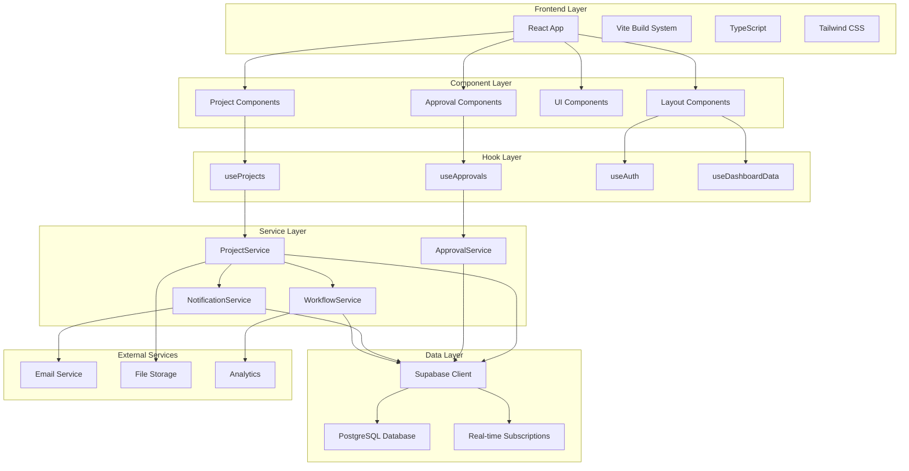

---

## Database Schema Relationships

### Core Entity Relationships

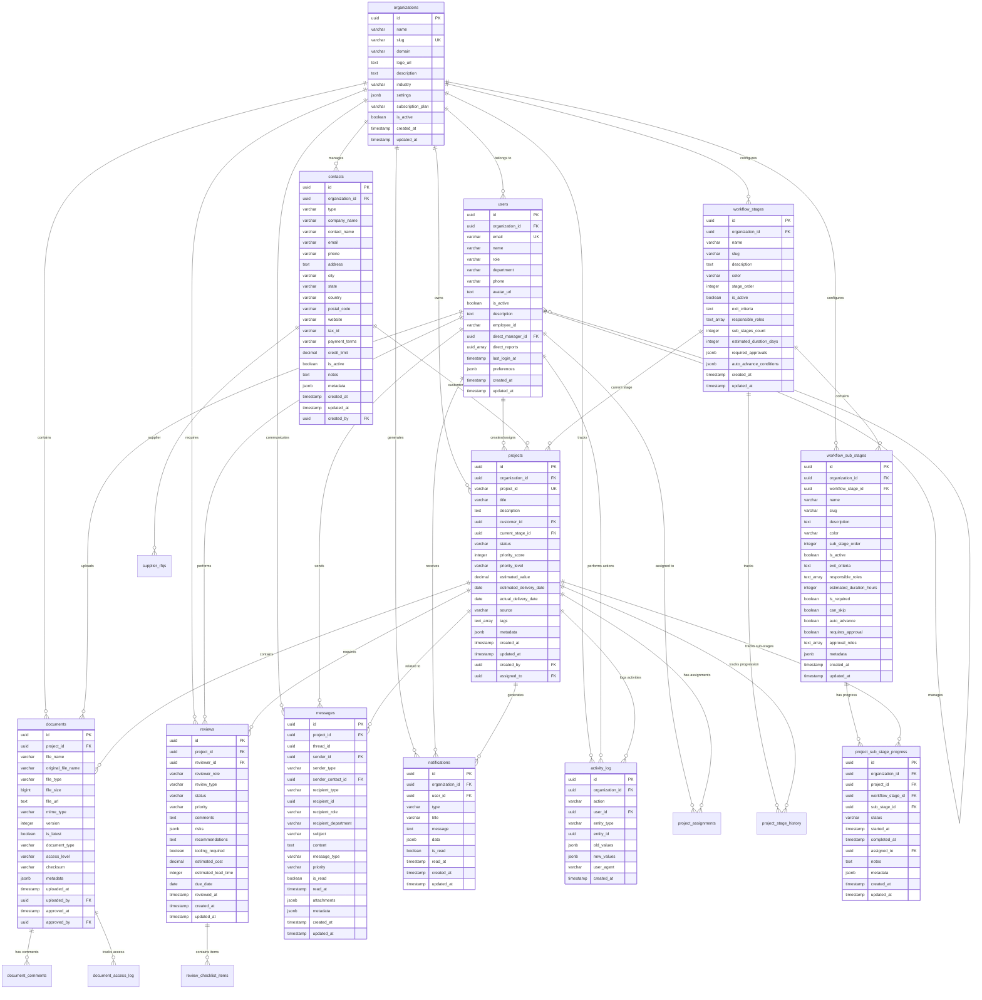

---

## Component Architecture

### React Component Hierarchy

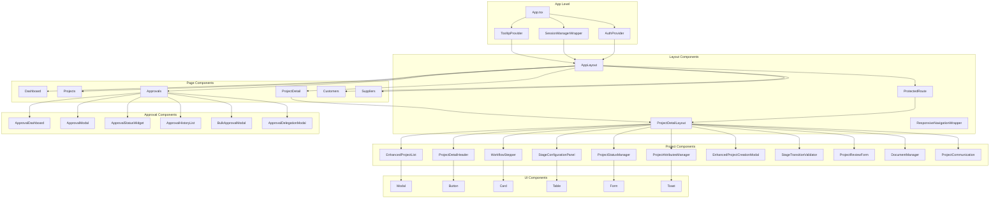

### Component Data Flow

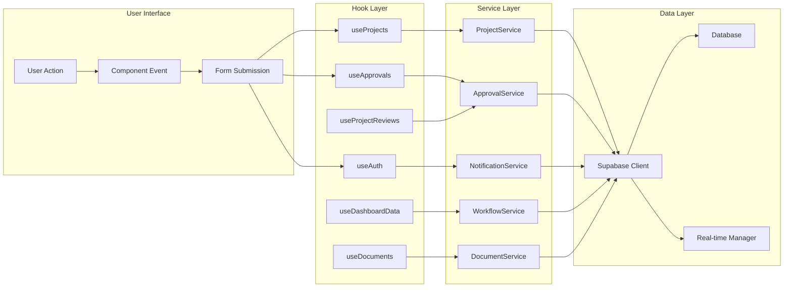

---

## Data Flow Patterns

### Project CRUD Operations

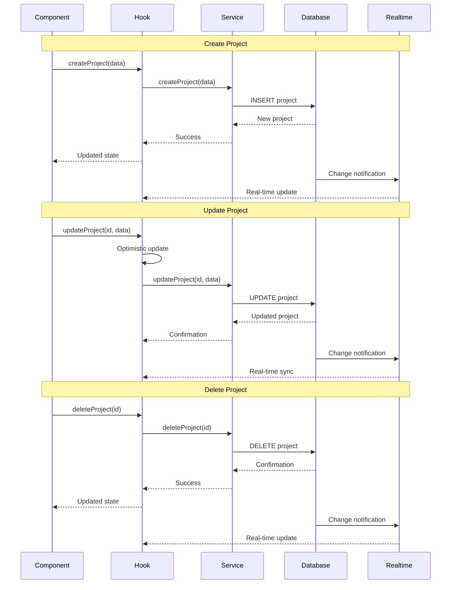

### Real-time Synchronization

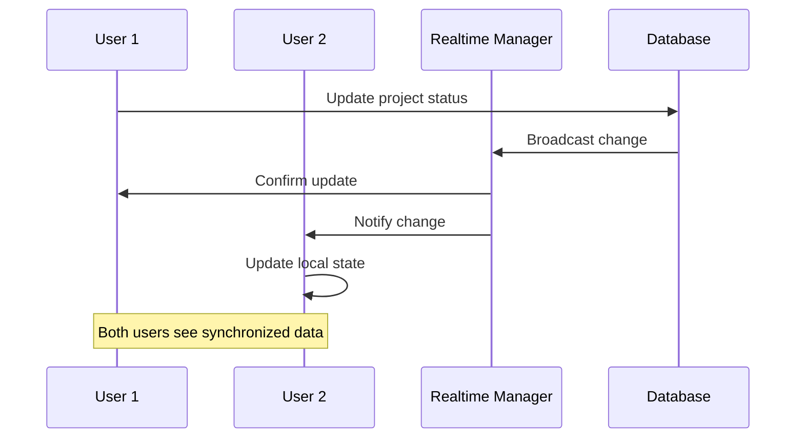

### Error Handling Flow

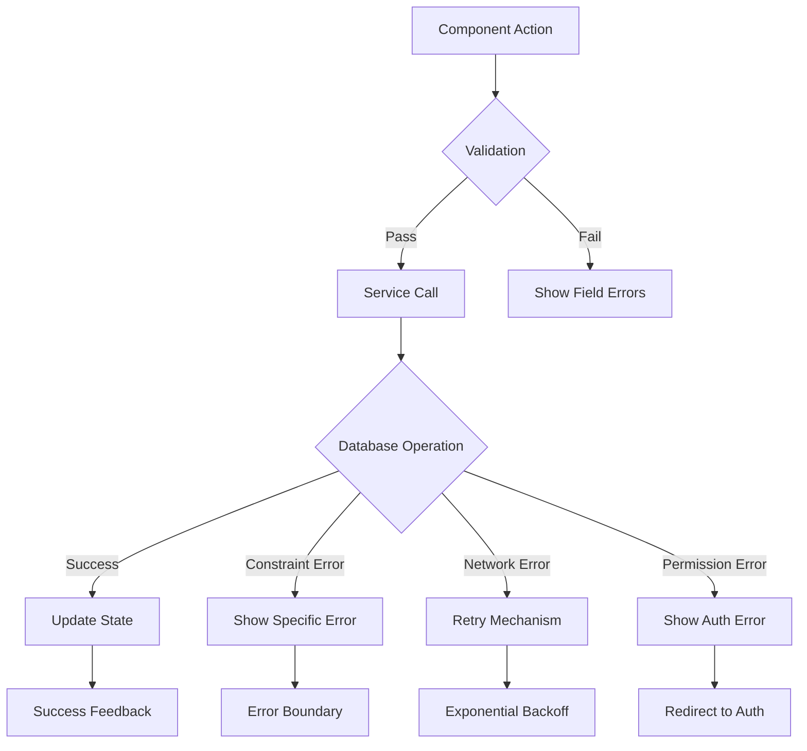

---

## Project Workflow Management

### Workflow Stage System

```mermaid
graph LR
    A[Inquiry Received] --> B[Technical Review]
    B --> C[Supplier RFQ Sent]
    C --> D[Quoted]
    D --> E[Order Confirmed]
    E --> F[Procurement Planning]
    F --> G[In Production]
    G --> H[Shipped & Closed]
    
    style A fill:#3B82F6
    style B fill:#F59E0B
    style C fill:#8B5CF6
    style D fill:#10B981
    style E fill:#6366F1
    style F fill:#8B5CF6
    style G fill:#84CC16
    style H fill:#6B7280
```

### Sub-Stage Workflow Detail

```mermaid
graph TB
    subgraph "Inquiry Received"
        A1[RFQ Documentation Review]
        A2[Initial Feasibility Assessment]
        A3[Customer Requirements Clarification]
    end
    
    subgraph "Technical Review"
        B1[Engineering Technical Review]
        B2[QA Requirements Review]
        B3[Production Capability Assessment]
        B4[Cross-Team Meeting]
    end
    
    subgraph "Supplier RFQ Sent"
        C1[Supplier Identification]
        C2[RFQ Preparation]
        C3[RFQ Distribution]
        C4[Supplier Response Collection]
    end
    
    subgraph "Quoted"
        D1[Cost Analysis]
        D2[Quote Preparation]
        D3[Quote Review and Approval]
        D4[Quote Submission]
    end
    
    subgraph "Order Confirmed"
        E1[Customer PO Review]
        E2[Contract Finalization]
        E3[Production Planning Initiation]
    end
    
    subgraph "Procurement Planning"
        F1[BOM Finalization]
        F2[Purchase Order Issuance]
        F3[Material Planning]
        F4[Production Schedule Confirmation]
    end
    
    subgraph "In Production"
        G1[Manufacturing Setup]
        G2[Assembly Process]
        G3[Quality Control Testing]
        G4[Final Assembly and Packaging]
    end
    
    subgraph "Shipped & Closed"
        H1[Shipping Preparation]
        H2[Product Delivery]
        H3[Project Documentation]
        H4[Project Closure]
    end
    
    A1 --> A2 --> A3
    B1 --> B2 --> B3 --> B4
    C1 --> C2 --> C3 --> C4
    D1 --> D2 --> D3 --> D4
    E1 --> E2 --> E3
    F1 --> F2 --> F3 --> F4
    G1 --> G2 --> G3 --> G4
    H1 --> H2 --> H3 --> H4
```

### Stage Transition Logic

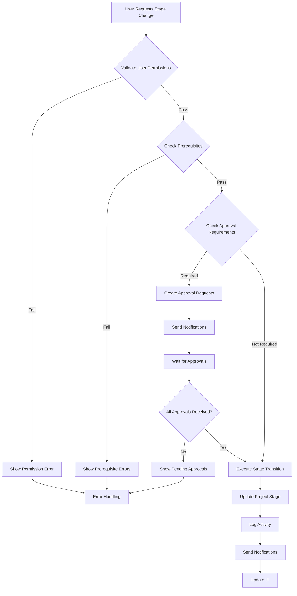

---

## Approval System Flow

### Approval Request Creation

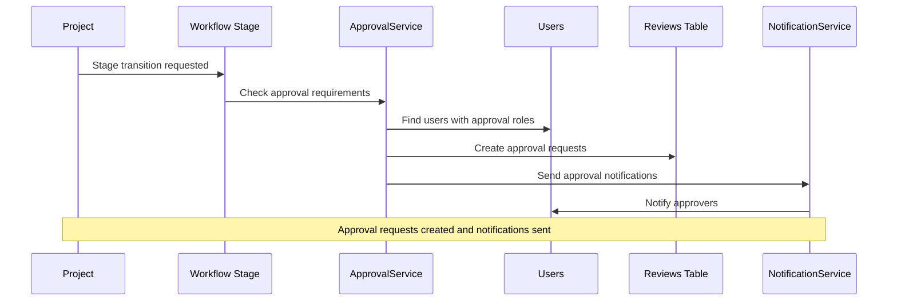

### Approval Decision Flow

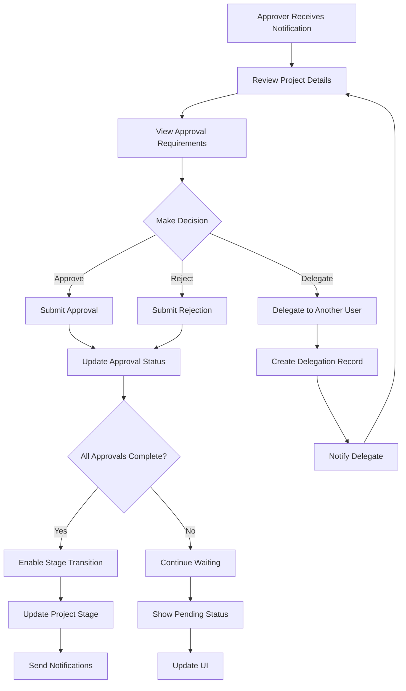

### Approval System Architecture

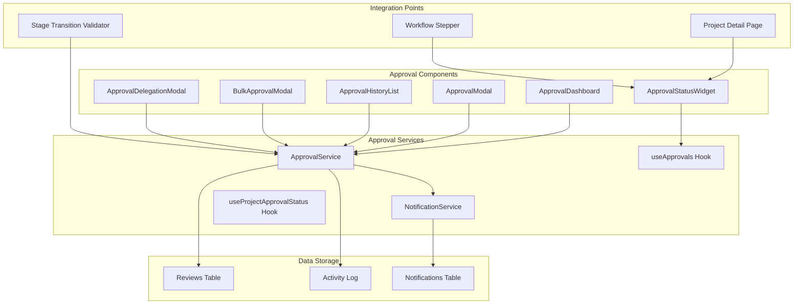

---

## Authentication & Authorization

### Authentication Flow

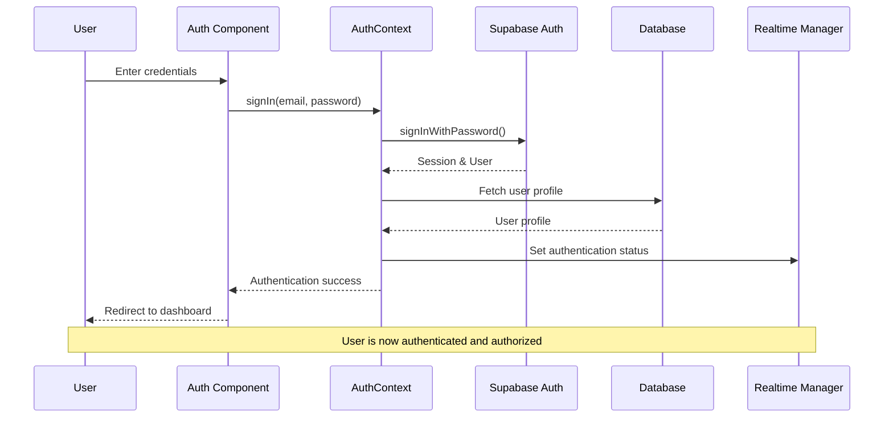

### Role-Based Access Control

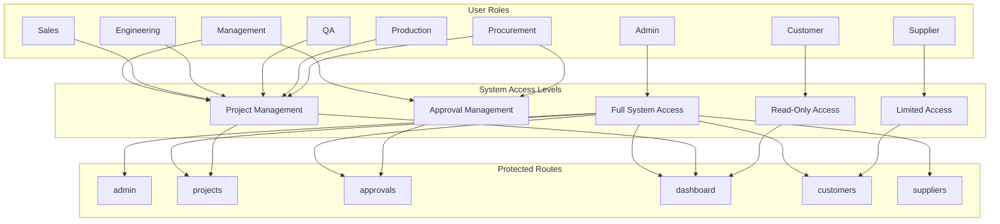

### Session Management

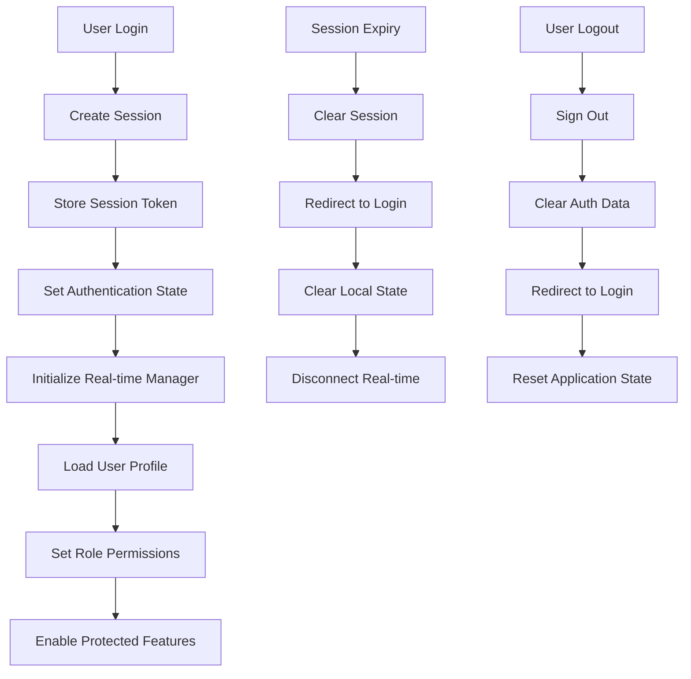

---

## Service Layer Architecture

### Service Dependencies

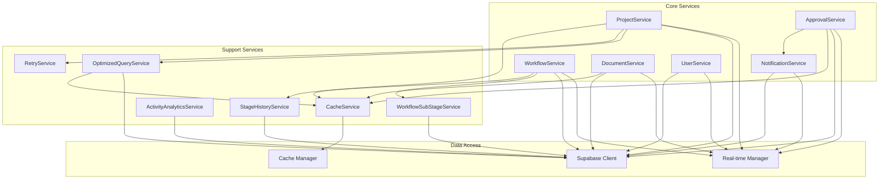

### Service Method Relationships

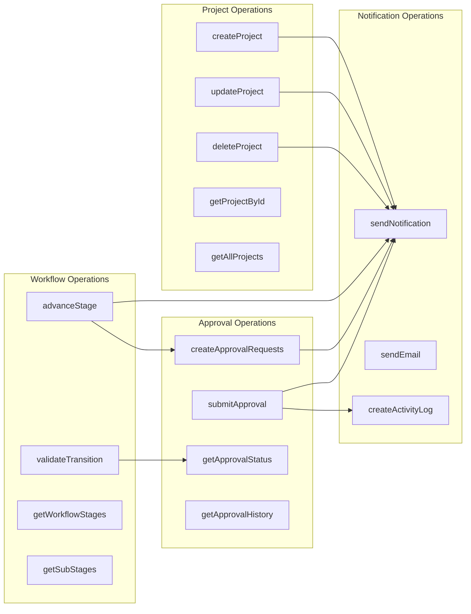

---

## Real-time Communication

### Real-time Manager Architecture

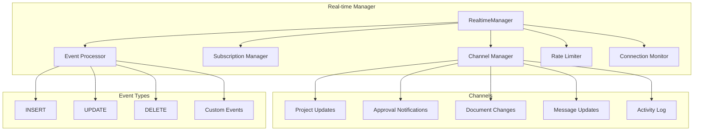

### Real-time Event Flow

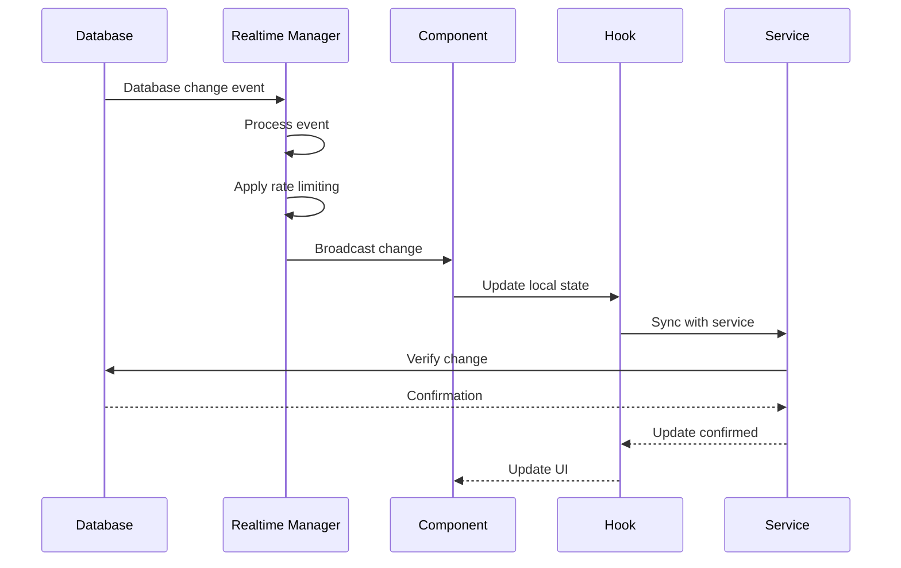

---

## Error Handling & Recovery

### Error Handling Architecture

```mermaid
graph TD
    A[Error Occurs] --> B{Error Type}
    
    B -->|Validation Error| C[Show Field Errors]
    B -->|Network Error| D[Retry with Backoff]
    B -->|Permission Error| E[Redirect to Auth]
    B -->|Database Error| F[Show Database Error]
    B -->|System Error| G[Show Generic Error]
    
    C --> H[User Corrects Input]
    D --> I{Retry Success?}
    I -->|Yes| J[Continue Operation]
    I -->|No| K[Show Error Message]
    
    E --> L[User Re-authenticates]
    F --> M[Log Error Details]
    G --> N[Show Error Boundary]
    
    H --> O[Retry Operation]
    J --> P[Success Flow]
    K --> Q[Error Recovery]
    L --> R[Resume Operation]
    M --> S[Error Logging]
    N --> T[Graceful Degradation]
```

### Recovery Mechanisms

```mermaid
graph LR
    subgraph "Error Recovery"
        A[Automatic Retry]
        B[Exponential Backoff]
        C[Fallback Data]
        D[Offline Mode]
        E[Error Boundaries]
        F[Graceful Degradation]
    end
    
    subgraph "User Recovery"
        G[Manual Retry]
        H[Refresh Page]
        I[Clear Cache]
        J[Re-authenticate]
        K[Contact Support]
    end
    
    subgraph "System Recovery"
        L[Connection Recovery]
        M[State Synchronization]
        N[Cache Invalidation]
        O[Service Restart]
    end
    
    A --> B
    B --> C
    C --> D
    D --> E
    E --> F
    
    G --> H
    H --> I
    I --> J
    J --> K
    
    L --> M
    M --> N
    N --> O
```

---

## Summary

This comprehensive architecture diagram set provides a complete view of the Factory Pulse Manufacturing Execution System, covering:

1. **System Overview**: High-level architecture showing frontend, component, hook, service, and data layers
2. **Database Schema**: Complete entity relationships with all tables and their connections
3. **Component Architecture**: React component hierarchy and data flow patterns
4. **Data Flow**: CRUD operations, real-time synchronization, and error handling
5. **Project Workflow**: 8-stage workflow system with sub-stages and transition logic
6. **Approval System**: Complete approval workflow with request creation, decision flow, and integration
7. **Authentication**: User authentication, role-based access control, and session management
8. **Service Layer**: Service dependencies and method relationships
9. **Real-time Communication**: Real-time manager architecture and event flow
10. **Error Handling**: Comprehensive error handling and recovery mechanisms

The system is designed as a multi-tenant SaaS application with:
- **Scalable Architecture**: Component-based design with clear separation of concerns
- **Real-time Updates**: Live synchronization across all users
- **Role-based Security**: Granular permissions based on user roles
- **Workflow Management**: Configurable stages with approval requirements
- **Comprehensive Logging**: Activity tracking and audit trails
- **Error Resilience**: Multiple recovery mechanisms and graceful degradation

This architecture supports the complete manufacturing project lifecycle from initial inquiry through production to final delivery and closure.
