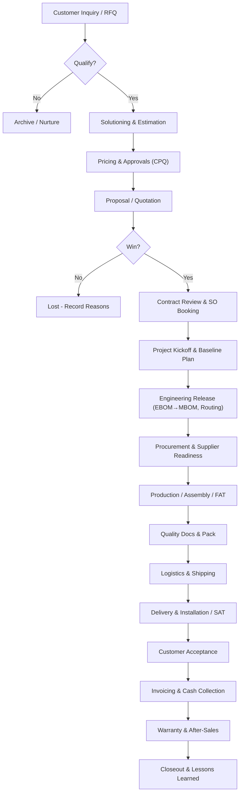
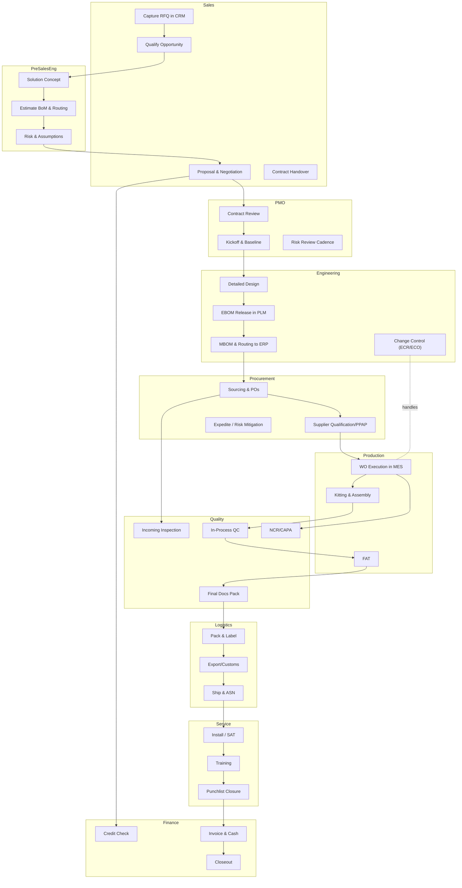
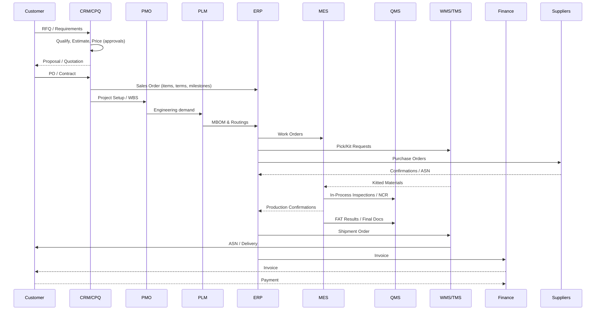

I didn’t receive your image yet; meanwhile, here’s a best-practice end-to-end workflow you can adopt immediately. Once you upload the current flow, I’ll tailor this to match your organization, product mix (ETO/MTO/CTO), systems, and market regulations.

Overview and objectives
- Purpose: Create a standardized, stage-gated sales-to-delivery workflow that improves predictability, lead time, cash flow, and customer satisfaction.
- Principles: Single source of truth, gated approvals, proactive risk control, design for manufacturability, supplier alignment, digital traceability, and lean execution.
- Scope: From customer inquiry through quote, order booking, engineering, procurement, production, quality, logistics, commissioning, invoicing, cash collection, and after-sales service.

Stage-gated end-to-end workflow (SG0–SG8)
1) SG0 Inquiry & Qualification
- Intake RFQ/inquiry via CRM; capture requirements, timeline, budget, and compliance constraints (ITAR/EAR, CE, UL, ISO, cyber).
- Quick technical feasibility and commercial fit; set probability and opportunity size.
- Exit criteria: Qualified opportunity with clear scope and go/no-go approval (Sales Director + Pre-Sales Eng).

2) SG1 Solutioning & Estimation
- Pre-sales engineering drafts solution concept, preliminary BoM, routing, lead-time model; DFM/DFS sanity check.
- Cost build-up (materials, labor, overheads, logistics, warranty); pricing via CPQ with approval thresholds.
- Exit criteria: Reviewed estimate, risk register v1, pricing approval, tender plan.

3) SG2 Proposal & Negotiation
- Formal proposal/quotation incl. technical scope, SoW, assumptions/exclusions, schedule, payment terms, warranty, and incoterms.
- Address compliance (export, safety, ESG) and data security needs.
- Exit criteria: Signed SoW/contract or PO; deviations documented; handover to project/order management.

4) SG3 Contract Review & Order Booking
- Cross-functional contract review (Sales, PM, Legal, Finance, Ops, Quality, HSE).
- Create Sales Order in ERP; baseline project in PM tool; lock scope/terms; set cash plan and milestones.
- Exit criteria: Booked SO, WBS/cost codes, baseline plan, risk register v2, kickoff scheduled.

5) SG4 Engineering Release
- Detailed engineering; EBOM in PLM, convert to MBOM and routings; change control enabled.
- Drawings, specs, test plans (FAT/SAT), compliance file; special processes validated.
- Exit criteria: Released MBOM and routings to ERP/MES; make/buy split; long-lead POs approved.

6) SG5 Procurement & Supply Readiness
- Source and place POs; APQP/PPAP or source qualification as needed; confirm supplier capacity.
- Materials planning, safety stocks/kanbans; incoming inspection plans.
- Exit criteria: Critical materials scheduled/confirmed; suppliers committed; logistics plans in place.

7) SG6 Production, Assembly, and Quality
- Execute work orders in MES; kitting, builds, in-process QC; NCR/CAPA loop for defects.
- FAT per test protocol; documentation pack compiled (CoC, ITP, as-builts).
- Exit criteria: Build complete, FAT pass, shipment-ready with full documentation set.

8) SG7 Logistics, Delivery, Commissioning
- Export control check, packing lists, HS codes, incoterms; TMS booking and ASN.
- Site installation/SAT; customer training; punch list closure.
- Exit criteria: Customer acceptance certificate signed; HSE handback; warranty start.

9) SG8 Invoicing, Cash Collection, and Closeout
- Milestone or final invoice; resolve discrepancies; cash application.
- Post-project review, lessons learned, warranty plan; archive digital record.
- Exit criteria: Cash collected, project financials closed, actions fed to CI backlog.

High-level flow (Mermaid)

Swimlane operating model (Mermaid)

Systems and data hand-offs (Mermaid)

Core artifacts and controls by phase
- Inquiry/Qualification: RFQ capture, requirements log, preliminary risk register. Approvals: Sales Lead.
- Solutioning/Estimate: Cost model, preliminary BoM, routing, lead-time, risk register v1, pricing approvals per DoA.
- Proposal/Contract: Quotation, SoW, T&Cs, compliance checklist, export screening, bid/no-bid record.
- Order Booking: Contract review minutes, SO, WBS, baseline schedule, cash plan, credit approval.
- Engineering Release: EBOM, MBOM, routings, drawings, test plan (FAT/SAT), ECO governance, design FMEA.
- Procurement: Sourcing plan, supplier contracts, PPAP/APQP (as needed), PO ack, supplier risk log.
- Production/QA: Travelers, work instructions, inspection plans, NCRs, CAPAs, SPC data.
- Logistics/Delivery: Packing list, CoC, CoA, customs docs, HS codes, country-of-origin, export docs.
- Commissioning/Acceptance: SAT report, training record, acceptance certificate.
- Invoicing/Cash: Milestone invoices, proof of delivery, dispute log; cash application evidence.
- Closeout: Final financials, lessons learned, doc archive, warranty plan.

RACI (summary for key activities)
| Activity             | Sales | Pre-Sales Eng | PMO | Engineering | Procurement | Production | Quality | Logistics | Finance | Service |
| -------------------- | ----- | ------------- | --- | ----------- | ----------- | ---------- | ------- | --------- | ------- | ------- |
| Qualify Opportunity  | R/A   | C             | C   | I           | I           | I          | I       | I         | C       | I       |
| Estimation & Pricing | C     | R             | C   | C           | C           | I          | I       | I         | A       | I       |
| Contract Review      | C     | C             | R   | C           | C           | I          | C       | I         | A       | I       |
| Engineering Release  | I     | C             | C   | R/A         | I           | I          | C       | I         | I       | I       |
| Sourcing & POs       | I     | I             | C   | C           | R/A         | I          | C       | I         | I       | I       |
| Production & FAT     | I     | I             | C   | I           | I           | R          | C       | I         | I       | I       |
| Shipment             | I     | I             | C   | I           | I           | I          | C       | R/A       | I       | I       |
| SAT & Acceptance     | I     | I             | C   | I           | I           | I          | C       | I         | I       | R/A     |
| Invoicing & Cash     | I     | I             | I   | I           | I           | I          | I       | I         | R/A     | I       |
R = Responsible, A = Accountable, C = Consulted, I = Informed.

KPIs and dashboards
- Sales/Front-End: Quote cycle time, win rate, pricing approval cycle time, forecast accuracy, margin at quote.
- Engineering: ECO cycle time, first-pass release quality, design rework rate, on-time release to plan.
- Supply Chain: Supplier OTD, PO confirmation time, PPV, critical material coverage days, expedite rate.
- Production/Quality: WO on-time completion, yield/FTQ, NCR rate, FAT first-pass rate, capacity utilization.
- Logistics: OTIF, damage rate, customs clearance lead time, freight cost per kg.
- Finance: DSO, milestone adherence, invoice accuracy, cash conversion cycle, margin at completion (MAC).
- Customer: SAT/acceptance on-time, NPS/CSAT, warranty claims rate, mean time to resolve service tickets.

Variants by delivery model
- ETO (Engineer-to-Order): Heavier SG4; gated design reviews (PDR/CDR); longer lead times; strict change control; fat/sat mandatory; projectized cost control.
- MTO (Make-to-Order): Predefined designs; focus on capacity planning, materials availability, and takt adherence; standard FAT may be sampling.
- CTO (Configure-to-Order): Use product configurator; automated MBOM/routing; short lead times; emphasis on order accuracy and configurator rules.

Exception handling (embed these mini-flows)
- Expedited/Hot Orders: Triage board; capacity check; premium freight decision; escalation matrix; protect baseline plan via buffer management.
- Engineering Change (ECR/ECO): Impact analysis (cost, schedule, inventory); MRB for WIP/scrap; customer approval if contractual; version control in PLM; cascade to ERP/MES.
- Supplier Failure/Delay: Alternative source trigger; part substitution with approval; dynamic replanning; enforce supplier 8D if quality-related.
- Nonconformances (NCR/CAPA): Contain, root-cause (5-Why/Fishbone), corrective/preventive, effectiveness check; update control plan.
- Returns/RMA: RMA authorization, triage (repair/replace/credit), closed-loop learning to design/suppliers.

Governance rhythm and escalation
- Tiered Daily/Weekly: Tier 1 (cell) 15-min daily; Tier 2 (value stream) 30-min; Tier 3 S&OP weekly; Executive MoM.
- Stage-Gate Reviews: SG0–SG8 approvals with DoA; red/amber/green thresholds per KPI.
- S&OP Integration: Demand, supply, inventory, and financial reconciliation monthly; link to capacity and CapEx plans.
- Risk Management: RAID log owned by PM; heatmap reviewed weekly; playbooks for top 5 systemic risks.

Digital backbone and integration
- CRM/CPQ for opportunity-to-quote; PLM for EBOM/ECO; ERP for SO/MBOM/PO/Finance; MES for execution; QMS for quality records; WMS/TMS for logistics.
- Master data governance (items, BoMs, routings, suppliers, customers) with change controls and audit trails.
- Document control: Single doc set auto-built from PLM/QMS; e-signatures for gate approvals.

90-day implementation plan (pragmatic)
1) Weeks 1–3: Current-state mapping (once you share your image), data assessment, pain points, KPI baseline; agree on target-state and stage-gate definitions.
2) Weeks 4–6: Draft SOPs, RACI, templates (quote, contract review, ECO, NCR, FAT/SAT, acceptance); set approval matrices.
3) Weeks 7–10: System configuration quick wins (CPQ approvals, PLM release workflow, ERP SO template, MES travelers); integrate minimal handoffs; pilot on 1–2 product families.
4) Weeks 11–13: Train-the-trainer, dashboard rollout, go-live for pilot; capture lessons; refine and plan scale-up.

What I need to tailor this to you
- Your current workflow diagram (please upload the image).
- Delivery model mix (ETO/MTO/CTO), typical lead times, and product families.
- Systems in use (CRM/CPQ/PLM/ERP/MES/QMS) and integration pain points.
- Compliance constraints (export controls, industry certifications).
- Top 3 recurring issues (e.g., late engineering releases, supplier slips, rework, slow cash).

Summary
- The above gives you a complete, gated, cross-functional workflow from inquiry through cash, with clear roles, controls, KPIs, and system handoffs.
- Three Mermaid diagrams provide the high-level flow, functional swimlanes, and system data handoff sequence.
- Upload your current image and basic context; I’ll overlay gaps, remove waste, and deliver a tailored version with exact gate criteria, forms, and dashboard specs.