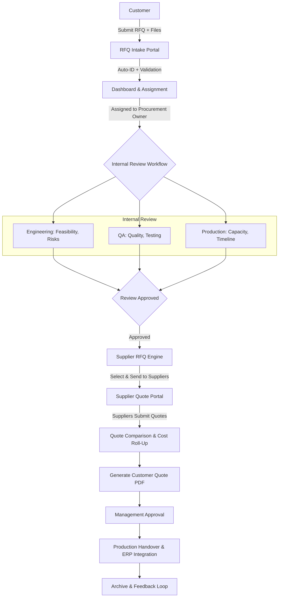

## Workflow Diagram

```mermaid
graph TD
    A[Customer] -- Submit RFQ + Files --> B[RFQ Intake Portal];
    B -- Auto-ID + Validation --> C[Dashboard & Assignment];
    C -- Assigned to Procurement Owner --> D{Internal Review Workflow};

    subgraph Internal Review
        E[Engineering: Feasibility, Risks]
        F[QA: Quality, Testing]
        G[Production: Capacity, Timeline]
    end

    D --> E;
    D --> F;
    D --> G;

    E --> H{Review Approved};
    F --> H;
    G --> H;
    
    H -- Approved --> I[Supplier RFQ Engine];
    I -- Select & Send to Suppliers --> J[Supplier Quote Portal];
    J -- Suppliers Submit Quotes --> K[Quote Comparison & Cost Roll-Up];
    K --> L[Generate Customer Quote PDF];
    L --> M[Management Approval];
    M --> N[Production Handover & ERP Integration];
    N --> O[Archive & Feedback Loop];
```

