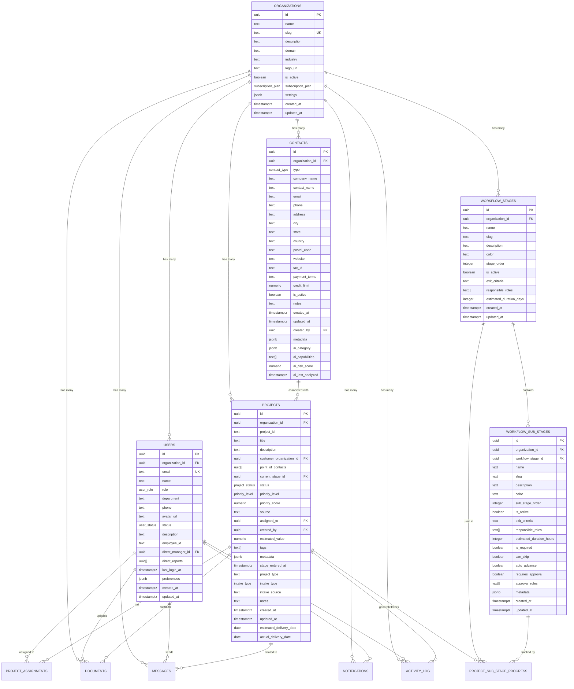

# Factory Pulse - Architecture Diagrams

## System Architecture Overview

## Data Flow Architecture

## Database Schema Relationships

## Component Hierarchy

## Authentication Flow

## Project Workflow

## Data Synchronization Flow

## API Request Flow

## File Upload Flow

## Error Handling Flow

## Deployment Pipeline

## Security Architecture

These diagrams provide a comprehensive visual representation of the Factory Pulse system architecture, showing how all components work together to deliver a robust, scalable manufacturing execution system.
