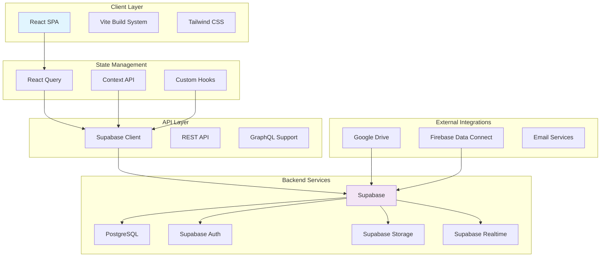
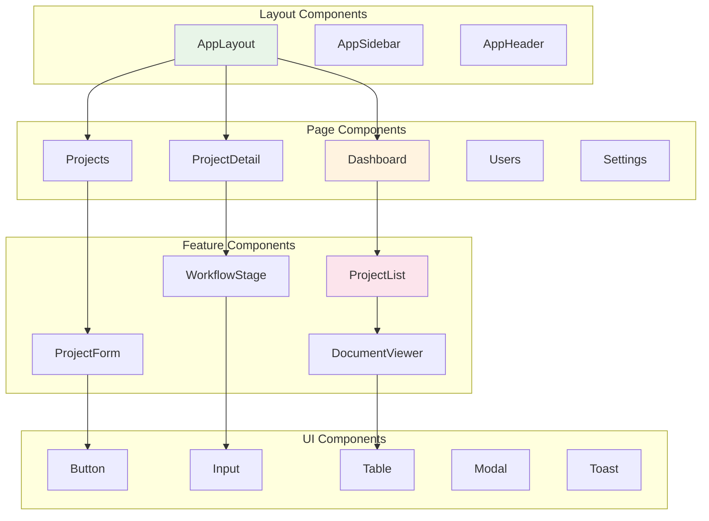
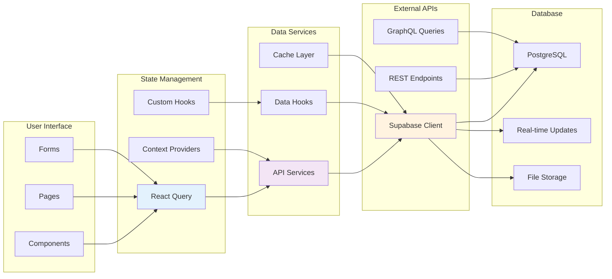
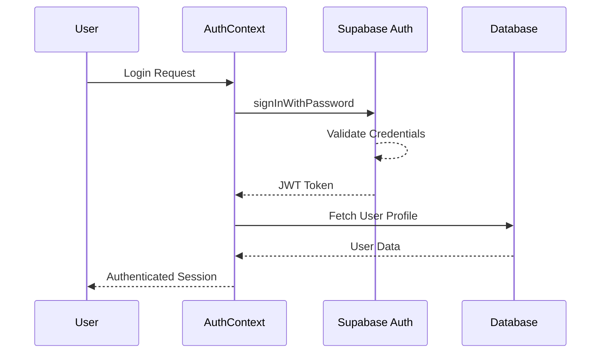
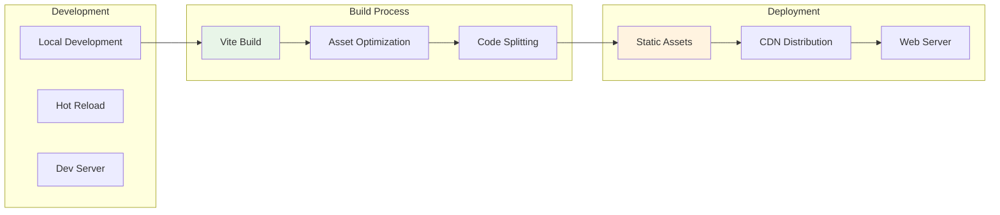

# Factory Pulse - System Architecture

## Overview

Factory Pulse is a modern Manufacturing Execution System (MES) designed to streamline manufacturing workflows, project management, and operational efficiency. This document outlines the complete system architecture, technology stack, and design patterns.

## Architecture Overview



## Technology Stack

### Frontend
- **React 18** - Component-based UI framework
- **TypeScript** - Type-safe JavaScript
- **Vite** - Fast build tool and dev server
- **Tailwind CSS** - Utility-first CSS framework
- **Radix UI** - Accessible component library
- **Framer Motion** - Animation library
- **React Router** - Client-side routing
- **React Hook Form** - Form management
- **Zod** - Schema validation

### Backend & Database
- **Supabase** - Backend-as-a-Service
- **PostgreSQL** - Primary database
- **Supabase Auth** - Authentication & authorization
- **Supabase Storage** - File storage
- **Supabase Realtime** - Real-time subscriptions

### Development Tools
- **ESLint** - Code linting
- **Vitest** - Unit testing
- **Bun** - Package manager
- **Git** - Version control

## Application Architecture

### Component Architecture



### Data Flow Architecture



## Core Architecture Patterns

### 1. Component Composition Pattern

```typescript
// Higher-order components for reusability
const withDataFetching = (WrappedComponent: React.ComponentType<any>) => {
  return (props: any) => {
    const { data, loading, error } = useDataHook();
    return <WrappedComponent {...props} data={data} loading={loading} error={error} />;
  };
};

// Render props for flexible data handling
const DataProvider = ({ children, render }) => {
  const data = useDataHook();
  return children ? children(data) : render(data);
};
```

### 2. Custom Hooks Pattern

```typescript
// Data fetching hooks
const useProjects = (filters?: ProjectFilters) => {
  return useQuery({
    queryKey: ['projects', filters],
    queryFn: () => projectService.getProjects(filters),
    staleTime: 5 * 60 * 1000, // 5 minutes
  });
};

// Business logic hooks
const useProjectActions = (projectId: string) => {
  const queryClient = useQueryClient();

  const updateProject = useMutation({
    mutationFn: (updates: Partial<Project>) =>
      projectService.updateProject(projectId, updates),
    onSuccess: () => {
      queryClient.invalidateQueries({ queryKey: ['projects'] });
    },
  });

  return { updateProject };
};
```

### 3. Context Provider Pattern

```typescript
// Auth context for global state
const AuthContext = createContext<AuthContextType | undefined>(undefined);

export const AuthProvider: React.FC<{ children: React.ReactNode }> = ({ children }) => {
  const [user, setUser] = useState<User | null>(null);
  const [profile, setProfile] = useState<UserProfile | null>(null);

  // Auth logic here...

  const value = {
    user,
    profile,
    signIn,
    signOut,
    // ... other methods
  };

  return (
    <AuthContext.Provider value={value}>
      {children}
    </AuthContext.Provider>
  );
};
```

## Service Layer Architecture

### API Service Pattern

```typescript
// Base service class
class BaseService {
  protected supabase = createClient<Database>(url, key);

  protected async handleError(error: any): Promise<never> {
    console.error('Service error:', error);
    throw new Error(error.message || 'An unexpected error occurred');
  }

  protected async handleResponse<T>(response: any): Promise<T> {
    if (response.error) {
      return this.handleError(response.error);
    }
    return response.data;
  }
}

// Project service extending base
export class ProjectService extends BaseService {
  async getProjects(filters?: ProjectFilters): Promise<Project[]> {
    try {
      let query = this.supabase
        .from('projects')
        .select(`
          *,
          customer_organization:organizations(*),
          current_stage:workflow_stages(*),
          assignee:users(*)
        `);

      if (filters?.status) {
        query = query.eq('status', filters.status);
      }

      const response = await query;
      return this.handleResponse<Project[]>(response);
    } catch (error) {
      return this.handleError(error);
    }
  }
}
```

### Data Transformation Layer

```typescript
// Data transformers for consistent API responses
export const projectTransformer = {
  fromApi: (apiData: any): Project => ({
    id: apiData.id,
    title: apiData.title,
    status: apiData.status,
    // ... other fields
    customer_organization: apiData.customer_organization,
    current_stage: apiData.current_stage,
    // Computed fields
    days_in_stage: calculateDaysInStage(apiData.stage_entered_at),
    due_date: apiData.estimated_delivery_date,
  }),

  toApi: (project: Project): any => ({
    title: project.title,
    status: project.status,
    // ... other fields
  }),
};
```

## State Management Architecture

### React Query for Server State

```typescript
// Query configuration
const queryClient = new QueryClient({
  defaultOptions: {
    queries: {
      staleTime: 5 * 60 * 1000, // 5 minutes
      gcTime: 10 * 60 * 1000, // 10 minutes
      retry: (failureCount, error) => {
        // Custom retry logic
        if (error?.status === 401) return false;
        return failureCount < 3;
      },
    },
    mutations: {
      retry: false,
      onError: (error) => {
        console.error('Mutation error:', error);
        // Global error handling
      },
    },
  },
});
```

### Context for Client State

```typescript
// UI state management
const UIContext = createContext<{
  sidebarOpen: boolean;
  theme: 'light' | 'dark';
  toggleSidebar: () => void;
  setTheme: (theme: 'light' | 'dark') => void;
} | undefined>(undefined);
```

## Security Architecture

### Authentication Flow



### Authorization Pattern

```typescript
// Role-based access control hook
const usePermissions = (requiredRoles?: string[]) => {
  const { profile } = useAuth();
  const userRole = profile?.role;

  const hasPermission = useMemo(() => {
    if (!requiredRoles || requiredRoles.length === 0) return true;
    if (!userRole) return false;
    return requiredRoles.includes(userRole);
  }, [userRole, requiredRoles]);

  return { hasPermission, userRole };
};

// Usage in components
const AdminPanel = () => {
  const { hasPermission } = usePermissions(['admin', 'management']);

  if (!hasPermission) {
    return <AccessDenied />;
  }

  return <AdminContent />;
};
```

## Performance Optimization

### Code Splitting Strategy

```typescript
// Route-based code splitting
const Projects = lazy(() => import('../pages/Projects'));
const ProjectDetail = lazy(() => import('../pages/ProjectDetail'));

// Component-based code splitting for heavy components
const DocumentViewer = lazy(() => import('../components/documents/DocumentViewer'));

// With loading fallbacks
<Suspense fallback={<PageSkeleton />}>
  <Routes>
    <Route path="/projects" element={<Projects />} />
    <Route path="/project/:id" element={<ProjectDetail />} />
  </Routes>
</Suspense>
```

### Caching Strategy

```typescript
// Multi-layer caching
const useProjectsWithCache = (filters?: ProjectFilters) => {
  return useQuery({
    queryKey: ['projects', filters],
    queryFn: () => projectService.getProjects(filters),
    staleTime: 5 * 60 * 1000,
    gcTime: 30 * 60 * 1000,
    // Background refetching
    refetchOnWindowFocus: false,
    refetchOnMount: true,
  });
};
```

## Real-time Architecture

### Supabase Realtime Integration

```typescript
// Real-time subscriptions
const useRealtimeProjects = () => {
  const queryClient = useQueryClient();

  useEffect(() => {
    const channel = supabase
      .channel('projects')
      .on('postgres_changes',
        {
          event: '*',
          schema: 'public',
          table: 'projects'
        },
        (payload) => {
          // Update cache on real-time changes
          queryClient.invalidateQueries({ queryKey: ['projects'] });
        }
      )
      .subscribe();

    return () => {
      supabase.removeChannel(channel);
    };
  }, [queryClient]);
};
```

## Deployment Architecture

### Build Pipeline



### Environment Configuration

```typescript
// Environment-based configuration
const config = {
  development: {
    apiUrl: 'http://localhost:54321',
    enableDebug: true,
    logLevel: 'debug',
  },
  staging: {
    apiUrl: 'https://staging-api.supabase.co',
    enableDebug: false,
    logLevel: 'warn',
  },
  production: {
    apiUrl: 'https://api.supabase.co',
    enableDebug: false,
    logLevel: 'error',
  },
};

const currentConfig = config[import.meta.env.MODE] || config.development;
```

## Monitoring and Observability

### Error Handling

```typescript
// Global error boundary
class ErrorBoundary extends React.Component {
  componentDidCatch(error: Error, errorInfo: React.ErrorInfo) {
    // Log to error reporting service
    errorReporting.captureException(error, { extra: errorInfo });

    // Log to activity log
    logActivity('error', {
      error: error.message,
      stack: error.stack,
      componentStack: errorInfo.componentStack,
    });
  }
}
```

### Performance Monitoring

```typescript
// Performance tracking hook
const usePerformanceTracking = (componentName: string) => {
  useEffect(() => {
    const startTime = performance.now();

    return () => {
      const endTime = performance.now();
      const duration = endTime - startTime;

      // Track component render time
      analytics.track('component_render', {
        component: componentName,
        duration,
        timestamp: new Date().toISOString(),
      });
    };
  }, [componentName]);
};
```

This architecture provides a scalable, maintainable, and performant foundation for the Factory Pulse MES system, with clear separation of concerns and modern development practices.
