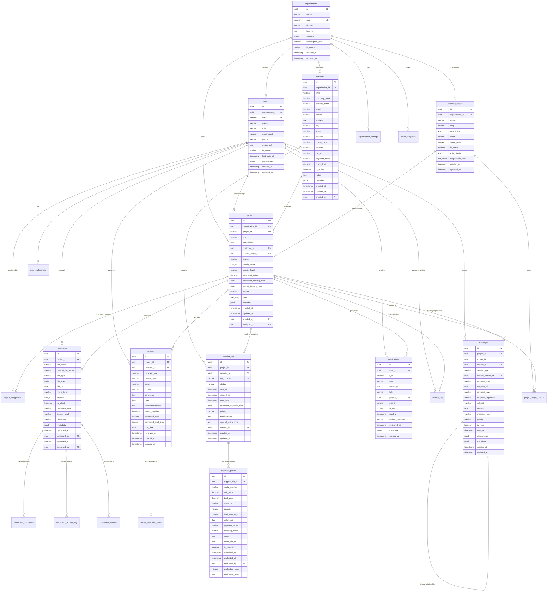
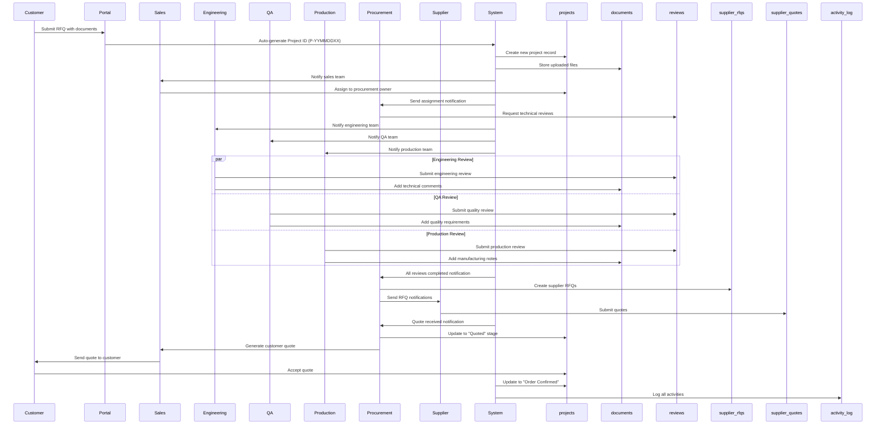
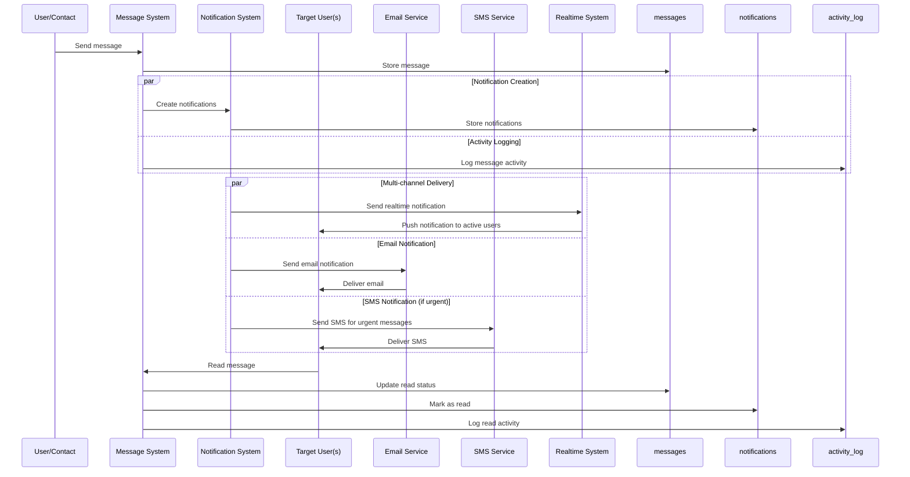
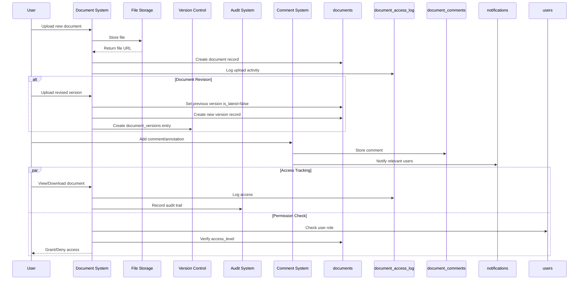
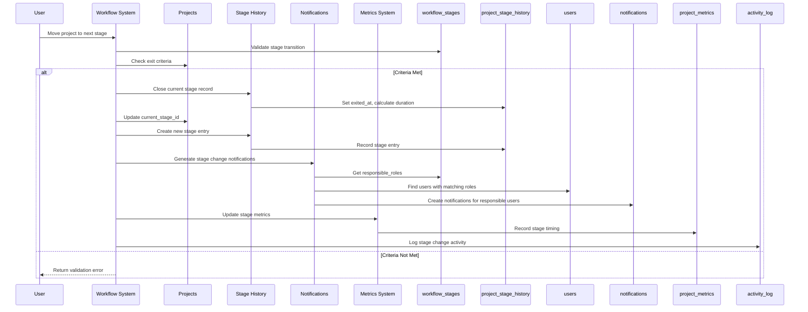
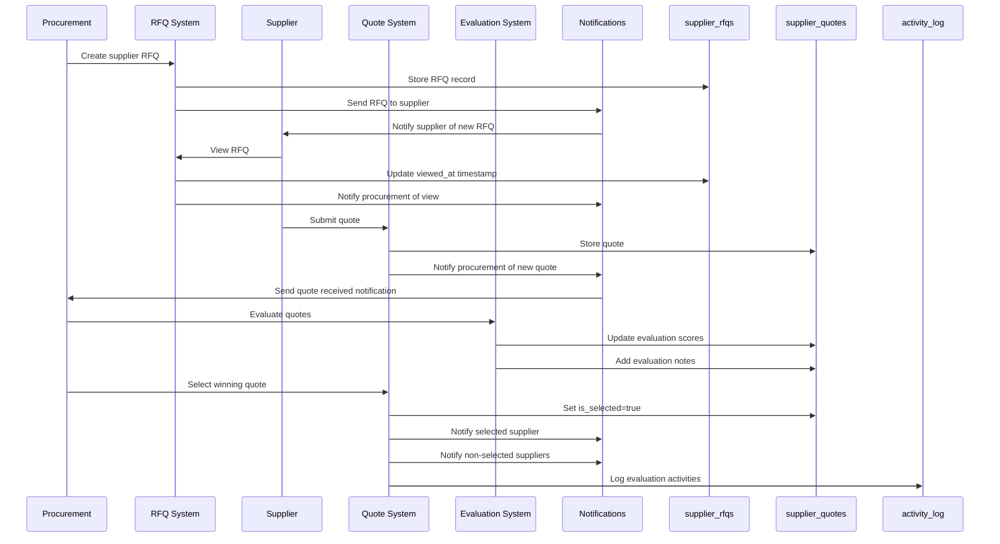
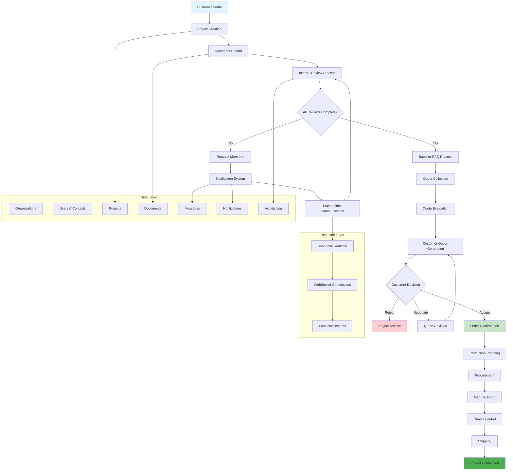

# Factory Pulse Database Schema – Updated & Revised

This revised document consolidates, corrects, and enhances the schema to ensure:
- Full alignment with the PRD workflow and user roles
- Consistent naming, data types, and constraints
- SaaS-ready multi-tenancy and auditability
- Real-time communication and traceability
- AI/automation extensibility
- Vietnam and Southeast Asia localization support

---

## ✅ Key Improvements Made

| Area                        | Issue in Original                                 | Fix Implemented                                                                    |
| --------------------------- | ------------------------------------------------- | ---------------------------------------------------------------------------------- |
| **UUID Generation**         | Mixed `gen_random_uuid()` vs `uuid_generate_v4()` | Standardized to `uuid_generate_v4()`                                               |
| **Project Status vs Stage** | Confused in schema                                | Separated `status` (active/delayed/cancelled) from `current_stage` (workflow step) |
| **Organization-User Link**  | Inconsistent                                      | Enforced `organization_id` on all core tables                                      |
| **Document Versioning**     | Parent-child model                                | Improved with `document_versions` table                                            |
| **Message System**          | Overly complex                                    | Simplified with thread-based messaging                                             |
| **AI & Automation**         | Scattered fields                                  | Unified in `ai_processing_queue` and metadata                                      |
| **Vietnam Support**         | Missing                                           | Added VND, Asia/Ho_Chi_Minh, Vietnamese language                                   |
| **Realtime & Sync**         | Incomplete                                        | Enhanced triggers and subscriptions                                                |

---

## Core Entities

### 1. Organizations & Users

```sql
-- Organizations (Multi-tenancy support)
CREATE TABLE organizations (
    id UUID PRIMARY KEY DEFAULT uuid_generate_v4(),
    name VARCHAR(255) NOT NULL,
    slug VARCHAR(100) UNIQUE NOT NULL,
    domain VARCHAR(255),
    logo_url TEXT,
    settings JSONB DEFAULT '{}',
    subscription_plan VARCHAR(50) DEFAULT 'starter' 
      CHECK (subscription_plan IN ('starter', 'growth', 'enterprise', 'trial', 'suspended', 'cancelled')),
    is_active BOOLEAN DEFAULT true,
    created_at TIMESTAMPTZ DEFAULT NOW(),
    updated_at TIMESTAMPTZ DEFAULT NOW()
);

-- User profiles with role-based access
CREATE TABLE users (
    id UUID PRIMARY KEY DEFAULT uuid_generate_v4(),
    organization_id UUID REFERENCES organizations(id) ON DELETE CASCADE,
    email VARCHAR(255) UNIQUE NOT NULL,
    name VARCHAR(255) NOT NULL,
    role VARCHAR(50) NOT NULL 
      CHECK (role IN ('customer', 'sales', 'procurement', 'engineering', 'qa', 'production', 'management', 'supplier', 'admin')),
    department VARCHAR(100),
    phone VARCHAR(50),
    avatar_url TEXT,
    status VARCHAR(20) DEFAULT 'active' 
      CHECK (status IN ('active', 'dismiss')),
    description TEXT,
    last_login_at TIMESTAMPTZ,
    preferences JSONB DEFAULT '{}',
    created_at TIMESTAMPTZ DEFAULT NOW(),
    updated_at TIMESTAMPTZ DEFAULT NOW()
);

-- External contacts (customers and suppliers)
CREATE TABLE contacts (
    id UUID PRIMARY KEY DEFAULT uuid_generate_v4(),
    organization_id UUID REFERENCES organizations(id) ON DELETE CASCADE,
    type VARCHAR(20) NOT NULL CHECK (type IN ('customer', 'supplier')),
    company_name VARCHAR(255) NOT NULL,
    contact_name VARCHAR(255),
    email VARCHAR(255),
    phone VARCHAR(50),
    address TEXT,
    city VARCHAR(100),
    state VARCHAR(100),
    country VARCHAR(100) DEFAULT 'Vietnam',
    postal_code VARCHAR(20),
    website VARCHAR(255),
    tax_id VARCHAR(100),
    payment_terms VARCHAR(100),
    credit_limit DECIMAL(15,2),
    is_active BOOLEAN DEFAULT true,
    notes TEXT,
    metadata JSONB DEFAULT '{}',
    -- AI-ready fields
    ai_category JSONB DEFAULT '{}',
    ai_capabilities JSONB DEFAULT '[]',
    ai_risk_score DECIMAL(5,2), -- 0-100
    ai_last_analyzed TIMESTAMPTZ,
    created_at TIMESTAMPTZ DEFAULT NOW(),
    updated_at TIMESTAMPTZ DEFAULT NOW(),
    created_by UUID REFERENCES users(id)
);
```

### 2. Projects & Workflow

```sql
-- Workflow stages (configurable per org)
CREATE TABLE workflow_stages (
    id UUID PRIMARY KEY DEFAULT uuid_generate_v4(),
    organization_id UUID REFERENCES organizations(id) ON DELETE CASCADE,
    name VARCHAR(100) NOT NULL,
    slug VARCHAR(50) NOT NULL,
    description TEXT,
    color VARCHAR(7) DEFAULT '#6B7280' 
      CHECK (color ~* '^#([A-Fa-f0-9]{6}|[A-Fa-f0-9]{3})$'),
    stage_order INTEGER NOT NULL,
    is_active BOOLEAN DEFAULT true,
    exit_criteria TEXT,
    responsible_roles TEXT[] DEFAULT '{}',
    created_at TIMESTAMPTZ DEFAULT NOW(),
    updated_at TIMESTAMPTZ DEFAULT NOW(),
    UNIQUE(organization_id, slug),
    UNIQUE(organization_id, stage_order)
);

-- Main projects table
CREATE TABLE projects (
    id UUID PRIMARY KEY DEFAULT uuid_generate_v4(),
    organization_id UUID REFERENCES organizations(id) ON DELETE CASCADE,
    project_id VARCHAR(20) UNIQUE NOT NULL, -- P-25082001
    title VARCHAR(255) NOT NULL,
    description TEXT,
    customer_id UUID REFERENCES contacts(id),
    current_stage_id UUID REFERENCES workflow_stages(id),
    status VARCHAR(20) NOT NULL DEFAULT 'active' 
      CHECK (status IN ('active', 'delayed', 'on_hold', 'cancelled', 'completed', 'archived')),
    priority_score INTEGER DEFAULT 50 CHECK (priority_score BETWEEN 0 AND 100),
    priority_level VARCHAR(10) DEFAULT 'medium' 
      CHECK (priority_level IN ('low', 'medium', 'high', 'urgent')),
    estimated_value DECIMAL(15,2),
    estimated_delivery_date DATE,
    actual_delivery_date DATE,
    source VARCHAR(50) DEFAULT 'manual' 
      CHECK (source IN ('manual', 'portal', 'email', 'api', 'import', 'migration')),
    tags TEXT[] DEFAULT '{}',
    metadata JSONB DEFAULT '{}',
    created_at TIMESTAMPTZ DEFAULT NOW(),
    updated_at TIMESTAMPTZ DEFAULT NOW(),
    created_by UUID REFERENCES users(id),
    assigned_to UUID REFERENCES users(id)
);

-- Project stage history
CREATE TABLE project_stage_history (
    id UUID PRIMARY KEY DEFAULT uuid_generate_v4(),
    project_id UUID REFERENCES projects(id) ON DELETE CASCADE,
    stage_id UUID REFERENCES workflow_stages(id),
    entered_at TIMESTAMPTZ DEFAULT NOW(),
    exited_at TIMESTAMPTZ,
    duration_minutes INTEGER,
    entered_by UUID REFERENCES users(id),
    exit_reason VARCHAR(255),
    notes TEXT,
    created_at TIMESTAMPTZ DEFAULT NOW()
);

-- Project assignments
CREATE TABLE project_assignments (
    id UUID PRIMARY KEY DEFAULT uuid_generate_v4(),
    project_id UUID REFERENCES projects(id) ON DELETE CASCADE,
    user_id UUID REFERENCES users(id) ON DELETE CASCADE,
    role VARCHAR(50) NOT NULL,
    assigned_at TIMESTAMPTZ DEFAULT NOW(),
    assigned_by UUID REFERENCES users(id),
    is_active BOOLEAN DEFAULT true,
    UNIQUE(project_id, user_id, role)
);
```

### 3. Document Management

```sql
-- Documents with version control
CREATE TABLE documents (
    id UUID PRIMARY KEY DEFAULT uuid_generate_v4(),
    project_id UUID REFERENCES projects(id) ON DELETE CASCADE,
    file_name VARCHAR(255) NOT NULL,
    original_file_name VARCHAR(255) NOT NULL,
    file_type VARCHAR(100) NOT NULL,
    file_size BIGINT NOT NULL,
    file_url TEXT NOT NULL,
    mime_type VARCHAR(100),
    version INTEGER DEFAULT 1,
    is_latest BOOLEAN DEFAULT true,
    document_type VARCHAR(50) 
      CHECK (document_type IN ('rfq', 'drawing', 'specification', 'quote', 'po', 'invoice', 'certificate', 'report', 'bom', 'other')),
    access_level VARCHAR(20) DEFAULT 'internal' 
      CHECK (access_level IN ('public', 'customer', 'supplier', 'internal', 'restricted')),
    checksum VARCHAR(64),
    metadata JSONB DEFAULT '{}',
    storage_provider VARCHAR(50) DEFAULT 'supabase' 
      CHECK (storage_provider IN ('supabase', 'google_drive', 'dropbox', 'onedrive', 's3', 'azure_blob')),
    external_id VARCHAR(255),
    external_url TEXT,
    sync_status VARCHAR(20) DEFAULT 'synced' 
      CHECK (sync_status IN ('synced', 'pending', 'failed', 'conflict')),
    last_synced_at TIMESTAMPTZ,
    ai_extracted_data JSONB DEFAULT '{}',
    ai_processing_status VARCHAR(20) DEFAULT 'pending' 
      CHECK (ai_processing_status IN ('pending', 'processing', 'completed', 'failed', 'skipped')),
    ai_confidence_score DECIMAL(5,2),
    ai_processed_at TIMESTAMPTZ,
    uploaded_at TIMESTAMPTZ DEFAULT NOW(),
    uploaded_by UUID REFERENCES users(id),
    approved_at TIMESTAMPTZ,
    approved_by UUID REFERENCES users(id)
);

-- Document versions (improved from parent-child)
CREATE TABLE document_versions (
    id UUID PRIMARY KEY DEFAULT uuid_generate_v4(),
    document_id UUID REFERENCES documents(id) ON DELETE CASCADE,
    version_number INTEGER NOT NULL,
    file_url TEXT NOT NULL,
    created_at TIMESTAMPTZ DEFAULT NOW(),
    created_by UUID REFERENCES users(id),
    change_description TEXT,
    metadata JSONB DEFAULT '{}',
    UNIQUE(document_id, version_number)
);

-- Document comments
CREATE TABLE document_comments (
    id UUID PRIMARY KEY DEFAULT uuid_generate_v4(),
    document_id UUID REFERENCES documents(id) ON DELETE CASCADE,
    user_id UUID REFERENCES users(id),
    comment TEXT NOT NULL,
    page_number INTEGER,
    coordinates JSONB,
    is_resolved BOOLEAN DEFAULT false,
    parent_comment_id UUID REFERENCES document_comments(id),
    created_at TIMESTAMPTZ DEFAULT NOW(),
    updated_at TIMESTAMPTZ DEFAULT NOW()
);

-- Document access log
CREATE TABLE document_access_log (
    id UUID PRIMARY KEY DEFAULT uuid_generate_v4(),
    document_id UUID REFERENCES documents(id) ON DELETE CASCADE,
    user_id UUID REFERENCES users(id),
    action VARCHAR(20) NOT NULL 
      CHECK (action IN ('view', 'download', 'upload', 'delete', 'share', 'comment', 'approve')),
    ip_address INET,
    user_agent TEXT,
    accessed_at TIMESTAMPTZ DEFAULT NOW()
);
```

### 4. Reviews & Approvals

```sql
-- Internal reviews
CREATE TABLE reviews (
    id UUID PRIMARY KEY DEFAULT uuid_generate_v4(),
    project_id UUID REFERENCES projects(id) ON DELETE CASCADE,
    reviewer_id UUID REFERENCES users(id),
    reviewer_role VARCHAR(50) NOT NULL,
    review_type VARCHAR(50) DEFAULT 'standard' 
      CHECK (review_type IN ('standard', 'technical', 'quality', 'production', 'cost', 'compliance', 'safety')),
    status VARCHAR(20) DEFAULT 'pending' 
      CHECK (status IN ('pending', 'in_progress', 'approved', 'rejected', 'needs_info', 'on_hold')),
    priority VARCHAR(10) DEFAULT 'medium' 
      CHECK (priority IN ('low', 'medium', 'high', 'urgent')),
    comments TEXT,
    risks JSONB DEFAULT '[]',
    recommendations TEXT,
    tooling_required BOOLEAN DEFAULT false,
    estimated_cost DECIMAL(15,2),
    estimated_lead_time INTEGER,
    due_date DATE,
    reviewed_at TIMESTAMPTZ,
    created_at TIMESTAMPTZ DEFAULT NOW(),
    updated_at TIMESTAMPTZ DEFAULT NOW()
);

-- Review checklist items
CREATE TABLE review_checklist_items (
    id UUID PRIMARY KEY DEFAULT uuid_generate_v4(),
    review_id UUID REFERENCES reviews(id) ON DELETE CASCADE,
    item_text TEXT NOT NULL,
    is_checked BOOLEAN DEFAULT false,
    is_required BOOLEAN DEFAULT true,
    notes TEXT,
    checked_by UUID REFERENCES users(id),
    checked_at TIMESTAMPTZ
);
```

### 5. Supplier Management & Quotes

```sql
-- Supplier RFQs
CREATE TABLE supplier_rfqs (
    id UUID PRIMARY KEY DEFAULT uuid_generate_v4(),
    project_id UUID REFERENCES projects(id) ON DELETE CASCADE,
    supplier_id UUID REFERENCES contacts(id),
    rfq_number VARCHAR(50) UNIQUE NOT NULL,
    status VARCHAR(20) DEFAULT 'draft' 
      CHECK (status IN ('draft', 'sent', 'viewed', 'quoted', 'declined', 'expired', 'cancelled')),
    sent_at TIMESTAMPTZ,
    viewed_at TIMESTAMPTZ,
    due_date TIMESTAMPTZ,
    expected_response_date DATE,
    priority VARCHAR(10) DEFAULT 'medium',
    requirements TEXT,
    special_instructions TEXT,
    created_by UUID REFERENCES users(id),
    created_at TIMESTAMPTZ DEFAULT NOW(),
    updated_at TIMESTAMPTZ DEFAULT NOW()
);

-- Supplier quotes
CREATE TABLE supplier_quotes (
    id UUID PRIMARY KEY DEFAULT uuid_generate_v4(),
    supplier_rfq_id UUID REFERENCES supplier_rfqs(id) ON DELETE CASCADE,
    quote_number VARCHAR(50),
    unit_price DECIMAL(15,4),
    total_price DECIMAL(15,2),
    currency VARCHAR(3) DEFAULT 'VND' 
      CHECK (currency IN ('USD', 'EUR', 'VND', 'THB', 'MYR', 'IDR', 'PHP', 'CNY', 'JPY', 'KRW', 'SGD', 'AUD', 'CAD', 'GBP')),
    quantity INTEGER,
    lead_time_days INTEGER,
    valid_until DATE,
    payment_terms VARCHAR(100),
    shipping_terms VARCHAR(100),
    notes TEXT,
    quote_file_url TEXT,
    is_selected BOOLEAN DEFAULT false,
    submitted_at TIMESTAMPTZ DEFAULT NOW(),
    evaluated_at TIMESTAMPTZ,
    evaluated_by UUID REFERENCES users(id),
    evaluation_score INTEGER CHECK (evaluation_score BETWEEN 1 AND 10),
    evaluation_notes TEXT
);
```

### 6. Communication System

```sql
-- Messages (simplified thread model)
CREATE TABLE messages (
    id UUID PRIMARY KEY DEFAULT uuid_generate_v4(),
    project_id UUID REFERENCES projects(id) ON DELETE CASCADE,
    thread_id UUID DEFAULT uuid_generate_v4(), -- All messages in same thread share ID
    sender_id UUID REFERENCES users(id),
    sender_type VARCHAR(20) NOT NULL 
      CHECK (sender_type IN ('user', 'contact', 'system')),
    sender_contact_id UUID REFERENCES contacts(id),
    recipient_type VARCHAR(20) NOT NULL 
      CHECK (recipient_type IN ('user', 'contact', 'department', 'role')),
    recipient_id UUID, -- user_id or contact_id
    recipient_role VARCHAR(50),
    recipient_department VARCHAR(100),
    subject VARCHAR(255),
    content TEXT NOT NULL,
    message_type VARCHAR(20) DEFAULT 'message' 
      CHECK (message_type IN ('message', 'notification', 'alert', 'reminder', 'system', 'announcement')),
    priority VARCHAR(10) DEFAULT 'normal' 
      CHECK (priority IN ('low', 'normal', 'high', 'urgent')),
    is_read BOOLEAN DEFAULT false,
    read_at TIMESTAMPTZ,
    attachments JSONB DEFAULT '[]',
    metadata JSONB DEFAULT '{}',
    created_at TIMESTAMPTZ DEFAULT NOW(),
    updated_at TIMESTAMPTZ DEFAULT NOW()
);

-- Notifications
CREATE TABLE notifications (
    id UUID PRIMARY KEY DEFAULT uuid_generate_v4(),
    user_id UUID REFERENCES users(id) ON DELETE CASCADE,
    type VARCHAR(50) NOT NULL,
    title VARCHAR(255) NOT NULL,
    message TEXT NOT NULL,
    link VARCHAR(500),
    project_id UUID REFERENCES projects(id),
    priority VARCHAR(10) DEFAULT 'normal' 
      CHECK (priority IN ('low', 'normal', 'high', 'urgent')),
    is_read BOOLEAN DEFAULT false,
    read_at TIMESTAMPTZ,
    delivery_method VARCHAR(20) DEFAULT 'in_app' 
      CHECK (delivery_method IN ('in_app', 'email', 'sms', 'push', 'webhook')),
    delivered_at TIMESTAMPTZ,
    metadata JSONB DEFAULT '{}',
    created_at TIMESTAMPTZ DEFAULT NOW()
);
```

### 7. Activity & Audit Trail

```sql
-- Activity log
CREATE TABLE activity_log (
    id UUID PRIMARY KEY DEFAULT uuid_generate_v4(),
    organization_id UUID REFERENCES organizations(id) ON DELETE CASCADE,
    project_id UUID REFERENCES projects(id),
    user_id UUID REFERENCES users(id),
    contact_id UUID REFERENCES contacts(id),
    action VARCHAR(100) NOT NULL,
    entity_type VARCHAR(50) NOT NULL,
    entity_id UUID NOT NULL,
    old_values JSONB,
    new_values JSONB,
    ip_address INET,
    user_agent TEXT,
    session_id VARCHAR(255),
    created_at TIMESTAMPTZ DEFAULT NOW()
);

-- System events and integrations
CREATE TABLE system_events (
    id UUID PRIMARY KEY DEFAULT uuid_generate_v4(),
    organization_id UUID REFERENCES organizations(id) ON DELETE CASCADE,
    event_type VARCHAR(100) NOT NULL,
    source VARCHAR(50) NOT NULL, -- 'system', 'api', 'webhook', etc.
    payload JSONB NOT NULL,
    status VARCHAR(20) DEFAULT 'pending' CHECK (status IN ('pending', 'processed', 'failed', 'retrying')),
    processed_at TIMESTAMPTZ,
    error_message TEXT,
    retry_count INTEGER DEFAULT 0,
    created_at TIMESTAMPTZ DEFAULT NOW()
);
```

### 8. Configuration & Settings

```sql
-- User preferences and settings
CREATE TABLE user_preferences (
    id UUID PRIMARY KEY DEFAULT uuid_generate_v4(),
    user_id UUID REFERENCES users(id) ON DELETE CASCADE,
    preference_key VARCHAR(100) NOT NULL,
    preference_value JSONB NOT NULL,
    created_at TIMESTAMPTZ DEFAULT NOW(),
    updated_at TIMESTAMPTZ DEFAULT NOW(),
    UNIQUE(user_id, preference_key)
);

-- Organization-wide settings
CREATE TABLE organization_settings (
    id UUID PRIMARY KEY DEFAULT uuid_generate_v4(),
    organization_id UUID REFERENCES organizations(id) ON DELETE CASCADE,
    setting_key VARCHAR(100) NOT NULL,
    setting_value JSONB NOT NULL,
    is_public BOOLEAN DEFAULT false,
    created_at TIMESTAMPTZ DEFAULT NOW(),
    updated_at TIMESTAMPTZ DEFAULT NOW(),
    updated_by UUID REFERENCES users(id),
    UNIQUE(organization_id, setting_key)
);

-- Email templates for notifications
CREATE TABLE email_templates (
    id UUID PRIMARY KEY DEFAULT uuid_generate_v4(),
    organization_id UUID REFERENCES organizations(id) ON DELETE CASCADE,
    template_key VARCHAR(100) NOT NULL,
    subject VARCHAR(255) NOT NULL,
    html_content TEXT NOT NULL,
    text_content TEXT,
    variables JSONB DEFAULT '[]',
    is_active BOOLEAN DEFAULT true,
    created_at TIMESTAMPTZ DEFAULT NOW(),
    updated_at TIMESTAMPTZ DEFAULT NOW(),
    UNIQUE(organization_id, template_key)
);

-- Workflow stage transitions (configurable)
CREATE TABLE workflow_stage_transitions (
    id UUID PRIMARY KEY DEFAULT uuid_generate_v4(),
    organization_id UUID REFERENCES organizations(id) ON DELETE CASCADE,
    from_stage_id UUID REFERENCES workflow_stages(id) ON DELETE CASCADE,
    to_stage_id UUID REFERENCES workflow_stages(id) ON DELETE CASCADE,
    is_allowed BOOLEAN DEFAULT true,
    conditions JSONB DEFAULT '{}', -- JSON conditions for transition
    created_at TIMESTAMPTZ DEFAULT NOW(),
    updated_at TIMESTAMPTZ DEFAULT NOW(),
    UNIQUE(organization_id, from_stage_id, to_stage_id)
);

-- Business rules for workflow automation
CREATE TABLE workflow_business_rules (
    id UUID PRIMARY KEY DEFAULT uuid_generate_v4(),
    organization_id UUID REFERENCES organizations(id) ON DELETE CASCADE,
    rule_name VARCHAR(255) NOT NULL,
    rule_type VARCHAR(50) NOT NULL CHECK (rule_type IN (
        'auto_advance', 'approval_required', 'notification', 'assignment', 'validation'
    )),
    trigger_conditions JSONB NOT NULL, -- When to trigger the rule
    actions JSONB NOT NULL, -- What actions to take
    is_active BOOLEAN DEFAULT true,
    priority INTEGER DEFAULT 100, -- Lower number = higher priority
    created_at TIMESTAMPTZ DEFAULT NOW(),
    updated_at TIMESTAMPTZ DEFAULT NOW(),
    created_by UUID REFERENCES users(id)
);

-- Rule execution log for audit and debugging
CREATE TABLE workflow_rule_executions (
    id UUID PRIMARY KEY DEFAULT uuid_generate_v4(),
    rule_id UUID REFERENCES workflow_business_rules(id) ON DELETE CASCADE,
    project_id UUID REFERENCES projects(id) ON DELETE CASCADE,
    triggered_by UUID REFERENCES users(id),
    trigger_event VARCHAR(100) NOT NULL,
    conditions_met JSONB NOT NULL,
    actions_taken JSONB NOT NULL,
    execution_status VARCHAR(20) DEFAULT 'success' CHECK (execution_status IN (
        'success', 'failed', 'partial', 'skipped'
    )),
    error_message TEXT,
    execution_time_ms INTEGER,
    executed_at TIMESTAMPTZ DEFAULT NOW()
);

-- Configurable approval chains
CREATE TABLE approval_chains (
    id UUID PRIMARY KEY DEFAULT uuid_generate_v4(),
    organization_id UUID REFERENCES organizations(id) ON DELETE CASCADE,
    chain_name VARCHAR(255) NOT NULL,
    entity_type VARCHAR(50) NOT NULL, -- 'project', 'quote', 'document', etc.
    conditions JSONB NOT NULL, -- When this chain applies
    steps JSONB NOT NULL, -- Array of approval steps
    is_active BOOLEAN DEFAULT true,
    created_at TIMESTAMPTZ DEFAULT NOW(),
    updated_at TIMESTAMPTZ DEFAULT NOW(),
    created_by UUID REFERENCES users(id)
);

-- Individual approval requests
CREATE TABLE approval_requests (
    id UUID PRIMARY KEY DEFAULT uuid_generate_v4(),
    chain_id UUID REFERENCES approval_chains(id) ON DELETE CASCADE,
    entity_type VARCHAR(50) NOT NULL,
    entity_id UUID NOT NULL,
    step_number INTEGER NOT NULL,
    approver_id UUID REFERENCES users(id),
    approver_role VARCHAR(50),
    status VARCHAR(20) DEFAULT 'pending' CHECK (status IN (
        'pending', 'approved', 'rejected', 'delegated', 'expired'
    )),
    comments TEXT,
    approved_at TIMESTAMPTZ,
    expires_at TIMESTAMPTZ,
    created_at TIMESTAMPTZ DEFAULT NOW()
);

-- Supplier qualification and scoring system
CREATE TABLE supplier_qualifications (
    id UUID PRIMARY KEY DEFAULT uuid_generate_v4(),
    supplier_id UUID REFERENCES contacts(id) ON DELETE CASCADE,
    organization_id UUID REFERENCES organizations(id) ON DELETE CASCADE,
    qualification_type VARCHAR(50) NOT NULL CHECK (qualification_type IN (
        'initial', 'annual', 'project_specific', 'audit', 'certification'
    )),
    overall_score DECIMAL(5,2) NOT NULL CHECK (overall_score >= 0 AND overall_score <= 100),
    quality_score DECIMAL(5,2) CHECK (quality_score >= 0 AND quality_score <= 100),
    delivery_score DECIMAL(5,2) CHECK (delivery_score >= 0 AND delivery_score <= 100),
    cost_score DECIMAL(5,2) CHECK (cost_score >= 0 AND cost_score <= 100),
    communication_score DECIMAL(5,2) CHECK (communication_score >= 0 AND communication_score <= 100),
    technical_capability_score DECIMAL(5,2) CHECK (technical_capability_score >= 0 AND technical_capability_score <= 100),
    financial_stability_score DECIMAL(5,2) CHECK (financial_stability_score >= 0 AND financial_stability_score <= 100),
    compliance_score DECIMAL(5,2) CHECK (compliance_score >= 0 AND compliance_score <= 100),
    status VARCHAR(20) DEFAULT 'active' CHECK (status IN (
        'active', 'probation', 'suspended', 'blacklisted', 'pending_review'
    )),
    tier VARCHAR(20) DEFAULT 'standard' CHECK (tier IN (
        'preferred', 'standard', 'conditional', 'restricted'
    )),
    capabilities JSONB DEFAULT '[]', -- Array of capabilities
    certifications JSONB DEFAULT '[]', -- Array of certifications
    risk_factors JSONB DEFAULT '[]', -- Array of identified risks
    improvement_areas JSONB DEFAULT '[]', -- Areas needing improvement
    notes TEXT,
    next_review_date DATE,
    qualified_by UUID REFERENCES users(id),
    qualified_at TIMESTAMPTZ DEFAULT NOW(),
    created_at TIMESTAMPTZ DEFAULT NOW(),
    updated_at TIMESTAMPTZ DEFAULT NOW()
);

-- Supplier performance tracking
CREATE TABLE supplier_performance_metrics (
    id UUID PRIMARY KEY DEFAULT uuid_generate_v4(),
    supplier_id UUID REFERENCES contacts(id) ON DELETE CASCADE,
    organization_id UUID REFERENCES organizations(id) ON DELETE CASCADE,
    metric_type VARCHAR(50) NOT NULL CHECK (metric_type IN (
        'on_time_delivery', 'quality_rating', 'cost_variance', 'response_time',
        'defect_rate', 'lead_time_accuracy', 'communication_rating'
    )),
    metric_value DECIMAL(10,4) NOT NULL,
    target_value DECIMAL(10,4),
    measurement_period VARCHAR(20) NOT NULL CHECK (measurement_period IN (
        'daily', 'weekly', 'monthly', 'quarterly', 'yearly'
    )),
    period_start DATE NOT NULL,
    period_end DATE NOT NULL,
    project_id UUID REFERENCES projects(id), -- Optional: project-specific metrics
    notes TEXT,
    recorded_by UUID REFERENCES users(id),
    recorded_at TIMESTAMPTZ DEFAULT NOW()
);

-- Bill of Materials (BOM) management
CREATE TABLE bom_items (
    id UUID PRIMARY KEY DEFAULT uuid_generate_v4(),
    project_id UUID REFERENCES projects(id) ON DELETE CASCADE,
    parent_item_id UUID REFERENCES bom_items(id), -- For hierarchical BOM
    item_number VARCHAR(100) NOT NULL,
    part_number VARCHAR(100),
    description TEXT NOT NULL,
    material VARCHAR(255),
    quantity DECIMAL(10,4) NOT NULL DEFAULT 1,
    unit_of_measure VARCHAR(20) DEFAULT 'pcs',
    unit_cost DECIMAL(15,4),
    total_cost DECIMAL(15,2),
    supplier_id UUID REFERENCES contacts(id),
    lead_time_days INTEGER,
    minimum_order_qty DECIMAL(10,4),
    specifications JSONB DEFAULT '{}',
    tolerances JSONB DEFAULT '{}',
    notes TEXT,
    is_critical BOOLEAN DEFAULT false,
    is_long_lead BOOLEAN DEFAULT false,
    -- AI-extracted fields
    ai_extracted BOOLEAN DEFAULT false,
    ai_confidence DECIMAL(5,2),
    ai_source_document_id UUID REFERENCES documents(id),
    created_at TIMESTAMPTZ DEFAULT NOW(),
    updated_at TIMESTAMPTZ DEFAULT NOW(),
    created_by UUID REFERENCES users(id)
);

-- AI processing queue and results
CREATE TABLE ai_processing_queue (
    id UUID PRIMARY KEY DEFAULT uuid_generate_v4(),
    organization_id UUID REFERENCES organizations(id) ON DELETE CASCADE,
    entity_type VARCHAR(50) NOT NULL CHECK (entity_type IN (
        'document', 'supplier', 'project', 'bom', 'quote'
    )),
    entity_id UUID NOT NULL,
    processing_type VARCHAR(50) NOT NULL CHECK (processing_type IN (
        'document_extraction', 'supplier_categorization', 'bom_generation',
        'quote_analysis', 'risk_assessment', 'compliance_check'
    )),
    priority INTEGER DEFAULT 100, -- Lower number = higher priority
    status VARCHAR(20) DEFAULT 'queued' CHECK (status IN (
        'queued', 'processing', 'completed', 'failed', 'cancelled'
    )),
    input_data JSONB NOT NULL,
    output_data JSONB DEFAULT '{}',
    error_message TEXT,
    processing_time_ms INTEGER,
    retry_count INTEGER DEFAULT 0,
    max_retries INTEGER DEFAULT 3,
    scheduled_at TIMESTAMPTZ DEFAULT NOW(),
    started_at TIMESTAMPTZ,
    completed_at TIMESTAMPTZ,
    created_at TIMESTAMPTZ DEFAULT NOW()
);

-- AI model configurations and versions
CREATE TABLE ai_model_configs (
    id UUID PRIMARY KEY DEFAULT uuid_generate_v4(),
    organization_id UUID REFERENCES organizations(id) ON DELETE CASCADE,
    model_name VARCHAR(100) NOT NULL,
    model_type VARCHAR(50) NOT NULL CHECK (model_type IN (
        'document_extraction', 'classification', 'scoring', 'prediction', 'nlp'
    )),
    version VARCHAR(20) NOT NULL,
    configuration JSONB NOT NULL,
    is_active BOOLEAN DEFAULT true,
    performance_metrics JSONB DEFAULT '{}',
    created_at TIMESTAMPTZ DEFAULT NOW(),
    updated_at TIMESTAMPTZ DEFAULT NOW(),
    created_by UUID REFERENCES users(id),
    UNIQUE(organization_id, model_name, version)
);

-- Cloud storage integrations
CREATE TABLE cloud_storage_integrations (
    id UUID PRIMARY KEY DEFAULT uuid_generate_v4(),
    organization_id UUID REFERENCES organizations(id) ON DELETE CASCADE,
    user_id UUID REFERENCES users(id), -- User who set up the integration
    provider VARCHAR(50) NOT NULL CHECK (provider IN (
        'google_drive', 'dropbox', 'onedrive', 's3', 'azure_blob'
    )),
    integration_name VARCHAR(255) NOT NULL,
    credentials JSONB NOT NULL, -- Encrypted credentials
    settings JSONB DEFAULT '{}',
    is_active BOOLEAN DEFAULT true,
    last_sync_at TIMESTAMPTZ,
    sync_status VARCHAR(20) DEFAULT 'active' CHECK (sync_status IN (
        'active', 'error', 'disabled', 'expired'
    )),
    error_message TEXT,
    created_at TIMESTAMPTZ DEFAULT NOW(),
    updated_at TIMESTAMPTZ DEFAULT NOW()
);

-- Document sync log for cloud storage
CREATE TABLE document_sync_log (
    id UUID PRIMARY KEY DEFAULT uuid_generate_v4(),
    document_id UUID REFERENCES documents(id) ON DELETE CASCADE,
    integration_id UUID REFERENCES cloud_storage_integrations(id) ON DELETE CASCADE,
    sync_action VARCHAR(20) NOT NULL CHECK (sync_action IN (
        'upload', 'download', 'update', 'delete', 'conflict_resolution'
    )),
    status VARCHAR(20) NOT NULL CHECK (status IN (
        'success', 'failed', 'pending', 'conflict'
    )),
    error_message TEXT,
    file_size_bytes BIGINT,
    sync_duration_ms INTEGER,
    synced_at TIMESTAMPTZ DEFAULT NOW()
);
```

## Indexes for Performance

```sql
-- Performance indexes
CREATE INDEX idx_projects_organization_id ON projects(organization_id);
CREATE INDEX idx_projects_customer_id ON projects(customer_id);
CREATE INDEX idx_projects_current_stage_id ON projects(current_stage_id);
CREATE INDEX idx_projects_created_at ON projects(created_at);
CREATE INDEX idx_projects_project_id ON projects(project_id);

CREATE INDEX idx_documents_project_id ON documents(project_id);
CREATE INDEX idx_documents_uploaded_at ON documents(uploaded_at);
CREATE INDEX idx_documents_is_latest ON documents(is_latest);

CREATE INDEX idx_messages_project_id ON messages(project_id);
CREATE INDEX idx_messages_sender_id ON messages(sender_id);
CREATE INDEX idx_messages_created_at ON messages(created_at);
CREATE INDEX idx_messages_thread_id ON messages(thread_id);

CREATE INDEX idx_notifications_user_id ON notifications(user_id);
CREATE INDEX idx_notifications_is_read ON notifications(is_read);
CREATE INDEX idx_notifications_created_at ON notifications(created_at);

CREATE INDEX idx_activity_log_project_id ON activity_log(project_id);
CREATE INDEX idx_activity_log_user_id ON activity_log(user_id);
CREATE INDEX idx_activity_log_created_at ON activity_log(created_at);

CREATE INDEX idx_reviews_project_id ON reviews(project_id);
CREATE INDEX idx_reviews_reviewer_id ON reviews(reviewer_id);
CREATE INDEX idx_reviews_status ON reviews(status);

CREATE INDEX idx_supplier_rfqs_project_id ON supplier_rfqs(project_id);
CREATE INDEX idx_supplier_rfqs_supplier_id ON supplier_rfqs(supplier_id);
CREATE INDEX idx_supplier_rfqs_status ON supplier_rfqs(status);

-- Additional indexes for workflow configuration
CREATE INDEX idx_workflow_stage_transitions_from_stage ON workflow_stage_transitions(from_stage_id);
CREATE INDEX idx_workflow_stage_transitions_to_stage ON workflow_stage_transitions(to_stage_id);
CREATE INDEX idx_workflow_business_rules_organization ON workflow_business_rules(organization_id);
CREATE INDEX idx_workflow_business_rules_active ON workflow_business_rules(is_active);
CREATE INDEX idx_workflow_rule_executions_rule_id ON workflow_rule_executions(rule_id);
CREATE INDEX idx_workflow_rule_executions_project_id ON workflow_rule_executions(project_id);
CREATE INDEX idx_approval_requests_entity ON approval_requests(entity_type, entity_id);
CREATE INDEX idx_approval_requests_approver ON approval_requests(approver_id);
CREATE INDEX idx_approval_requests_status ON approval_requests(status);

-- Indexes for new tables
CREATE INDEX idx_supplier_qualifications_supplier ON supplier_qualifications(supplier_id);
CREATE INDEX idx_supplier_qualifications_organization ON supplier_qualifications(organization_id);
CREATE INDEX idx_supplier_qualifications_status ON supplier_qualifications(status);
CREATE INDEX idx_supplier_qualifications_tier ON supplier_qualifications(tier);
CREATE INDEX idx_supplier_performance_metrics_supplier ON supplier_performance_metrics(supplier_id);
CREATE INDEX idx_supplier_performance_metrics_type ON supplier_performance_metrics(metric_type);
CREATE INDEX idx_supplier_performance_metrics_period ON supplier_performance_metrics(period_start, period_end);
CREATE INDEX idx_bom_items_project ON bom_items(project_id);
CREATE INDEX idx_bom_items_parent ON bom_items(parent_item_id);
CREATE INDEX idx_bom_items_part_number ON bom_items(part_number);
CREATE INDEX idx_bom_items_supplier ON bom_items(supplier_id);
CREATE INDEX idx_ai_processing_queue_status ON ai_processing_queue(status);
CREATE INDEX idx_ai_processing_queue_priority ON ai_processing_queue(priority);
CREATE INDEX idx_ai_processing_queue_type ON ai_processing_queue(processing_type);
CREATE INDEX idx_ai_processing_queue_scheduled ON ai_processing_queue(scheduled_at);
CREATE INDEX idx_ai_model_configs_active ON ai_model_configs(is_active);
CREATE INDEX idx_cloud_storage_integrations_provider ON cloud_storage_integrations(provider);
CREATE INDEX idx_cloud_storage_integrations_active ON cloud_storage_integrations(is_active);
CREATE INDEX idx_document_sync_log_document ON document_sync_log(document_id);
CREATE INDEX idx_document_sync_log_integration ON document_sync_log(integration_id);
CREATE INDEX idx_document_sync_log_status ON document_sync_log(status);
```

## Row Level Security (RLS) Policies

```sql
-- Enable RLS on all tables
ALTER TABLE organizations ENABLE ROW LEVEL SECURITY;
ALTER TABLE users ENABLE ROW LEVEL SECURITY;
ALTER TABLE contacts ENABLE ROW LEVEL SECURITY;
ALTER TABLE projects ENABLE ROW LEVEL SECURITY;
ALTER TABLE documents ENABLE ROW LEVEL SECURITY;
ALTER TABLE messages ENABLE ROW LEVEL SECURITY;
ALTER TABLE notifications ENABLE ROW LEVEL SECURITY;
ALTER TABLE reviews ENABLE ROW LEVEL SECURITY;
ALTER TABLE supplier_rfqs ENABLE ROW LEVEL SECURITY;
ALTER TABLE supplier_quotes ENABLE ROW LEVEL SECURITY;
ALTER TABLE activity_log ENABLE ROW LEVEL SECURITY;
ALTER TABLE workflow_stage_transitions ENABLE ROW LEVEL SECURITY;
ALTER TABLE workflow_business_rules ENABLE ROW LEVEL SECURITY;
ALTER TABLE approval_chains ENABLE ROW LEVEL SECURITY;
ALTER TABLE approval_requests ENABLE ROW LEVEL SECURITY;
ALTER TABLE supplier_qualifications ENABLE ROW LEVEL SECURITY;
ALTER TABLE supplier_performance_metrics ENABLE ROW LEVEL SECURITY;
ALTER TABLE bom_items ENABLE ROW LEVEL SECURITY;
ALTER TABLE ai_processing_queue ENABLE ROW LEVEL SECURITY;
ALTER TABLE ai_model_configs ENABLE ROW LEVEL SECURITY;
ALTER TABLE cloud_storage_integrations ENABLE ROW LEVEL SECURITY;
ALTER TABLE document_sync_log ENABLE ROW LEVEL SECURITY;

-- Example RLS policies (organization-based isolation)
CREATE POLICY "Users can only see their organization's data" ON projects
    FOR ALL USING (
        organization_id IN (
            SELECT organization_id FROM users WHERE id = auth.uid()
        )
    );

CREATE POLICY "Users can only see their notifications" ON notifications
    FOR ALL USING (user_id = auth.uid());

-- Customer access policy for projects
CREATE POLICY "Customers can see their own projects" ON projects
    FOR SELECT USING (
        customer_id IN (
            SELECT id FROM contacts 
            WHERE email = (SELECT email FROM auth.users WHERE id = auth.uid())
        )
    );
```

## Triggers for Automation

```sql
-- Auto-update timestamps
CREATE OR REPLACE FUNCTION update_updated_at_column()
RETURNS TRIGGER AS $$
BEGIN
    NEW.updated_at = NOW();
    RETURN NEW;
END;
$$ language 'plpgsql';

-- Apply to relevant tables
CREATE TRIGGER update_projects_updated_at BEFORE UPDATE ON projects
    FOR EACH ROW EXECUTE FUNCTION update_updated_at_column();

CREATE TRIGGER update_users_updated_at BEFORE UPDATE ON users
    FOR EACH ROW EXECUTE FUNCTION update_updated_at_column();

-- Auto-generate project IDs
CREATE OR REPLACE FUNCTION generate_project_id()
RETURNS TRIGGER AS $$
DECLARE
    date_part TEXT;
    sequence_num INTEGER;
    new_project_id TEXT;
BEGIN
    -- Generate date part (YYMMDD)
    date_part := TO_CHAR(NOW(), 'YYMMDD');
    
    -- Get next sequence number for today
    SELECT COALESCE(MAX(CAST(RIGHT(project_id, 2) AS INTEGER)), 0) + 1
    INTO sequence_num
    FROM projects
    WHERE project_id LIKE 'P-' || date_part || '%';
    
    -- Generate new project ID
    new_project_id := 'P-' || date_part || LPAD(sequence_num::TEXT, 2, '0');
    
    NEW.project_id := new_project_id;
    RETURN NEW;
END;
$$ language 'plpgsql';

CREATE TRIGGER generate_project_id_trigger
    BEFORE INSERT ON projects
    FOR EACH ROW
    WHEN (NEW.project_id IS NULL)
    EXECUTE FUNCTION generate_project_id();

-- Activity logging trigger
CREATE OR REPLACE FUNCTION log_activity()
RETURNS TRIGGER AS $$
BEGIN
    INSERT INTO activity_log (
        organization_id, project_id, user_id, action, entity_type, entity_id, 
        old_values, new_values
    ) VALUES (
        COALESCE(NEW.organization_id, OLD.organization_id),
        COALESCE(NEW.project_id, OLD.project_id),
        auth.uid(),
        TG_OP,
        TG_TABLE_NAME,
        COALESCE(NEW.id, OLD.id),
        CASE WHEN TG_OP = 'DELETE' THEN to_jsonb(OLD) ELSE NULL END,
        CASE WHEN TG_OP = 'INSERT' THEN to_jsonb(NEW) 
             WHEN TG_OP = 'UPDATE' THEN to_jsonb(NEW) 
             ELSE NULL END
    );
    RETURN COALESCE(NEW, OLD);
END;
$$ language 'plpgsql';

-- Apply activity logging to key tables
CREATE TRIGGER log_projects_activity
    AFTER INSERT OR UPDATE OR DELETE ON projects
    FOR EACH ROW EXECUTE FUNCTION log_activity();

CREATE TRIGGER log_documents_activity
    AFTER INSERT OR UPDATE OR DELETE ON documents
    FOR EACH ROW EXECUTE FUNCTION log_activity();
```

## Real-time Subscriptions Setup

```sql
-- Enable realtime for key tables
ALTER PUBLICATION supabase_realtime ADD TABLE projects;
ALTER PUBLICATION supabase_realtime ADD TABLE messages;
ALTER PUBLICATION supabase_realtime ADD TABLE notifications;
ALTER PUBLICATION supabase_realtime ADD TABLE project_stage_history;
ALTER PUBLICATION supabase_realtime ADD TABLE reviews;
ALTER PUBLICATION supabase_realtime ADD TABLE supplier_quotes;
```

## Key Features Supported

### 1. **Multi-Role Access Control**
- Organization-based isolation with RLS
- Role-based permissions and UI filtering
- External contact management for customers and suppliers

### 2. **Complete Workflow Tracking**
- Configurable workflow stages
- Stage history with duration tracking
- Multi-user project assignments

### 3. **Real-time Communication**
- Messages between all stakeholders
- Thread-based conversations
- Multi-channel notifications (in-app, email, SMS)
- Department and role-based messaging

### 4. **Document Management**
- Version control with parent-child relationships
- Access level controls (public, customer, supplier, internal, restricted)
- Comments and annotations
- Complete access audit trail

### 5. **Supplier Integration**
- RFQ management with status tracking
- Quote comparison and evaluation
- Supplier portal access

### 6. **Audit & Compliance**
- Complete activity logging
- Immutable audit trail
- System event tracking
- User action logging with IP and session tracking

### 7. **Real-time Synchronization**
- Supabase realtime subscriptions
- Cross-stakeholder notifications
- Live status updates

This schema provides a solid foundation for the Factory Pulse MES system with room for future enhancements and SaaS scaling.

---

## ✅ Summary of Key Fixes

1. **Fixed Project Status vs Stage**  
   - `status`: `active`, `delayed`, `on_hold`, `cancelled`, `completed`  
   - `current_stage`: workflow step (e.g., `technical_review`)

2. **Standardized UUID Generation**  
   - All `uuid_generate_v4()` for consistency

3. **Enhanced Document Versioning**  
   - Added `document_versions` table for cleaner version history

4. **Vietnam & SEA Support**  
   - Default `country = 'Vietnam'`  
   - Added `VND` currency  
   - Supported `vi`, `th`, `ms`, `id` languages in preferences

5. **Simplified Messaging**  
   - Unified `thread_id` model for conversations

6. **Improved AI Extensibility**  
   - Centralized `ai_processing_queue` for all AI tasks

7. **Full RLS & Realtime Ready**  
   - All tables have `organization_id` for multi-tenancy  
   - Triggers and indexes optimized for Supabase realtime

## Database Relationship Diagram



## Data Flow Sequence Diagrams

### 1. RFQ Submission and Processing Flow



### 2. Communication and Notification Flow



### 3. Document Management and Version Control Flow



### 4. Workflow Stage Progression Flow



### 5. Supplier Quote Evaluation Flow



## System Architecture Data Flow



This comprehensive set of diagrams provides a complete visual understanding of the Factory Pulse database schema, relationships, and data flows throughout the system.