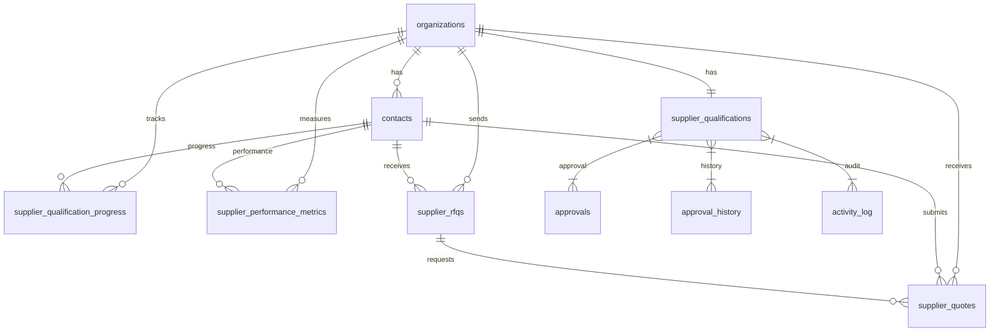

# Supplier Management Schema Documentation

## Overview

This document describes the database schema for the Supplier Management module in Factory Pulse. The schema is designed to work seamlessly with the existing Factory Pulse architecture while providing robust functionality for supplier onboarding, qualification, performance tracking, and RFQ management.

## Core Design Principles

1. **Leverage Existing Architecture**: Utilizes the established `organizations` and `contacts` tables for supplier data
2. **Normalized Structure**: Eliminates data redundancy through proper normalization
3. **Multi-tenancy Support**: Enforces Row Level Security (RLS) for organization-level data isolation
4. **Audit Trail**: Integrates with existing `activity_log` and `approval_history` tables
5. **Extensibility**: Designed to accommodate future enhancements

## Entity Relationship Diagram

## Table Descriptions

### 1. supplier_qualifications

Stores detailed qualification information for suppliers.

| Column                                | Type                          | Description                                   |
| ------------------------------------- | ----------------------------- | --------------------------------------------- |
| id                                    | UUID                          | Primary key                                   |
| organization_id                       | UUID                          | Foreign key to organizations table (supplier) |
| qualification_status                  | supplier_qualification_status | Current qualification status                  |
| qualification_expiry                  | DATE                          | Date when qualification expires               |
| qualification_conditions              | TEXT                          | Conditions for partial approval               |
| qualification_conditions_resolved     | BOOLEAN                       | Whether conditions are resolved               |
| qualification_exception_justification | TEXT                          | Justification for exception approval          |
| qualification_exception_expires_at    | DATE                          | Expiry date for exception approval            |
| qualification_exception_reviewed_by   | UUID                          | User who reviewed exception                   |
| overall_score                         | NUMERIC(5,2)                  | Overall qualification score (0-100)           |
| criteria_scores                       | JSONB                         | Detailed scores for each criterion            |
| recommendations                       | TEXT[]                        | Qualification recommendations                 |
| valid_until                           | DATE                          | Date until which qualification is valid       |
| approved_by                           | UUID                          | User who approved qualification               |
| approved_at                           | TIMESTAMPTZ                   | Timestamp of approval                         |
| created_by                            | UUID                          | User who created record                       |
| created_at                            | TIMESTAMPTZ                   | Record creation timestamp                     |
| updated_at                            | TIMESTAMPTZ                   | Record update timestamp                       |

### 2. supplier_qualification_progress

Tracks progress through qualification sub-stages.

| Column          | Type        | Description                                 |
| --------------- | ----------- | ------------------------------------------- |
| id              | UUID        | Primary key                                 |
| organization_id | UUID        | Foreign key to organizations table          |
| supplier_id     | UUID        | Foreign key to contacts table (supplier)    |
| sub_stage_slug  | TEXT        | Slug identifier for qualification sub-stage |
| status          | TEXT        | Status of sub-stage progress                |
| completed_at    | TIMESTAMPTZ | Timestamp when sub-stage completed          |
| metadata        | JSONB       | Additional tracking metadata                |
| created_at      | TIMESTAMPTZ | Record creation timestamp                   |
| updated_at      | TIMESTAMPTZ | Record update timestamp                     |

### 3. supplier_performance_metrics

Tracks supplier performance metrics for analytics and reporting.

| Column                      | Type          | Description                              |
| --------------------------- | ------------- | ---------------------------------------- |
| id                          | UUID          | Primary key                              |
| organization_id             | UUID          | Foreign key to organizations table       |
| supplier_id                 | UUID          | Foreign key to contacts table (supplier) |
| period_start                | DATE          | Start date of performance period         |
| period_end                  | DATE          | End date of performance period           |
| total_orders                | INTEGER       | Total orders placed with supplier        |
| on_time_deliveries          | INTEGER       | Number of on-time deliveries             |
| average_lead_time_days      | NUMERIC(5,2)  | Average lead time in days                |
| quality_incidents           | INTEGER       | Number of quality incidents              |
| quality_score               | NUMERIC(5,2)  | Quality score (0-100)                    |
| total_spend                 | NUMERIC(18,2) | Total spend with supplier                |
| average_cost_variance       | NUMERIC(5,2)  | Average cost variance percentage         |
| response_rate               | NUMERIC(5,2)  | Supplier response rate percentage        |
| average_response_time_hours | NUMERIC(5,2)  | Average response time in hours           |
| overall_performance_score   | NUMERIC(5,2)  | Overall performance score (0-100)        |
| performance_grade           | TEXT          | Performance grade (A-F)                  |
| notes                       | TEXT          | Additional notes                         |
| metadata                    | JSONB         | Additional performance metadata          |
| created_by                  | UUID          | User who created record                  |
| created_at                  | TIMESTAMPTZ   | Record creation timestamp                |
| updated_at                  | TIMESTAMPTZ   | Record update timestamp                  |

### 4. supplier_rfqs

Manages RFQs sent to suppliers.

| Column                 | Type                | Description                              |
| ---------------------- | ------------------- | ---------------------------------------- |
| id                     | UUID                | Primary key                              |
| organization_id        | UUID                | Foreign key to organizations table       |
| project_id             | UUID                | Foreign key to projects table            |
| supplier_id            | UUID                | Foreign key to contacts table (supplier) |
| rfq_number             | TEXT                | Unique RFQ number                        |
| status                 | supplier_rfq_status | Current RFQ status                       |
| priority               | TEXT                | RFQ priority level                       |
| due_date               | DATE                | Date by which response is due            |
| expected_response_date | DATE                | Expected date of response                |
| sent_at                | TIMESTAMPTZ         | Timestamp when RFQ was sent              |
| viewed_at              | TIMESTAMPTZ         | Timestamp when RFQ was viewed            |
| requirements           | TEXT                | RFQ requirements                         |
| special_instructions   | TEXT                | Special instructions for supplier        |
| created_by             | UUID                | User who created RFQ                     |
| created_at             | TIMESTAMPTZ         | Record creation timestamp                |
| updated_at             | TIMESTAMPTZ         | Record update timestamp                  |

### 5. supplier_quotes

Stores quotes received from suppliers.

| Column           | Type                  | Description                              |
| ---------------- | --------------------- | ---------------------------------------- |
| id               | UUID                  | Primary key                              |
| organization_id  | UUID                  | Foreign key to organizations table       |
| supplier_rfq_id  | UUID                  | Foreign key to supplier_rfqs table       |
| supplier_id      | UUID                  | Foreign key to contacts table (supplier) |
| quote_number     | TEXT                  | Supplier quote number                    |
| unit_price       | NUMERIC(18,2)         | Unit price quoted                        |
| total_amount     | NUMERIC(18,2)         | Total quote amount                       |
| currency         | TEXT                  | Currency of quote                        |
| quantity         | INTEGER               | Quantity quoted                          |
| lead_time_days   | INTEGER               | Lead time in days                        |
| valid_until      | DATE                  | Date until which quote is valid          |
| payment_terms    | TEXT                  | Payment terms offered                    |
| shipping_terms   | TEXT                  | Shipping terms offered                   |
| status           | supplier_quote_status | Current quote status                     |
| notes            | TEXT                  | Additional notes                         |
| quote_file_url   | TEXT                  | URL to quote document                    |
| is_selected      | BOOLEAN               | Whether quote is selected                |
| submitted_at     | TIMESTAMPTZ           | Timestamp when quote was submitted       |
| evaluated_at     | TIMESTAMPTZ           | Timestamp when quote was evaluated       |
| evaluated_by     | UUID                  | User who evaluated quote                 |
| evaluation_score | NUMERIC(5,2)          | Evaluation score (0-100)                 |
| evaluation_notes | TEXT                  | Evaluation notes                         |
| metadata         | JSONB                 | Additional quote metadata                |
| created_at       | TIMESTAMPTZ           | Record creation timestamp                |
| updated_at       | TIMESTAMPTZ           | Record update timestamp                  |

## Enums

### supplier_qualification_status
- `not_started`
- `in_progress`
- `pending_approval`
- `qualified`
- `qualified_with_conditions`
- `qualified_as_exception`
- `rejected`
- `expired`

### supplier_rfq_status
- `draft`
- `sent`
- `viewed`
- `quoted`
- `declined`
- `expired`
- `cancelled`

### supplier_quote_status
- `sent`
- `received`
- `rejected`
- `accepted`
- `expired`
- `cancelled`

## Integration with Existing Systems

### Organizations and Contacts
Suppliers are represented as organizations with `organization_type = 'supplier'` and contacts with `type = 'supplier'`. This leverages the existing multi-tenant architecture.

### Approvals
Supplier qualification approvals integrate with the existing `approvals` and `approval_history` tables through the `entity_type = 'supplier_qualification'` convention.

### Documents
Supplier documents use the existing `documents` table with supplier-specific categories:
- `supplier_nda`
- `supplier_iso`
- `supplier_insurance`
- `supplier_financial`
- `supplier_qc`
- `supplier_profile`
- `supplier_logo`

### Activity Logging
All supplier management actions are logged in the existing `activity_log` table with appropriate entity types.

## RPC Functions

### start_supplier_qualification(supplier_org_id UUID)
Initiates the qualification process for a supplier:
1. Creates/updates supplier qualification record with status `in_progress`
2. Creates qualification progress records for all sub-stages
3. Returns success status with qualification ID

### approve_supplier_qualification(...)
Handles approval of supplier qualification with support for different approval types:
- Full approval (`qualified`)
- Partial approval with conditions (`qualified_with_conditions`)
- Exception approval (`qualified_as_exception`)
- Rejection (`rejected`)

## Views

### supplier_details_view
Provides a comprehensive view of supplier information by joining:
- Organizations (supplier details)
- Contacts (primary contact information)
- Supplier qualifications
- Latest performance metrics
- RFQ and quote statistics

## Security

### Row Level Security (RLS)
All supplier management tables enforce RLS policies that restrict access to records belonging to the current user's organization.

### Roles
Access to supplier management functions is restricted based on user roles:
- `procurement`
- `quality`
- `engineering`
- `management`
- `admin`

## Performance Considerations

### Indexes
Strategic indexes are created on frequently queried columns:
- Organization IDs for all tables
- Status columns for filtering
- Date columns for time-based queries
- Foreign key relationships for joins

### Triggers
Automatic `updated_at` timestamp updates are implemented using triggers on all tables.

## Migration Notes

This schema is designed to be applied as a single migration file. It includes:
1. Creation of new tables
2. Index definitions
3. Trigger functions
4. RLS policies
5. Seed data for document categories
6. RPC functions
7. Views

The migration is idempotent and can be safely re-run without duplicating data.

## Future Enhancements

This schema supports future enhancements such as:
- Supplier risk assessment
- Supplier diversity tracking
- Advanced analytics and reporting
- Integration with external supplier databases
- Automated re-qualification workflows