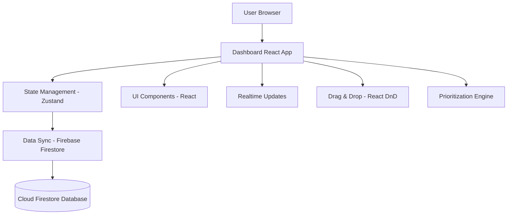

### `requirements-feature3.md`


# Requirements Document: Feature 3 - Dashboard & Workflow Management

## Introduction
The Dashboard & Workflow Management system is the central command center for the RFQ management platform. It provides internal teams with a comprehensive view of all RFQs, enables efficient workflow management through a Kanban-style interface, and automates key processes to ensure timely completion of quotes. This system is designed for Procurement Owners, Engineering teams, QA teams, Production teams, and Management to collaborate effectively on RFQ processing.

## Stakeholders
- Procurement Owner
- Engineering Team
- QA Team
- Production Team
- Management
- System Administrator

## Requirements

### Requirement 3.1: Kanban-Style Dashboard
**User Story:** As a Procurement Owner, I want to see all RFQs organized by status in a Kanban board, so I can monitor progress at a glance.  
**Acceptance Criteria:**
- The system SHALL display a Kanban-style dashboard with configurable columns representing RFQ phases (e.g., Inquiry, Review, Quotation, Production, Completed) with RFQ statuses (e.g., Inquiry, Technical Review, QA Review, Send To Supplier, Quotation To Customer, Won, Lost).
- Columns SHALL be reorderable and customizable by administrators.
- Each RFQ card SHALL display key information: RFQ ID, project name, customer, volume, estimated margin, and priority level.

### Requirement 3.2: Drag-and-Drop Workflow Management
**User Story:** As a team lead, I want to move RFQs between stages using drag-and-drop, so I can update their status quickly and intuitively.  
**Acceptance Criteria:**
- Users SHALL be able to drag and drop RFQ cards between columns to change their status.
- The system SHALL update the RFQ status in Firestore in real time upon drop.
- Invalid transitions (e.g., skipping required stages) SHALL be prevented based on workflow rules.

### Requirement 3.3: Real-Time Updates
**User Story:** As a team member, I want to see changes made by others instantly, so I can stay synchronized without refreshing.  
**Acceptance Criteria:**
- The dashboard SHALL update in real time when RFQs are moved, assigned, or modified by any user.
- Changes SHALL be reflected across all connected clients within 1 second.
- The system SHALL handle reconnection gracefully after network interruptions.

### Requirement 3.4: Priority Scoring & Sorting
**User Story:** As a manager, I want RFQs sorted by priority, so critical opportunities are addressed first.  
**Acceptance Criteria:**
- The system SHALL automatically calculate a priority score for each RFQ based on:
  - Annual volume
  - Estimated margin
  - Technical complexity
  - Timeline constraints
- Priority levels (High, Medium, Low) SHALL be visually indicated using color coding and badges.
- RFQs within each column SHALL be sorted by priority score (descending).

### Requirement 3.5: Performance and Responsiveness
**User Story:** As a user, I want the dashboard to remain fast and smooth, even with hundreds of RFQs.  
**Acceptance Criteria:**
- The dashboard SHALL load within 2 seconds for datasets of up to 1,000 RFQs.
- Drag-and-drop operations SHALL be animated smoothly without lag.
- Filtering and searching SHALL return results within 1 second.
- Under heavy load, the system SHALL display loading indicators for long-running operations.

## Non-Functional Requirements
- The system SHALL support concurrent access by 100+ users.
- All real-time data synchronization SHALL use secure WebSocket connections (via Firebase).
- The UI SHALL be responsive and usable on desktop and tablet devices.


### `design-feature3.md`

# Design Document: Feature 3 - Dashboard & Workflow Management

## Overview
The Dashboard & Workflow Management system is the central hub of the RFQ management platform, providing a comprehensive Kanban-style interface for managing the entire RFQ lifecycle. The system is designed to handle high-volume operations with real-time updates, intelligent prioritization, and seamless collaboration between internal teams. Built on a modern React architecture with Firebase backend, it emphasizes performance, scalability, and user experience.

## Architecture

### High-Level Architecture


## Components and Interfaces

### Frontend Components

#### 1. Kanban Board
```typescript
interface KanbanBoardProps {
  columns: WorkflowStage[];
  rfqs: RFQCardData[];
  onRfqMove: (rfqId: string, newStage: string) => void;
}

interface RFQCardData {
  rfqId: string;
  projectName: string;
  customer: string;
  volume: number;
  estimatedMargin: number;
  priority: 'High' | 'Medium' | 'Low';
  currentPhase: string;
  timeInPhase: number; // days
}
```

#### 2. Drag-and-Drop Service
- Uses `react-dnd` or `dnd-kit` for smooth drag interactions.
- Cards are lifted on drag start with visual feedback.
- Drop zones highlight valid targets.

### Backend Services

#### 1. Real-Time Sync Service
- Firebase Firestore listeners on `rfqs` collection with status and priority filters.
- Optimized queries using composite indexes.

#### 2. Priority Scoring Engine
```typescript
interface PriorityScoreRequest {
  rfqId: string;
  volume: number;
  estimatedMargin: number;
  complexity: number; // 1-10
  timelineUrgency: number; // days until deadline
}

interface PriorityScoreResponse {
  score: number; // 0-100
  priority: 'High' | 'Medium' | 'Low';
  breakdown: {
    volumeWeight: number;
    marginWeight: number;
    complexityWeight: number;
    timelineWeight: number;
  };
}
```

## Data Model
```json
rfqs (collection)
  └── {rfqId} (document)
      ├── rfqId: string
      ├── status: string (maps to workflow stage)
      ├── priorityScore: number
      ├── priorityLevel: "High" | "Medium" | "Low"
      ├── assignedTo: reference to user (optional)
      ├── createdAt: timestamp
      ├── updatedAt: timestamp
      ├── phaseHistory: array of { stage, enteredAt, exitedAt }
      └── metadata: { timeInCurrentPhase, totalTime }
```

## Workflow Configuration
- Workflow stages are stored in a `workflowConfig` document.
- Admins can modify stage names, order, colors, and transition rules.

## Performance Optimization
- Virtualized rendering for large lists.
- Firestore query optimization with pagination and caching.
- Zustand state partitioning to avoid unnecessary re-renders.

## Monitoring Metrics
```typescript
interface PerformanceMetrics {
  dashboardLoadTime: number; // ms
  realTimeUpdateLatency: number; // ms
  searchResponseTime: number; // ms
  dragDropLatency: number; // ms
  memoryUsage: number; // MB
  errorRate: number; // %
}
```

### `tasks-feature3.md`

# Implementation Plan: Feature 3 - Dashboard & Workflow Management

## Sprint 1 (from PRD)

- [ ] **1. Set up dashboard foundation and state management**
  - [ ] Initialize React project structure with TypeScript and modern tooling
  - [ ] Configure Zustand for global state management and React Query for server state
  - [ ] Set up Firebase integration with Firestore real-time listeners
  - [ ] Create base routing structure and authentication guards
  - **Requirements:** 3.1, 9.1

- [ ] **2. Implement Kanban-style dashboard with real-time data**
  - [ ] Design and build Kanban board UI with dynamic columns
  - [ ] Fetch RFQ data from Firestore in real time
  - [ ] Display RFQ cards with key metadata (ID, project, customer, volume, margin)
  - [ ] Implement column reordering and responsive layout
  - **Requirements:** 3.1, 3.3

- [ ] **3. Add drag-and-drop functionality**
  - [ ] Integrate `dnd-kit` or `react-dnd` for drag-and-drop support
  - [ ] Enable moving RFQ cards between columns
  - [ ] On drop, update RFQ status in Firestore
  - [ ] Add visual feedback (hover states, drop zones)
  - **Requirements:** 3.2

- [ ] **4. Implement automatic priority scoring**
  - [ ] Define scoring algorithm based on volume, margin, complexity, timeline
  - [ ] Create `calculatePriorityScore` utility function
  - [ ] Run scoring on RFQ creation and update
  - [ ] Store score and priority level in Firestore
  - **Requirements:** 3.4

- [ ] **5. Add visual indicators for priority levels**
  - [ ] Use color coding (red, yellow, green) for priority
  - [ ] Add badges to RFQ cards
  - [ ] Sort RFQs within each column by priority score (descending)
  - **Requirements:** 3.4

- [ ] **6. Implement real-time sync and conflict handling**
  - [ ] Use Firestore listeners for live updates
  - [ ] Handle concurrent edits with last-write-wins or merge logic
  - [ ] Show toast notifications when RFQs are updated by others
  - **Requirements:** 3.3

- [ ] **7. Optimize performance for large datasets**
  - [ ] Implement virtual scrolling for long columns
  - [ ] Optimize Firestore queries with indexes and pagination
  - [ ] Add loading skeletons and performance monitoring
  - **Requirements:** 3.5

- [ ] **8. Write unit and integration tests**
  - [ ] Test drag-and-drop logic
  - [ ] Mock real-time updates and verify UI reactivity
  - [ ] Validate priority scoring accuracy
  - [ ] Test performance under simulated load
