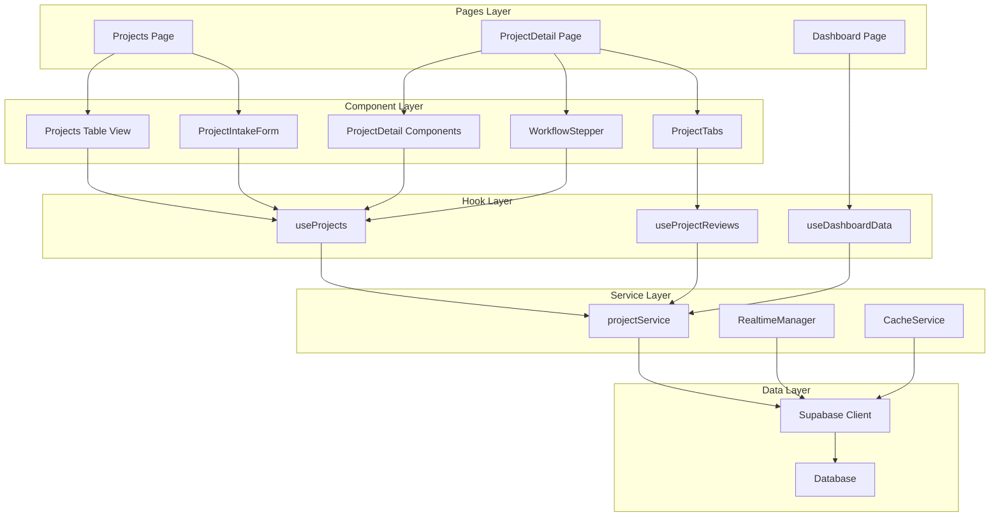
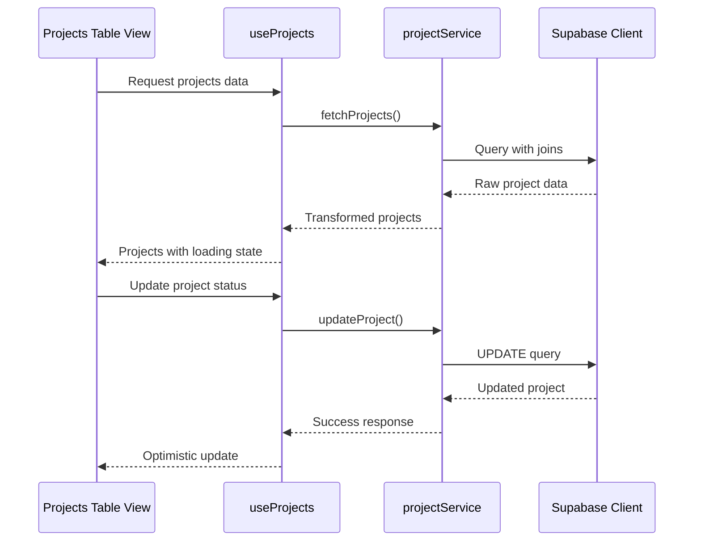
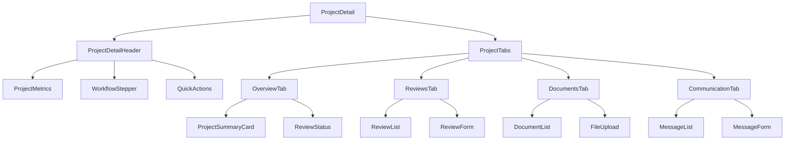
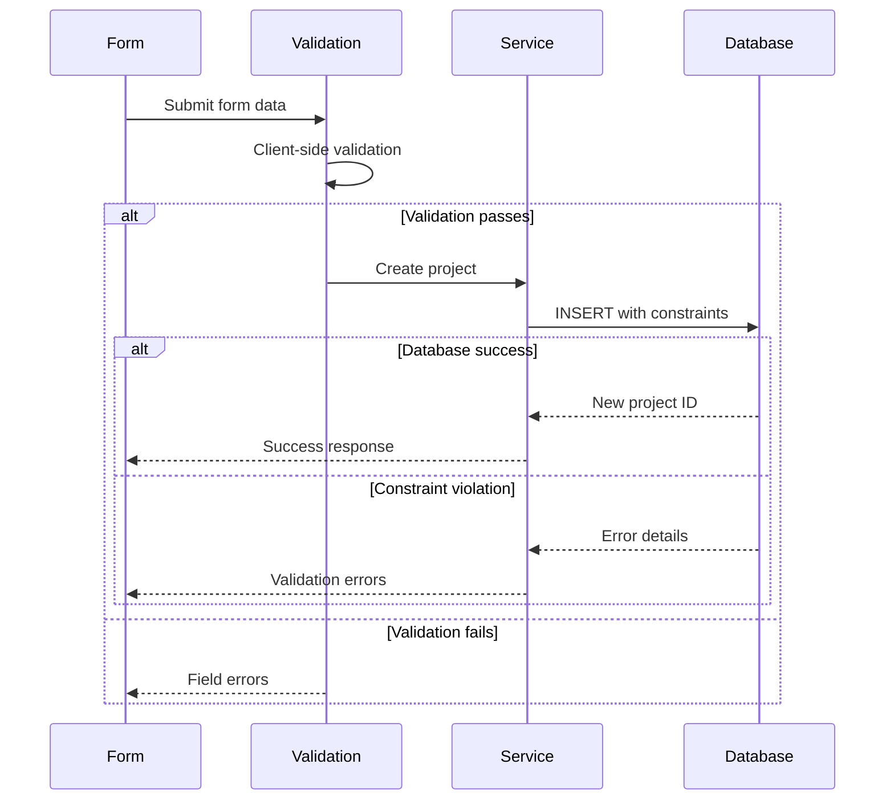
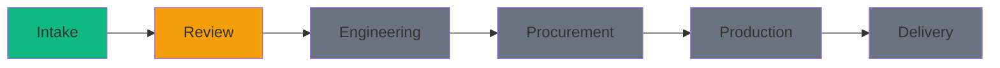
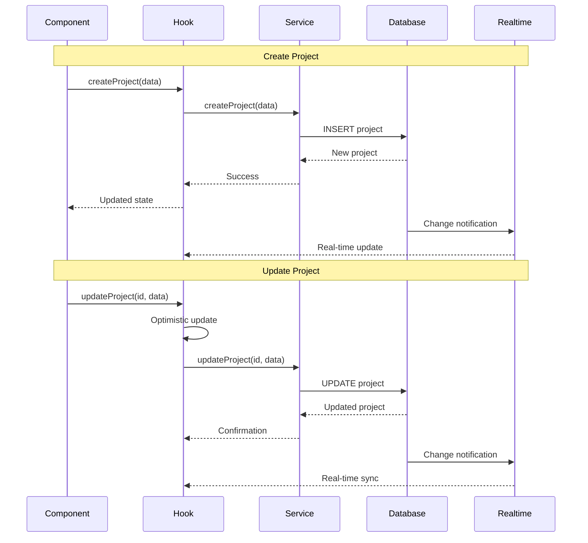
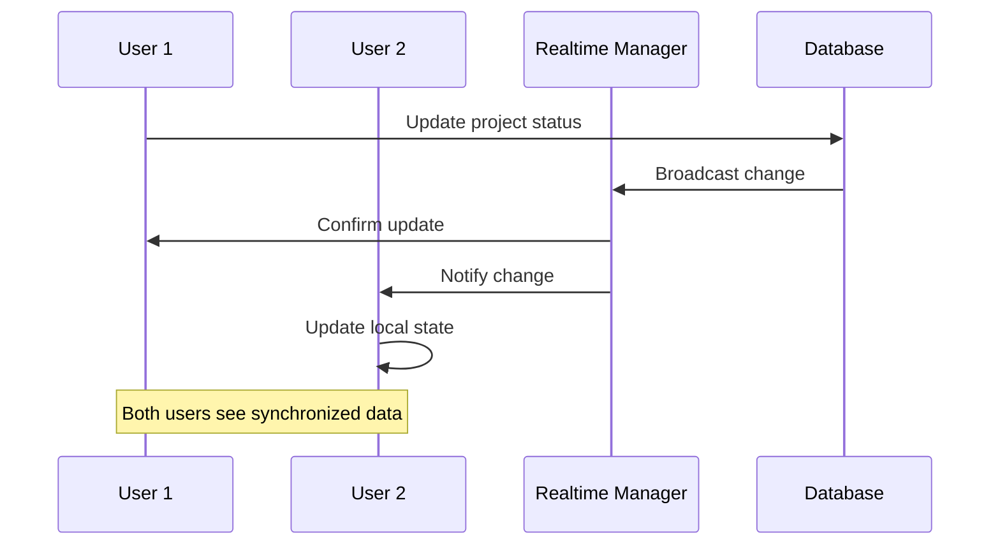
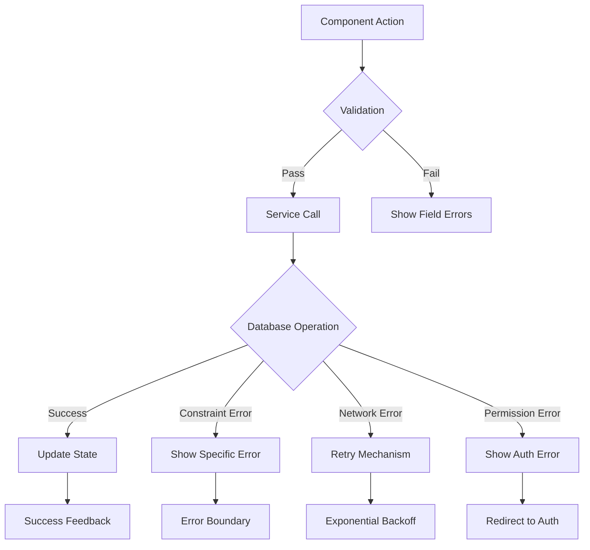
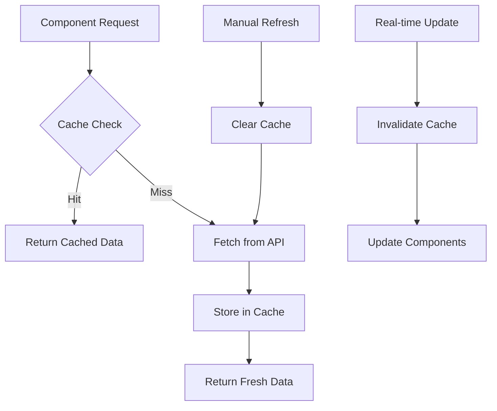
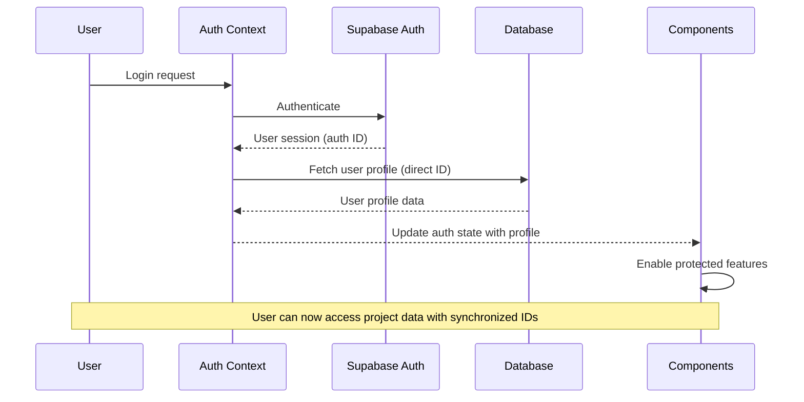

# Component Architecture and Data Flow

## Overview

This document outlines the component architecture of the Factory Pulse project management system, including data flow patterns, component relationships, and integration points.

## High-Level Architecture



## Setup and Configuration Scripts

### Google Drive Setup Script

**Purpose**: Automated setup and configuration script for Google Drive integration

**Location**: `scripts/setup-google-drive.js`

**Status**: ✅ **Script implemented and integrated with npm scripts**

**NPM Script**: `npm run setup:google-drive`

**Script Features:**
- **Environment Validation**: Validates required Supabase and Google Drive credentials
- **Database Setup**: Checks for Google Drive integration tables and creates configuration
- **Organization Integration**: Automatically detects and uses first available organization
- **Configuration Management**: Creates or updates Google Drive config with current environment variables
- **Comprehensive Validation**: Validates setup completion and provides next-step guidance

**Prerequisites:**
```bash
# Required environment variables in .env.local
VITE_SUPABASE_URL=your_supabase_url
VITE_SUPABASE_SERVICE_ROLE_KEY=your_service_role_key
VITE_GOOGLE_CLIENT_ID=your_google_client_id
VITE_GOOGLE_CLIENT_SECRET=your_google_client_secret
```

**Database Schema (Updated 2025-09-03):**
```sql
-- Simplified Google Drive Configuration Table
CREATE TABLE IF NOT EXISTS google_drive_config (
    id UUID DEFAULT gen_random_uuid() PRIMARY KEY,
    organization_id UUID NOT NULL,  -- Simplified: No foreign key constraint
    client_id TEXT NOT NULL,
    client_secret TEXT NOT NULL,
    redirect_uri TEXT NOT NULL,
    is_active BOOLEAN DEFAULT true,
    created_at TIMESTAMP WITH TIME ZONE DEFAULT NOW(),
    updated_at TIMESTAMP WITH TIME ZONE DEFAULT NOW()
    -- Removed: created_by column and complex unique constraints
);

-- Simplified Google Drive Tokens Table
CREATE TABLE IF NOT EXISTS google_drive_tokens (
    id UUID DEFAULT gen_random_uuid() PRIMARY KEY,
    user_id UUID NOT NULL,          -- Simplified: No foreign key constraint
    organization_id UUID NOT NULL,  -- Simplified: No foreign key constraint
    access_token TEXT NOT NULL,
    refresh_token TEXT,
    token_type TEXT DEFAULT 'Bearer',
    expires_at TIMESTAMP WITH TIME ZONE NOT NULL,
    scope TEXT,
    created_at TIMESTAMP WITH TIME ZONE DEFAULT NOW(),
    updated_at TIMESTAMP WITH TIME ZONE DEFAULT NOW(),
    UNIQUE(user_id, organization_id)  -- Maintained: Unique constraint
);
```

**Schema Simplification Benefits:**
- **Improved Compatibility**: Removes dependency on existing table structures
- **Easier Setup**: Eliminates foreign key constraint errors during migration
- **Maintained Security**: RLS policies handle access control instead of foreign key constraints
- **Flexible Deployment**: Can be applied regardless of existing data state

**Setup Process:**
```typescript
// 1. Environment validation
if (!supabaseUrl || !supabaseServiceKey) {
    console.error('❌ Missing Supabase configuration');
    process.exit(1);
}

if (!googleClientId || !googleClientSecret) {
    console.error('❌ Missing Google Drive configuration');
    console.error('Get credentials from Google Cloud Console');
    process.exit(1);
}

// 2. Database table validation (simplified schema)
const { data: configTable, error: configError } = await supabase
    .from('google_drive_config')
    .select('count')
    .limit(1);

// 3. Organization detection and configuration
const { data: orgs } = await supabase
    .from('organizations')
    .select('id, name')
    .limit(1);

// 4. Configuration creation or update (simplified insert)
const { data: newConfig, error: insertError } = await supabase
    .from('google_drive_config')
    .insert({
        organization_id: defaultOrg.id,
        client_id: googleClientId,
        client_secret: googleClientSecret,
        redirect_uri: 'http://localhost:8080/auth/google/callback',
        is_active: true
    });
```

**Error Handling:**
- **Missing Credentials**: Clear error messages with setup instructions
- **Database Issues**: Guidance for running migrations if tables don't exist
- **Configuration Conflicts**: Automatic detection and update of existing configurations
- **Validation Failures**: Comprehensive error reporting with troubleshooting steps

**Success Output:**
```bash
✅ Google Drive integration setup completed successfully!

📋 Next steps:
1. Make sure your Google Cloud Console OAuth settings include:
   - Authorized redirect URI: http://localhost:8080/auth/google/callback
   - Authorized JavaScript origins: http://localhost:8080
2. Restart your development server: npm run dev
3. Test the integration from the document management page
```

**Integration Points:**
- **Google Drive Service**: Configures database for `googleDriveService` operations
- **OAuth Flow**: Sets up redirect URI and client credentials for authentication
- **Document Management**: Enables Google Drive integration in document upload/link features
- **Organization System**: Integrates with existing organization-based multi-tenancy

**Dependencies:**
- **@supabase/supabase-js**: Database operations with service role authentication
- **dotenv**: Environment variable loading from .env.local
- **Node.js ES Modules**: Modern module system with file URL utilities

## Core Components

### ProjectDetailLayout Component

**Purpose**: Foundation layout component for project detail pages with tabbed interface and status monitoring

**Location**: `src/components/project/ProjectDetailLayout.tsx`

**Status**: ✅ **Core component implemented and ready for integration**

**Component Features:**
- **Tabbed Interface**: Six main tabs (Overview, Documents, Communication, Reviews, Analytics, Settings) with dynamic badge support
- **Project Status Summary**: Real-time status card with progress indicators, health metrics, and time tracking
- **Health Monitoring**: Automated health scoring system with risk level assessment (Good/At Risk/Critical)
- **Progress Visualization**: Stage-based progress calculation with animated progress bar
- **Responsive Design**: Mobile-friendly layout with grid-based responsive breakpoints
- **Tab Management**: Internal and external tab state management with callback support

**Component Interface:**
```typescript
interface ProjectDetailLayoutProps {
  project: Project;
  workflowStages?: WorkflowStage[];
  activeTab?: string;
  onTabChange?: (tab: string) => void;
  children?: React.ReactNode;
  className?: string;
}

interface TabConfig {
  id: string;
  label: string;
  icon: React.ElementType;
  badge?: number;
  badgeVariant?: 'default' | 'secondary' | 'destructive' | 'outline';
  disabled?: boolean;
}
```

**Health Scoring System:**
- **Algorithm**: Analyzes time in stage, priority level, and delivery date proximity
- **Risk Thresholds**: Critical (>3 days for critical projects), At Risk (>7 days for high priority, >14 days general)
- **Visual Indicators**: Color-coded health icons (CheckCircle2, AlertCircle) with descriptive status text
- **Real-time Updates**: Recalculates health metrics based on current project state

**Progress Calculation Features:**
- **Stage-Based Progress**: Calculates completion percentage based on current workflow stage position
- **Visual Progress Bar**: Animated progress indicator with smooth transitions and percentage display
- **Stage Information**: Current stage display with color-coded badges and entry date tracking
- **Time Tracking**: Days in current stage with formatted entry date display

**Tab System Features:**
- **Dynamic Badges**: Support for notification badges with overflow handling (99+ for large numbers)
- **Icon Integration**: Lucide React icons for each tab with consistent sizing
- **State Management**: Internal tab state with external control support via onTabChange callback
- **Accessibility**: Proper ARIA labels and keyboard navigation support

**Integration Points:**
- **EnhancedProjectDetail**: Main container component that uses this layout
- **ProjectStatusManager**: Status management component for status transitions
- **InlineProjectEditor**: Inline editing component for project information
- **Tab Content Components**: DocumentManager, ProjectCommunication, ReviewList for tab content
- **WorkflowStage System**: Integration with workflow stages for progress calculation

**Performance Optimizations:**
- **Memoized Calculations**: Efficient progress and health score calculations with helper functions
- **Callback Optimization**: Proper event handler optimization to prevent unnecessary re-renders
- **Conditional Rendering**: Smart rendering of badges and status indicators
- **Responsive Breakpoints**: Optimized layout for different screen sizes

**Dependencies:**
- **UI Components**: Card, Tabs, Badge, Button, Separator from shadcn/ui
- **Icons**: Lucide React icons (FileText, MessageSquare, Users, BarChart3, Settings, Clock, CheckCircle2, AlertCircle, Activity)
- **Types**: Project and WorkflowStage interfaces from project types
- **Utilities**: cn utility function for conditional class names

### DocumentUploadZone Component

**Purpose**: Advanced document upload interface with drag-and-drop functionality and comprehensive file management

**Location**: `src/components/project/DocumentUploadZone.tsx`

**Status**: ✅ **Fully implemented and integrated with document management system**

### GoogleDriveTest Component

**Purpose**: Comprehensive testing interface for Google Drive integration with admin tools and debugging capabilities

**Location**: `src/pages/GoogleDriveTest.tsx`

**Status**: ✅ **Component implemented and integrated with existing Google Drive system**

**Component Features:**
- **Integration Status Dashboard**: Real-time display of Google Drive connection status with visual indicators
- **One-Click Authentication**: Direct Google Drive connection testing with error handling
- **Admin Configuration Access**: Role-based access to GoogleDriveConfigPanel for system administrators
- **Embedded Setup Instructions**: Quick setup guide with external resource links
- **Debug Panel Integration**: Comprehensive debugging tools via GoogleDriveDebugPanel
- **Resource Management**: Direct links to Google Cloud Console and API documentation

**Component Interface:**
```typescript
// No props - standalone page component
// Uses useAuth for role-based access control
// Uses useGoogleDrive for authentication state management
```

**Key Features:**
- **Status Monitoring**: Live connection status with color-coded indicators (Connected/Not Connected)
- **Error Display**: Real-time error messages with troubleshooting context
- **Admin Tools**: Conditional rendering of configuration panel based on user role
- **External Integration**: Direct links to Google Cloud Console credentials page
- **Documentation Links**: Embedded links to setup guides and API documentation

**Integration Points:**
- **GoogleDriveConfigPanel**: Admin-only configuration management interface
- **GoogleDriveDebugPanel**: Comprehensive debugging and testing tools
- **useGoogleDrive Hook**: Authentication state management and error handling
- **useAuth Context**: Role-based access control for admin features

**User Experience:**
- **Visual Feedback**: Clear status indicators and loading states
- **Error Handling**: Comprehensive error display with actionable guidance
- **Resource Access**: Quick access to external documentation and tools
- **Role-Based UI**: Different interface elements based on user permissions

### GoogleDriveCallback Component

**Purpose**: OAuth callback handler for Google Drive authentication with enhanced debugging capabilities

**Location**: `src/pages/GoogleDriveCallback.tsx`

**Status**: ✅ **Component implemented with enhanced debugging and error handling**

**Component Features:**
- **OAuth Callback Processing**: Handles Google Drive OAuth 2.0 authentication callback
- **Enhanced State Debugging**: Comprehensive logging of authentication state variables
- **Error Handling**: Graceful handling of authentication errors and edge cases
- **localStorage Management**: Proper cleanup of OAuth state after processing
- **User Experience**: Loading states and success/error feedback with automatic redirection

**Recent Enhancements (2025-09-03):**
- **Enhanced OAuth State Debugging**: Added comprehensive logging for troubleshooting authentication issues
- **Improved Error Handling**: Prevents premature error states when user authentication is still loading
- **localStorage Inspection**: Detailed debugging of OAuth state storage and retrieval with full localStorage enumeration
- **Authentication Flow Coordination**: Better handling of user authentication timing to prevent race conditions

**Component Interface:**
```typescript
// No props - uses URL search parameters and React Router
// Handles OAuth callback automatically on mount
// Manages authentication state internally
```

**Authentication Flow:**
```typescript
// 1. Wait for user authentication to complete
if (authLoading || !user || !profile) return;

// 2. Validate OAuth state from localStorage
const storedState = localStorage.getItem('google_drive_auth_state');
const storedOrgId = localStorage.getItem('google_drive_organization_id');

// 3. Process OAuth callback with enhanced debugging
const code = searchParams.get('code');
const state = searchParams.get('state');
await handleAuthCallback(code, state);

// 4. Clean up OAuth state and redirect
localStorage.removeItem('google_drive_auth_state');
localStorage.removeItem('google_drive_organization_id');
navigate(-1);
```

**Debugging Features:**
- **Comprehensive Logging**: Detailed console output for OAuth state inspection
- **localStorage Enumeration**: Full inspection of localStorage contents for debugging
- **URL Parameter Logging**: Complete search parameter analysis
- **Authentication State Tracking**: User and profile authentication status monitoring
- **Error Context**: Detailed error information with troubleshooting guidance

**Integration Points:**
- **useGoogleDrive Hook**: OAuth callback processing and token management
- **useAuth Context**: User authentication state and profile information
- **React Router**: URL parameter handling and navigation
- **localStorage**: OAuth state persistence and cleanup

**Error Handling:**
- **Authentication Timing**: Graceful handling of authentication loading states
- **Missing State**: Clear error messages when OAuth state is not found
- **Invalid Parameters**: Validation of OAuth callback parameters
- **Network Errors**: Proper error handling for API failures

**Component Features:**
- **Drag-and-Drop Interface**: Full support for file dropping with visual feedback and hover states
- **File Selection**: Click-to-browse functionality with hidden file input and multiple file support
- **Progress Tracking**: Real-time upload progress with individual progress bars for each file
- **Metadata Management**: Comprehensive document type, access level, and tags configuration
- **File Validation**: Integration with `validateFileUploads` from project schemas with detailed error reporting
- **Batch Operations**: Upload multiple files with individual progress tracking and status management
- **Stage Integration**: Smart document type suggestions based on current workflow stage

**Component Interface:**
```typescript
interface DocumentUploadZoneProps {
    projectId: string;
    currentStageId?: string;
    onClose: () => void;
}

interface FileWithMetadata {
    file: File;
    id: string;
    metadata: DocumentMetadata;
    progress: number;
    status: 'pending' | 'uploading' | 'completed' | 'error';
    error?: string;
}

interface DocumentMetadata {
    document_type: string;
    access_level: string;
    tags: string[];
    description: string;
}
```

**File Management Features:**
- **Default Metadata Settings**: Pre-configure document type, access level, and tags for batch uploads
- **Individual File Control**: Modify metadata for each file independently before upload
- **File Removal**: Remove files from upload queue before processing
- **Status Tracking**: Visual indicators for pending, uploading, completed, and error states
- **Error Recovery**: Graceful error handling with detailed error messages and retry capabilities

**Stage-Aware Document Types:**
```typescript
const DOCUMENT_TYPES = [
    { value: 'rfq', label: 'RFQ Document', stages: ['rfq-intake', 'initial-review'] },
    { value: 'drawing', label: 'Technical Drawing', stages: ['engineering-review', 'design-development'] },
    { value: 'specification', label: 'Specification', stages: ['engineering-review', 'design-development'] },
    { value: 'quote', label: 'Quote/Proposal', stages: ['quotation', 'proposal-preparation'] },
    { value: 'contract', label: 'Contract', stages: ['contract-negotiation', 'order-confirmation'] },
    { value: 'bom', label: 'Bill of Materials', stages: ['engineering-review', 'procurement'] },
    { value: 'inspection', label: 'Inspection Report', stages: ['quality-control', 'final-inspection'] },
    { value: 'certificate', label: 'Certificate/Compliance', stages: ['quality-control', 'delivery'] },
    { value: 'other', label: 'Other', stages: [] }
];
```

**Upload Process Flow:**
```typescript
// Sequential upload with progress tracking
for (const fileItem of files) {
    // Update status to uploading
    setFiles(prev => prev.map(f => 
        f.id === fileItem.id 
            ? { ...f, status: 'uploading', progress: 0 }
            : f
    ));

    // Simulate progress updates
    const progressInterval = setInterval(() => {
        setFiles(prev => prev.map(f =>
            f.id === fileItem.id && f.progress < 90
                ? { ...f, progress: f.progress + 10 }
                : f
        ));
    }, 200);

    // Actual upload
    await uploadDocument(fileItem.file, fileItem.metadata);
    
    // Mark as completed
    setFiles(prev => prev.map(f => 
        f.id === fileItem.id 
            ? { ...f, status: 'completed', progress: 100 }
            : f
    ));
}
```

**Validation and Security:**
- **File Type Validation**: Supports PDF, DOC, DOCX, XLS, XLSX, DWG, CAD files, and images
- **Size Limits**: 50MB per file, 100MB total upload size with real-time size tracking
- **Access Level Control**: Public, Internal Only, and Confidential access levels
- **Tag System**: Flexible tagging system for document organization and search

**Integration Points:**
- **useDocuments Hook**: Seamless integration with existing document management system
- **useWorkflowStages Hook**: Stage-aware document type suggestions and validation
- **validateFileUploads**: Comprehensive file validation from project schemas
- **Sonner Toasts**: User-friendly success and error notifications
- **Modal System**: Integrated with shadcn/ui modal component for consistent UX

### DocumentManager Component

**Purpose**: Comprehensive document management interface for project files with advanced filtering and organization

**Location**: `src/components/project/DocumentManager.tsx`

**Status**: ✅ **Core component implemented, dependencies required**

**Component Features:**
- **Dual View Modes**: Seamless switching between grid and list views
- **Advanced Filtering**: Multi-criteria filtering by search, type, access level, date range, tags, and uploader
- **Smart Sorting**: Sort by name, date, size, or type with ascending/descending order control
- **Bulk Operations**: Multi-select documents for batch download, tagging, and deletion
- **Upload Integration**: Modal-based file upload with drag-and-drop support
- **Empty States**: Contextual messaging for no documents and filtered results
- **Loading States**: Proper loading indicators during data fetching

**Component Interface:**
```typescript
interface DocumentManagerProps {
  projectId: string;
}

interface DocumentFiltersState {
  search: string;
  type: string[];
  accessLevel: string[];
  dateRange: {
    from?: Date;
    to?: Date;
  };
  tags: string[];
  uploadedBy: string[];
}

export type ViewMode = 'grid' | 'list';
export type SortField = 'name' | 'date' | 'size' | 'type';
export type SortOrder = 'asc' | 'desc';
```

**State Management Features:**
- **Filter State**: Complex filtering state with multiple criteria
- **Selection State**: Multi-document selection for bulk operations
- **View State**: Toggle between grid and list presentation modes
- **Sort State**: Dynamic sorting with field and order control
- **UI State**: Modal visibility and filter panel toggle states

**Performance Optimizations:**
- **Memoized Filtering**: Efficient document filtering with useMemo
- **Memoized Sorting**: Optimized sorting operations
- **Callback Optimization**: useCallback for event handlers to prevent re-renders
- **Computed Values**: Derived state for filter options and active filter detection

**Dependencies Required:**
- **useDocuments Hook**: Data fetching hook for project documents
- **DocumentUploadZone**: Modal component for file uploads
- **DocumentGrid**: Grid view component for document display
- **DocumentList**: List view component for document display
- **DocumentFilters**: Advanced filtering component
- **ProjectDocument Type**: TypeScript interface for document data

**Integration Points:**
- **Project Detail Tabs**: Integrates as Documents tab in project detail page
- **File Upload System**: Connects to Supabase storage for file management
- **Permission System**: Respects document access levels and user permissions
- **Search System**: Integrates with global search functionality

### Projects Table View

**Purpose**: Simplified project listing with filtering and basic information display

**Location**: `src/pages/Projects.tsx` (Table tab implementation)

**Implementation**: Direct HTML table with Tailwind CSS styling for better performance and maintainability

**Features**:
- Project type filtering
- Responsive design with overflow handling
- Status and type badges
- Currency formatting for estimated values
  onProjectSelect?: (project: Project) => void;
  onStatusChange?: (projectId: string, status: ProjectStatus) => void;
  onStageChange?: (projectId: string, stageId: string) => void;
  filters?: ProjectFilters;
  onFiltersChange?: (filters: ProjectFilters) => void;
}
```

**Data Flow**:


**Key Features**:
- Sortable columns with database field mapping
- Real-time updates via Supabase subscriptions
- Optimistic updates for better UX
- Bulk operations support
- Advanced filtering and search

### ProjectDetail Components

**Purpose**: Comprehensive project view with workflow management

**Location**: `src/pages/ProjectDetail.tsx`

**Current Implementation**: Simplified layout with enhanced project summary

**Component Hierarchy**:


### ProjectSummaryCard Component

**Purpose**: Enhanced project summary with stage-specific action items and workflow guidance

**Location**: `src/components/project/ProjectSummaryCard.tsx`

**Current Implementation**: Comprehensive project summary with dynamic action items based on workflow stage

**Props Interface**:
```typescript
interface ProjectSummaryCardProps {
  project: Project;
  workflowStages?: WorkflowStage[];
  onEdit?: () => void;
  onViewDetails?: () => void;
  className?: string;
}

interface ActionItem {
  id: string;
  title: string;
  description: string;
  priority: 'high' | 'medium' | 'low';
  icon: React.ElementType;
  action: () => void;
  completed?: boolean;
  dueDate?: string;
}
```

**Recent Updates**:
- Fixed missing `Calendar` icon import to resolve compilation issues
- All Lucide React icons properly imported and functional

**Key Features**:
- **Stage-Specific Actions**: Dynamic action items that change based on current workflow stage
- **Priority System**: Color-coded priority indicators (high/medium/low)
- **Comprehensive Coverage**: Action items for all 8 workflow stages
- **Interactive Elements**: Clickable actions with tooltips and descriptions
- **Visual Hierarchy**: Clear organization of project information and next steps

**Action Item System**:
- **Inquiry Received**: Customer verification, document upload, reviewer assignment
- **Technical Review**: Engineering, QA, and Production reviews
- **Supplier RFQ**: BOM creation, supplier selection, RFQ distribution
- **Quoted**: Quote compilation, customer quote preparation, quote delivery
- **Order Confirmed**: PO processing, work order creation, delivery confirmation
- **Procurement Planning**: Supplier finalization, production scheduling, material tracking
- **In Production**: Progress monitoring, quality inspections, shipping preparation
- **Shipped & Closed**: Delivery confirmation, feedback collection, project closure

**Priority Color System**:
```typescript
const getPriorityColor = (priority: 'high' | 'medium' | 'low'): string => {
  const colors = {
    high: 'bg-red-100 text-red-800 border-red-200',
    medium: 'bg-yellow-100 text-yellow-800 border-yellow-200',
    low: 'bg-green-100 text-green-800 border-green-200'
  };
  return colors[priority];
};
```

**Available Enhanced Components** (not currently integrated):
- `EnhancedProjectOverviewCard` - Advanced project overview with health scoring
- `VisualTimelineProgression` - Interactive timeline visualization

### StageConfigurationPanel Component

**Purpose**: Advanced workflow stage management with intelligent requirement generation and stage advancement controls

**Location**: `src/components/project/StageConfigurationPanel.tsx`

**Status**: ✅ **Component implemented and ready for integration**

**Component Features:**
- **Dynamic Requirements Generation**: Automatically generates stage-specific requirements based on workflow stage configuration
- **Exit Criteria Parsing**: Parses JSON exit criteria from workflow stages or handles plain text requirements
- **Requirement Status Tracking**: Tracks completion status of each requirement (completed/in_progress/pending)
- **Stage Advancement Controls**: Provides buttons to advance to next stages with validation
- **Progress Visualization**: Visual progress bar showing stage completion percentage
- **Requirement Type System**: Categorizes requirements by type (document/approval/data/review)

**Component Interface:**
```typescript
interface StageConfigurationPanelProps {
  project: Project;
  onStageUpdate?: (stageId: string) => void;
}

interface StageRequirement {
  id: string;
  name: string;
  description: string;
  type: 'document' | 'approval' | 'data' | 'review';
  status: 'completed' | 'pending' | 'in_progress';
  required: boolean;
}
```

**Requirement Generation System:**
- **Exit Criteria Parsing**: Automatically parses JSON exit criteria from workflow stages
- **Stage-Specific Requirements**: Generates contextual requirements based on stage name
- **Status Validation**: Intelligent status determination based on project data
- **Default Requirements**: Fallback requirements for stages without specific criteria

**Stage-Specific Logic:**
```typescript
// Example stage-specific requirements
switch (stageName) {
  case 'Inquiry Received':
    // Customer information and project description validation
  case 'Technical Review':
    // Engineering, QA, and Production review requirements
  case 'Supplier RFQ':
    // BOM breakdown and supplier selection requirements
  case 'Quoted':
    // Quote preparation and customer submission requirements
}
```

**Advancement Control Features:**
- **Prerequisite Validation**: Checks all required requirements before allowing advancement
- **Visual Indicators**: Color-coded buttons showing advancement readiness
- **Tooltip Guidance**: Contextual tooltips explaining advancement status
- **Stage Preview**: Shows next 2 available stages with advancement controls

**Integration Points:**
- **useWorkflowStages Hook**: Fetches workflow stage data and configuration
- **workflowStageService**: Service integration for stage management operations
- **Project Detail Tabs**: Designed for integration with project detail tabbed interface
- **Stage Transition System**: Connects to stage transition validation and history tracking

**Dependencies:**
- **UI Components**: Card, Badge, Button, Tooltip from shadcn/ui
- **Icons**: Lucide React icons (Settings, CheckCircle, Clock, AlertCircle, Users, FileText, ArrowRight, Info)
- **Hooks**: useWorkflowStages for stage data management
- **Services**: workflowStageService for stage operations
- **Types**: Project and WorkflowStage interfaces

### InteractiveNavigationSidebar Component

**Purpose**: Enhanced project detail navigation with hierarchical tabs and interactive features

**Location**: `src/components/project/InteractiveNavigationSidebar.tsx`

**Status**: ✅ **Component implemented and simplified for single-level navigation**

**Key Features:**
- **Single-Level Navigation**: Clean, streamlined navigation without sub-tabs
- **Session Persistence**: Remembers active tab states across browser sessions
- **Interactive States**: Loading, error, and notification indicators with visual feedback
- **Breadcrumb Navigation**: Contextual breadcrumbs with clickable navigation links
- **Project Context Display**: Shows current project title and ID in sidebar header
- **Secondary Actions**: Contextual dropdown menu with export, notification, and configuration options
- **Responsive Design**: Optimized layout with proper spacing and overflow handling

**Component Interface:**
```typescript
interface InteractiveNavigationSidebarProps {
  activeTab: string;
  onTabChange: (tabId: string) => void;
  tabs: NavigationTab[];
  breadcrumbs?: BreadcrumbItem[];
  projectId?: string;
  projectTitle?: string;
  onBack?: () => void;
  className?: string;
}

interface NavigationTab {
  id: string;
  label: string;
  icon: React.ComponentType<{ className?: string }>;
  badge?: number;
  disabled?: boolean;
  loading?: boolean;
  error?: boolean;
  hasNotifications?: boolean;
}
```

**State Management Features:**
- **Tab States**: Visual loading indicators during tab transitions
- **Error Handling**: Error states with visual indicators and fallback UI
- **Badge System**: Notification badges and counters for tabs
- **Active State**: Clear indication of currently active tab

**Visual Features:**
- **Interactive Icons**: Dynamic icons based on tab state (loading spinner, error alert, normal icon)
- **Badge Display**: Smart badge rendering with overflow handling (99+ for large numbers)
- **Hover Effects**: Smooth transitions and hover states for better UX
- **Active States**: Clear visual indication of active tabs and sub-tabs
- **Notification Indicators**: Animated pulse dots for urgent notifications

**Integration Points:**
- **Navigation Hook**: Designed to work with `useProjectNavigation` hook
- **Tab Content System**: Connects to project detail tab content management
- **Breadcrumb System**: Integrates with routing and navigation context
- **Action System**: Provides contextual actions based on active tab selection

### EnhancedProjectOverviewCard Component

**Purpose**: Comprehensive project header with real-time monitoring and analytics

**Location**: `src/components/project/EnhancedProjectOverviewCard.tsx`

**Status**: ⏸️ **Component created but temporarily not integrated in ProjectDetail page**

**Key Features**:
- **Real-time Status**: Live connection indicator with project health monitoring
- **Intelligent Alerts**: Dynamic alert generation based on project conditions
- **Health Scoring**: Automated project health calculation (0-100 scale)
- **Risk Assessment**: Automatic risk level determination (low/medium/high)
- **Timeline Visualization**: Mini workflow progression with stage indicators
- **Sub-stage Integration**: Real workflow sub-stage display with completion status
- **Interactive Elements**: Tooltips, dropdown menus, and action buttons

**Current Implementation**: ProjectDetail page uses simplified project summary layout instead of enhanced components

**Component Interface**:
```typescript
interface EnhancedProjectOverviewCardProps {
  project: Project;
  workflowStages?: WorkflowStage[];
  onEdit?: () => void;
  onViewDetails?: () => void;
  className?: string;
}

interface ProjectMetrics {
  healthScore: number;        // 0-100 calculated health score
  daysInStage: number;       // Days in current workflow stage
  totalDuration: number;     // Total project duration in days
  estimatedCompletion: string | null; // Formatted completion date
  riskLevel: 'low' | 'medium' | 'high'; // Calculated risk level
  progressPercentage: number; // Overall workflow progress (0-100)
}

interface ProjectAlert {
  id: string;
  type: 'warning' | 'error' | 'info' | 'success';
  title: string;
  message: string;
  actionable: boolean;
  action?: () => void;
  dismissible: boolean;
}
```

**Health Score Algorithm**:
```typescript
// Base score: 100 points
let healthScore = 100;

// Stage duration penalties
if (daysInStage > 14) healthScore -= 20;
else if (daysInStage > 7) healthScore -= 10;

// Delivery date penalties
if (project.estimated_delivery_date) {
  const daysToDelivery = differenceInDays(parseISO(project.estimated_delivery_date), new Date());
  if (daysToDelivery < 0) healthScore -= 30; // Overdue
  else if (daysToDelivery < 7) healthScore -= 15; // Due soon
}

// Priority adjustments
if (project.priority_level === 'urgent') healthScore -= 10;
else if (project.priority_level === 'high') healthScore -= 5;

// Risk level determination
let riskLevel = 'low';
if (healthScore < 50) riskLevel = 'high';
else if (healthScore < 75) riskLevel = 'medium';
```

**Alert Generation System**:
```typescript
// Dynamic alert generation based on project conditions
const alerts: ProjectAlert[] = [];

// Stage duration alert
if (metrics.daysInStage > 14) {
  alerts.push({
    id: 'stage-duration',
    type: 'warning',
    title: 'Long Stage Duration',
    message: `Project has been in ${project.current_stage?.name} for ${metrics.daysInStage} days`,
    actionable: true,
    action: () => navigateToWorkflowManagement(),
    dismissible: true
  });
}

// Overdue project alert
if (daysToDelivery < 0) {
  alerts.push({
    id: 'overdue',
    type: 'error',
    title: 'Project Overdue',
    message: `Delivery was due ${Math.abs(daysToDelivery)} days ago`,
    actionable: true,
    action: () => updateDeliveryDate(),
    dismissible: false
  });
}
```

**Visual Timeline Implementation**:
```typescript
// Mini workflow progression with stage indicators
{workflowStages.slice(0, 6).map((stage, index) => {
  const currentIndex = workflowStages.findIndex(s => s.id === project.current_stage_id);
  const isCompleted = index < currentIndex;
  const isCurrent = index === currentIndex;
  const isUpcoming = index > currentIndex;

  return (
    <div className={cn(
      "w-6 h-6 rounded-full flex items-center justify-center",
      isCompleted && "bg-green-600 text-white",
      isCurrent && "bg-blue-600 text-white ring-2 ring-blue-200",
      isUpcoming && "bg-muted text-muted-foreground"
    )}>
      {isCompleted ? <CheckCircle2 className="w-3 h-3" /> : <span>{index + 1}</span>}
    </div>
  );
})}
```

**Data Dependencies**:
```typescript
interface ProjectDetailData {
  project: Project;
  workflowStages: WorkflowStage[];
  reviews: Review[];
  messages: Message[];
  documents: Document[];
  activities: ActivityLog[];
}
```

### ProjectIntakeForm Component

**Purpose**: New project creation with validation and workflow integration

**Location**: `src/components/project/ProjectIntakeForm.tsx`

**Form Schema**:
```typescript
const ProjectIntakeFormSchema = z.object({
  project_id: z.string().min(1).max(50),
  title: z.string().min(1).max(255),
  description: z.string().optional(),
  customer_id: z.string().uuid().optional(),
  priority_level: z.enum(['low', 'medium', 'high', 'urgent']),
  estimated_value: z.number().positive().optional(),
  project_type: z.string().max(100).optional(),
  tags: z.array(z.string()).optional(),
  notes: z.string().optional(),
});
```

**Validation Flow**:


### WorkflowFlowchart Component

**Purpose**: Dynamic workflow visualization with database-driven stages

**Location**: `src/components/project/WorkflowFlowchart.tsx`

**Key Features**:
- Database-driven workflow stages via `workflowStageService`
- Real-time project counts per stage
- Interactive stage selection and project filtering
- Animated transitions and loading states
- Stage transition validation

**Service Integration**:
```typescript
// Uses workflowStageService for dynamic stage management
const [workflowStages, setWorkflowStages] = useState<WorkflowStage[]>([]);

useEffect(() => {
  const loadWorkflowStages = async () => {
    const stages = await workflowStageService.getWorkflowStages();
    setWorkflowStages(stages);
  };
  loadWorkflowStages();
}, []);
```

### WorkflowStepper Component

**Purpose**: Visual workflow progression with stage management

**Location**: `src/components/project/WorkflowStepper.tsx`

**Stage Visualization**:


**Props Interface**:
```typescript
interface WorkflowFlowchartProps {
  selectedProject: Project | null;
  onProjectSelect: (project: Project | null) => void;
  onStageSelect?: (stageId: string) => void;
  selectedStage?: string | null;
  projectTypeFilter?: ProjectType | 'all';
  projects?: Project[];
  updateProjectStatusOptimistic?: (projectId: string, newStatus: ProjectStatus) => Promise<boolean>;
  refetch?: (forceRefresh?: boolean) => Promise<void>;
}
```

**WorkflowStepper Props Interface**:
```typescript
interface WorkflowStepperProps {
  project: Project;
  stages: WorkflowStage[];
  onStageChange?: (stageId: string) => void;
  canAdvance?: boolean;
  canRevert?: boolean;
}
```

## Data Flow Patterns

### Project CRUD Operations



### Real-time Synchronization



### Error Handling Flow



## State Management

### Hook Architecture

```typescript
// useProjects - Main project state management
interface UseProjectsReturn {
  projects: Project[];
  loading: boolean;
  error: Error | null;
  createProject: (data: ProjectCreateData) => Promise<Project>;
  updateProject: (id: string, data: ProjectUpdateData) => Promise<Project>;
  deleteProject: (id: string) => Promise<void>;
  refetch: () => Promise<void>;
  // Enhanced with automatic legacy field mapping:
  // - Maps estimated_delivery_date → due_date
  // - Maps priority_level → priority  
  // - Computes order_index from stage_order
}

// useProjectReviews - Review system integration
interface UseProjectReviewsReturn {
  reviews: Review[];
  loading: boolean;
  createReview: (data: ReviewCreateData) => Promise<Review>;
  updateReview: (id: string, data: ReviewUpdateData) => Promise<Review>;
  assignReviewer: (reviewId: string, userId: string) => Promise<void>;
}
```

### Cache Strategy



## Integration Points

### Supabase Integration

**Client Configuration**:
```typescript
const supabase = createClient(
  process.env.VITE_SUPABASE_URL!,
  process.env.VITE_SUPABASE_ANON_KEY!,
  {
    auth: {
      persistSession: true,
      autoRefreshToken: true,
    },
    realtime: {
      params: {
        eventsPerSecond: 10,
      },
    },
  }
);
```

**Real-time Subscriptions**:
```typescript
const subscription = supabase
  .channel('projects')
  .on('postgres_changes', {
    event: '*',
    schema: 'public',
    table: 'projects',
    filter: `organization_id=eq.${organizationId}`,
  }, handleProjectChange)
  .subscribe();
```

### Authentication Integration



**Direct ID Synchronization**:
```typescript
// AuthContext with direct ID matching (ID_MISMATCH_MAP removed)
const getUserProfile = async (authUser) => {
  // Direct ID matching - no mapping needed
  const { data, error } = await supabase
    .from('users')
    .select('*')
    .eq('id', authUser.id) // Direct matching with synchronized IDs
    .single();
    
  return { data, error };
};
```

## Performance Optimizations

### Query Optimization

1. **Selective Field Loading**:
```typescript
// Optimized project list query
const { data } = await supabase
  .from('projects')
  .select(`
    id,
    project_id,
    title,
    status,
    priority_level,
    estimated_value,
    updated_at,
    customer:contacts(name, company),
    current_stage:workflow_stages(name, color)
  `)
  .eq('organization_id', organizationId)
  .order('updated_at', { ascending: false });
```

2. **Pagination Strategy**:
```typescript
const ITEMS_PER_PAGE = 50;
const { data, count } = await supabase
  .from('projects')
  .select('*', { count: 'exact' })
  .range(offset, offset + ITEMS_PER_PAGE - 1);
```

### Component Optimization

1. **Memoization**:
```typescript
const ProjectTable = memo(({ projects, onProjectSelect }) => {
  const sortedProjects = useMemo(() => 
    projects.sort((a, b) => 
      new Date(b.updated_at).getTime() - new Date(a.updated_at).getTime()
    ), [projects]
  );
  
  return <Table data={sortedProjects} />;
});
```

2. **Virtual Scrolling** (for large datasets):
```typescript
import { FixedSizeList as List } from 'react-window';

const VirtualizedProjectList = ({ projects }) => (
  <List
    height={600}
    itemCount={projects.length}
    itemSize={80}
    itemData={projects}
  >
    {ProjectRow}
  </List>
);
```

## Testing Strategy

### Component Testing

```typescript
describe('ProjectTable', () => {
  it('displays projects correctly', async () => {
    const mockProjects = [createMockProject()];
    render(<ProjectTable projects={mockProjects} />);
    
    expect(screen.getByText(mockProjects[0].title)).toBeInTheDocument();
  });
  
  it('handles status updates', async () => {
    const onStatusChange = jest.fn();
    render(<ProjectTable projects={[]} onStatusChange={onStatusChange} />);
    
    // Test status change interaction
  });
});
```

### Integration Testing

```typescript
describe('Project Management Flow', () => {
  it('creates and updates project successfully', async () => {
    // Test complete CRUD flow
    const project = await createProject(mockData);
    expect(project.id).toBeDefined();
    
    const updated = await updateProject(project.id, { status: 'completed' });
    expect(updated.status).toBe('completed');
  });
});
```

## Best Practices

### Component Design

1. **Single Responsibility**: Each component has one clear purpose
2. **Prop Drilling Prevention**: Use context for deeply nested data
3. **Error Boundaries**: Wrap components in error boundaries
4. **Loading States**: Always handle loading and error states
5. **Accessibility**: Follow ARIA guidelines and keyboard navigation

### Data Management

1. **Optimistic Updates**: Update UI immediately, sync with server
2. **Cache Invalidation**: Clear cache on mutations
3. **Real-time Sync**: Use Supabase real-time for live updates
4. **Error Recovery**: Implement retry mechanisms and fallbacks
5. **Type Safety**: Maintain strict TypeScript interfaces