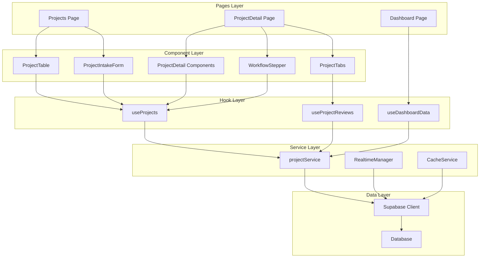
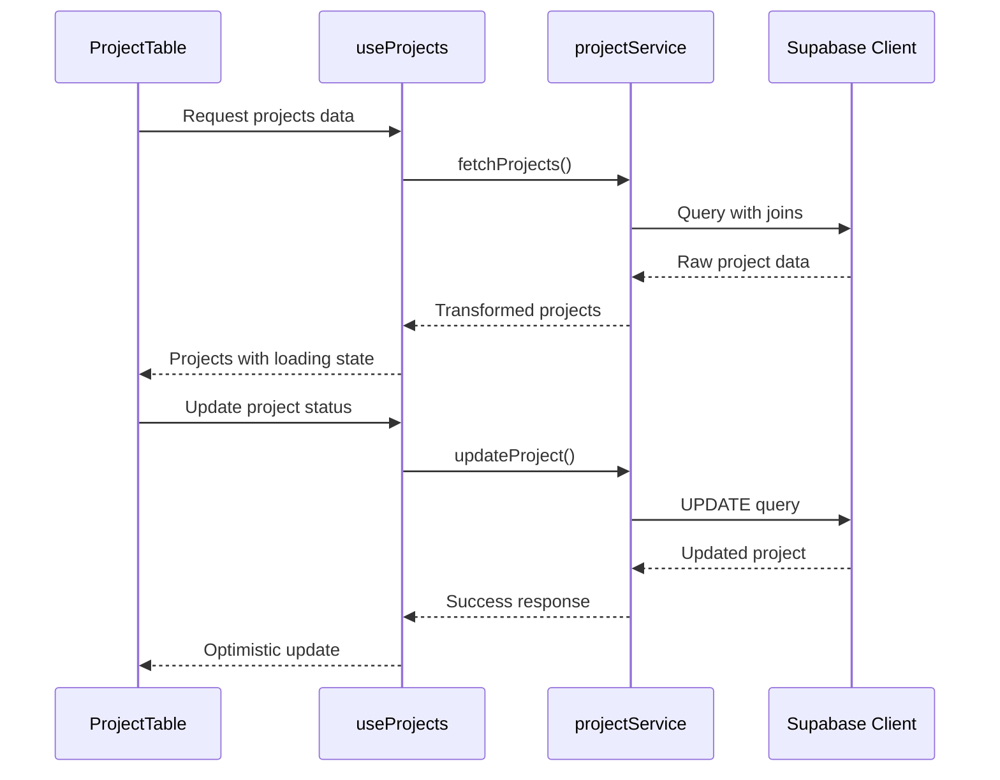
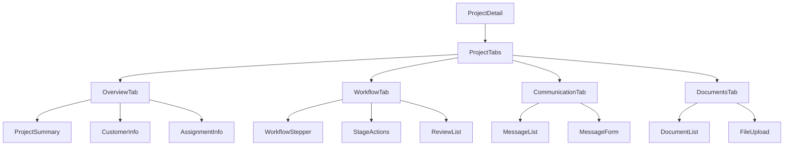
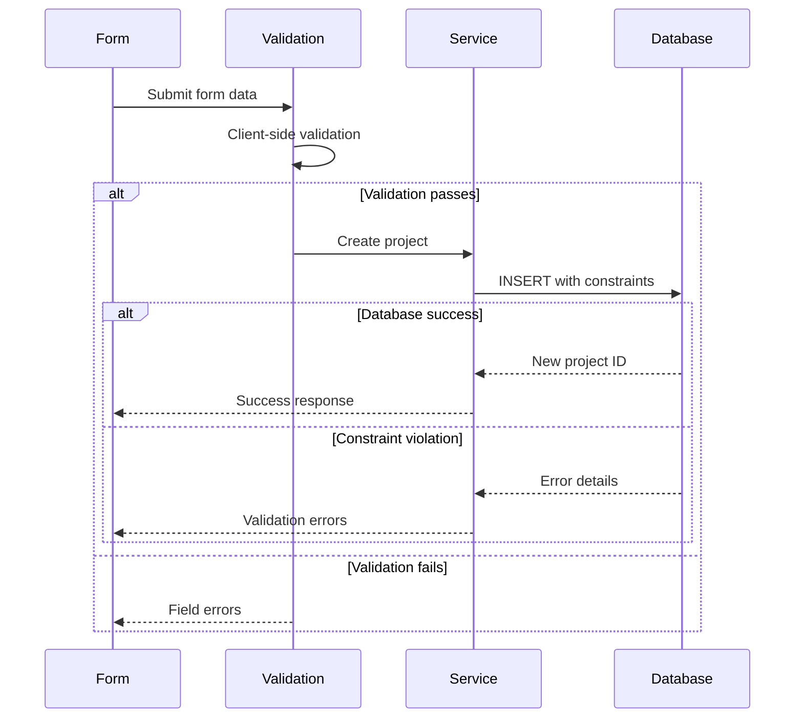
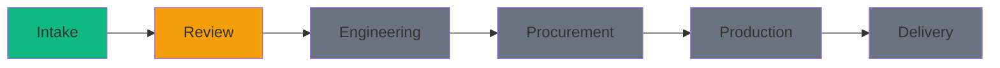
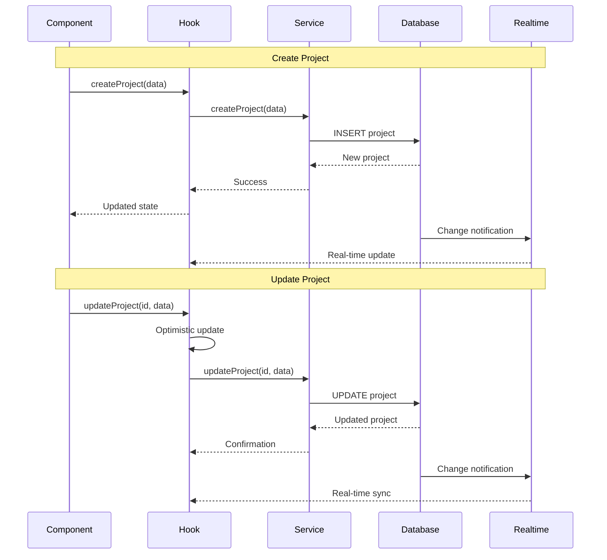
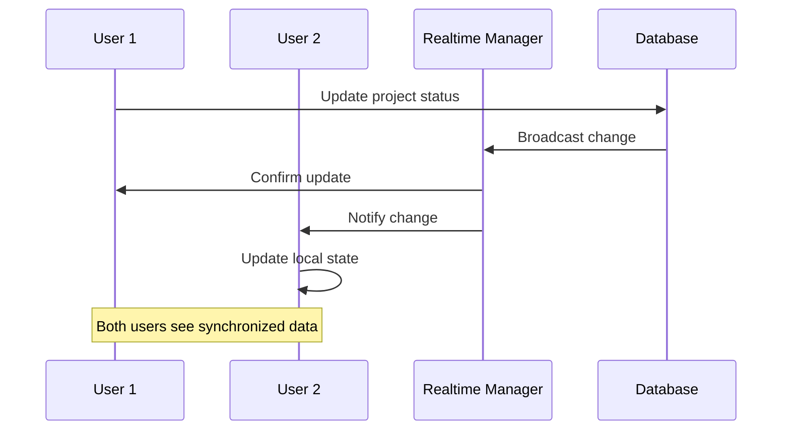
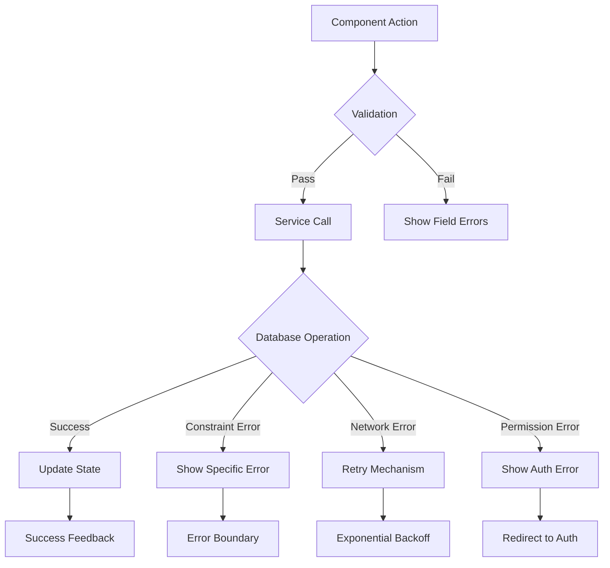
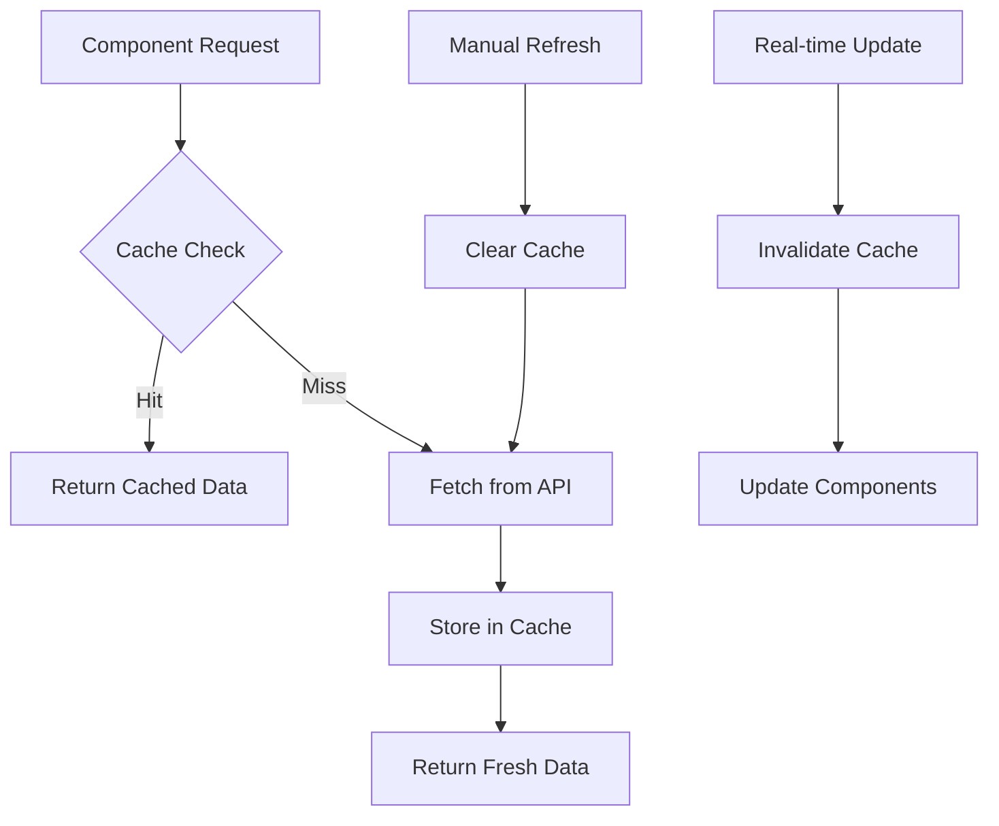
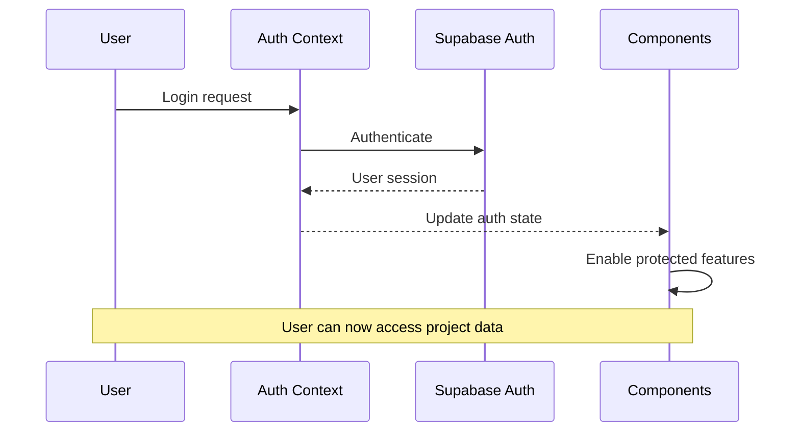

# Component Architecture and Data Flow

## Overview

This document outlines the component architecture of the Factory Pulse project management system, including data flow patterns, component relationships, and integration points.

## High-Level Architecture



## Core Components

### ProjectTable Component

**Purpose**: Main project listing with sorting, filtering, and bulk operations

**Location**: `src/components/project/ProjectTable.tsx`

**Props Interface**:
```typescript
interface ProjectTableProps {
  projects: Project[];
  loading?: boolean;
  onProjectSelect?: (project: Project) => void;
  onStatusChange?: (projectId: string, status: ProjectStatus) => void;
  onStageChange?: (projectId: string, stageId: string) => void;
  filters?: ProjectFilters;
  onFiltersChange?: (filters: ProjectFilters) => void;
}
```

**Data Flow**:


**Key Features**:
- Sortable columns with database field mapping
- Real-time updates via Supabase subscriptions
- Optimistic updates for better UX
- Bulk operations support
- Advanced filtering and search

### ProjectDetail Components

**Purpose**: Comprehensive project view with workflow management

**Location**: `src/components/project/ProjectDetail.tsx`

**Component Hierarchy**:


**Data Dependencies**:
```typescript
interface ProjectDetailData {
  project: Project;
  workflowStages: WorkflowStage[];
  reviews: Review[];
  messages: Message[];
  documents: Document[];
  activities: ActivityLog[];
}
```

### ProjectIntakeForm Component

**Purpose**: New project creation with validation and workflow integration

**Location**: `src/components/project/ProjectIntakeForm.tsx`

**Form Schema**:
```typescript
const ProjectIntakeFormSchema = z.object({
  project_id: z.string().min(1).max(50),
  title: z.string().min(1).max(255),
  description: z.string().optional(),
  customer_id: z.string().uuid().optional(),
  priority_level: z.enum(['low', 'medium', 'high', 'urgent']),
  estimated_value: z.number().positive().optional(),
  project_type: z.string().max(100).optional(),
  tags: z.array(z.string()).optional(),
  notes: z.string().optional(),
});
```

**Validation Flow**:


### WorkflowStepper Component

**Purpose**: Visual workflow progression with stage management

**Location**: `src/components/project/WorkflowStepper.tsx`

**Stage Visualization**:


**Props Interface**:
```typescript
interface WorkflowStepperProps {
  project: Project;
  stages: WorkflowStage[];
  onStageChange?: (stageId: string) => void;
  canAdvance?: boolean;
  canRevert?: boolean;
}
```

## Data Flow Patterns

### Project CRUD Operations



### Real-time Synchronization



### Error Handling Flow



## State Management

### Hook Architecture

```typescript
// useProjects - Main project state management
interface UseProjectsReturn {
  projects: Project[];
  loading: boolean;
  error: Error | null;
  createProject: (data: ProjectCreateData) => Promise<Project>;
  updateProject: (id: string, data: ProjectUpdateData) => Promise<Project>;
  deleteProject: (id: string) => Promise<void>;
  refetch: () => Promise<void>;
}

// useProjectReviews - Review system integration
interface UseProjectReviewsReturn {
  reviews: Review[];
  loading: boolean;
  createReview: (data: ReviewCreateData) => Promise<Review>;
  updateReview: (id: string, data: ReviewUpdateData) => Promise<Review>;
  assignReviewer: (reviewId: string, userId: string) => Promise<void>;
}
```

### Cache Strategy



## Integration Points

### Supabase Integration

**Client Configuration**:
```typescript
const supabase = createClient(
  process.env.VITE_SUPABASE_URL!,
  process.env.VITE_SUPABASE_ANON_KEY!,
  {
    auth: {
      persistSession: true,
      autoRefreshToken: true,
    },
    realtime: {
      params: {
        eventsPerSecond: 10,
      },
    },
  }
);
```

**Real-time Subscriptions**:
```typescript
const subscription = supabase
  .channel('projects')
  .on('postgres_changes', {
    event: '*',
    schema: 'public',
    table: 'projects',
    filter: `organization_id=eq.${organizationId}`,
  }, handleProjectChange)
  .subscribe();
```

### Authentication Integration



## Performance Optimizations

### Query Optimization

1. **Selective Field Loading**:
```typescript
// Optimized project list query
const { data } = await supabase
  .from('projects')
  .select(`
    id,
    project_id,
    title,
    status,
    priority_level,
    estimated_value,
    updated_at,
    customer:contacts(name, company),
    current_stage:workflow_stages(name, color)
  `)
  .eq('organization_id', organizationId)
  .order('updated_at', { ascending: false });
```

2. **Pagination Strategy**:
```typescript
const ITEMS_PER_PAGE = 50;
const { data, count } = await supabase
  .from('projects')
  .select('*', { count: 'exact' })
  .range(offset, offset + ITEMS_PER_PAGE - 1);
```

### Component Optimization

1. **Memoization**:
```typescript
const ProjectTable = memo(({ projects, onProjectSelect }) => {
  const sortedProjects = useMemo(() => 
    projects.sort((a, b) => 
      new Date(b.updated_at).getTime() - new Date(a.updated_at).getTime()
    ), [projects]
  );
  
  return <Table data={sortedProjects} />;
});
```

2. **Virtual Scrolling** (for large datasets):
```typescript
import { FixedSizeList as List } from 'react-window';

const VirtualizedProjectList = ({ projects }) => (
  <List
    height={600}
    itemCount={projects.length}
    itemSize={80}
    itemData={projects}
  >
    {ProjectRow}
  </List>
);
```

## Testing Strategy

### Component Testing

```typescript
describe('ProjectTable', () => {
  it('displays projects correctly', async () => {
    const mockProjects = [createMockProject()];
    render(<ProjectTable projects={mockProjects} />);
    
    expect(screen.getByText(mockProjects[0].title)).toBeInTheDocument();
  });
  
  it('handles status updates', async () => {
    const onStatusChange = jest.fn();
    render(<ProjectTable projects={[]} onStatusChange={onStatusChange} />);
    
    // Test status change interaction
  });
});
```

### Integration Testing

```typescript
describe('Project Management Flow', () => {
  it('creates and updates project successfully', async () => {
    // Test complete CRUD flow
    const project = await createProject(mockData);
    expect(project.id).toBeDefined();
    
    const updated = await updateProject(project.id, { status: 'completed' });
    expect(updated.status).toBe('completed');
  });
});
```

## Best Practices

### Component Design

1. **Single Responsibility**: Each component has one clear purpose
2. **Prop Drilling Prevention**: Use context for deeply nested data
3. **Error Boundaries**: Wrap components in error boundaries
4. **Loading States**: Always handle loading and error states
5. **Accessibility**: Follow ARIA guidelines and keyboard navigation

### Data Management

1. **Optimistic Updates**: Update UI immediately, sync with server
2. **Cache Invalidation**: Clear cache on mutations
3. **Real-time Sync**: Use Supabase real-time for live updates
4. **Error Recovery**: Implement retry mechanisms and fallbacks
5. **Type Safety**: Maintain strict TypeScript interfaces