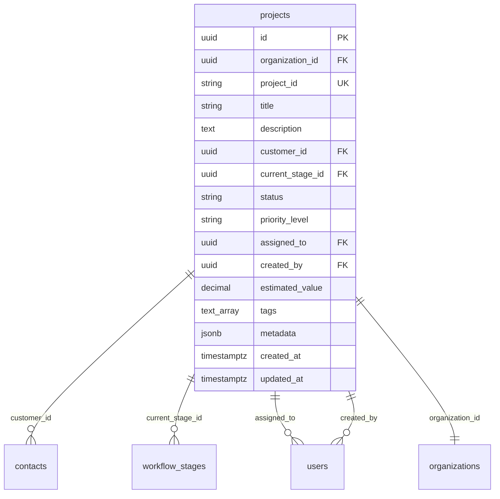

# Database Schema and TypeScript Interface Alignment

## Overview

This document provides the complete database schema for the project management system and its corresponding TypeScript interfaces, ensuring perfect alignment between backend and frontend data structures.

## Projects Table Schema

### Database Definition

```sql
CREATE TABLE projects (
    id UUID PRIMARY KEY DEFAULT uuid_generate_v4(),
    organization_id UUID REFERENCES organizations(id) ON DELETE CASCADE,
    project_id VARCHAR(50) UNIQUE NOT NULL,
    title VARCHAR(255) NOT NULL,
    description TEXT,
    customer_id UUID REFERENCES contacts(id) ON DELETE SET NULL,
    current_stage_id UUID REFERENCES workflow_stages(id) ON DELETE SET NULL,
    status VARCHAR(20) DEFAULT 'active' 
      CHECK (status IN ('active', 'on_hold', 'delayed', 'cancelled', 'completed')),
    priority_level VARCHAR(20) DEFAULT 'medium' 
      CHECK (priority_level IN ('low', 'medium', 'high', 'urgent')),
    source VARCHAR(50) DEFAULT 'portal',
    assigned_to UUID REFERENCES users(id) ON DELETE SET NULL,
    created_by UUID REFERENCES users(id) ON DELETE SET NULL,
    estimated_value DECIMAL(15,2),
    tags TEXT[],
    metadata JSONB DEFAULT '{}',
    stage_entered_at TIMESTAMPTZ,
    project_type VARCHAR(100),
    notes TEXT,
    created_at TIMESTAMPTZ DEFAULT NOW(),
    updated_at TIMESTAMPTZ DEFAULT NOW()
);
```

### TypeScript Interface

```typescript
interface Project {
  // Core fields - exact database mapping
  id: string;
  organization_id: string;
  project_id: string;
  title: string;
  description?: string;
  customer_id?: string;
  current_stage_id?: string;
  status: ProjectStatus;
  priority_level: ProjectPriority;
  source: string;
  assigned_to?: string;
  created_by?: string;
  estimated_value?: number;
  tags?: string[];
  metadata?: Record<string, any>;
  stage_entered_at?: string;
  project_type?: string;
  notes?: string;
  created_at: string;
  updated_at: string;
  
  // Computed/joined fields
  customer?: Contact;
  current_stage?: WorkflowStage;
  assignee?: User;
  creator?: User;
}

// Enum types matching database constraints
type ProjectStatus = 'active' | 'on_hold' | 'delayed' | 'cancelled' | 'completed';
type ProjectPriority = 'low' | 'medium' | 'high' | 'urgent';
```

## Related Tables

### Workflow Stages

```sql
CREATE TABLE workflow_stages (
    id UUID PRIMARY KEY DEFAULT uuid_generate_v4(),
    organization_id UUID REFERENCES organizations(id) ON DELETE CASCADE,
    name VARCHAR(100) NOT NULL,
    description TEXT,
    color VARCHAR(7) DEFAULT '#6B7280',
    stage_order INTEGER NOT NULL,
    is_active BOOLEAN DEFAULT true,
    stage_type VARCHAR(50) DEFAULT 'standard',
    exit_criteria JSONB DEFAULT '{}',
    created_at TIMESTAMPTZ DEFAULT NOW(),
    updated_at TIMESTAMPTZ DEFAULT NOW()
);
```

```typescript
interface WorkflowStage {
  id: string;
  organization_id: string;
  name: string;
  description?: string;
  color: string;
  stage_order: number;
  is_active: boolean;
  stage_type: string;
  exit_criteria?: Record<string, any>;
  created_at: string;
  updated_at: string;
}
```

### Contacts (Customers)

```sql
CREATE TABLE contacts (
    id UUID PRIMARY KEY DEFAULT uuid_generate_v4(),
    organization_id UUID REFERENCES organizations(id) ON DELETE CASCADE,
    name VARCHAR(255) NOT NULL,
    email VARCHAR(255),
    phone VARCHAR(50),
    company VARCHAR(255),
    address TEXT,
    contact_type VARCHAR(50) DEFAULT 'customer',
    is_active BOOLEAN DEFAULT true,
    metadata JSONB DEFAULT '{}',
    created_at TIMESTAMPTZ DEFAULT NOW(),
    updated_at TIMESTAMPTZ DEFAULT NOW()
);
```

```typescript
interface Contact {
  id: string;
  organization_id: string;
  name: string;
  email?: string;
  phone?: string;
  company?: string;
  address?: string;
  contact_type: string;
  is_active: boolean;
  metadata?: Record<string, any>;
  created_at: string;
  updated_at: string;
}
```

## Field Mapping Reference

### Critical Mappings

| Database Column    | TypeScript Property | Type                   | Notes                          |
| ------------------ | ------------------- | ---------------------- | ------------------------------ |
| `current_stage_id` | `current_stage_id`  | `string?`              | Foreign key to workflow_stages |
| `priority_level`   | `priority_level`    | `ProjectPriority`      | Enum constraint in database    |
| `status`           | `status`            | `ProjectStatus`        | Enum constraint in database    |
| `estimated_value`  | `estimated_value`   | `number?`              | DECIMAL(15,2) in database      |
| `tags`             | `tags`              | `string[]?`            | TEXT[] array in database       |
| `metadata`         | `metadata`          | `Record<string, any>?` | JSONB in database              |

### Nullable Fields

The following fields are nullable in the database and optional in TypeScript:
- `description`
- `customer_id`
- `current_stage_id`
- `assigned_to`
- `created_by`
- `estimated_value`
- `tags`
- `stage_entered_at`
- `project_type`
- `notes`

## Validation Rules

### Database Constraints

```sql
-- Status constraint
CHECK (status IN ('active', 'on_hold', 'delayed', 'cancelled', 'completed'))

-- Priority constraint
CHECK (priority_level IN ('low', 'medium', 'high', 'urgent'))

-- String length constraints
project_id VARCHAR(50)
title VARCHAR(255)
source VARCHAR(50)
project_type VARCHAR(100)

-- Decimal precision
estimated_value DECIMAL(15,2)
```

### TypeScript Validation (Zod)

```typescript
const ProjectSchema = z.object({
  project_id: z.string().max(50),
  title: z.string().min(1).max(255),
  description: z.string().optional(),
  customer_id: z.string().uuid().optional(),
  current_stage_id: z.string().uuid().optional(),
  status: z.enum(['active', 'on_hold', 'delayed', 'cancelled', 'completed']),
  priority_level: z.enum(['low', 'medium', 'high', 'urgent']),
  source: z.string().max(50).default('portal'),
  assigned_to: z.string().uuid().optional(),
  estimated_value: z.number().positive().optional(),
  tags: z.array(z.string()).optional(),
  project_type: z.string().max(100).optional(),
  notes: z.string().optional(),
});
```

## Relationships

### Foreign Key Relationships



### Query Patterns

#### Basic Project Query
```sql
SELECT 
  p.*,
  c.name as customer_name,
  c.company as customer_company,
  ws.name as stage_name,
  ws.color as stage_color,
  u1.name as assignee_name,
  u2.name as creator_name
FROM projects p
LEFT JOIN contacts c ON p.customer_id = c.id
LEFT JOIN workflow_stages ws ON p.current_stage_id = ws.id
LEFT JOIN users u1 ON p.assigned_to = u1.id
LEFT JOIN users u2 ON p.created_by = u2.id
WHERE p.organization_id = $1;
```

#### Optimized Project List Query
```sql
SELECT 
  p.id,
  p.project_id,
  p.title,
  p.status,
  p.priority_level,
  p.estimated_value,
  p.created_at,
  p.updated_at,
  c.name as customer_name,
  c.company as customer_company,
  ws.name as stage_name,
  ws.color as stage_color
FROM projects p
LEFT JOIN contacts c ON p.customer_id = c.id
LEFT JOIN workflow_stages ws ON p.current_stage_id = ws.id
WHERE p.organization_id = $1
ORDER BY p.updated_at DESC;
```

## Migration History

### Key Schema Changes

1. **Initial Schema** (20250127000005) - Created projects table with basic structure
2. **Workflow Integration** (20250127000004) - Added workflow_stages relationship
3. **Performance Optimization** (20250130000001) - Added indexes for common queries

### Index Strategy

```sql
-- Performance indexes
CREATE INDEX idx_projects_organization_id ON projects(organization_id);
CREATE INDEX idx_projects_status ON projects(status);
CREATE INDEX idx_projects_current_stage_id ON projects(current_stage_id);
CREATE INDEX idx_projects_assigned_to ON projects(assigned_to);
CREATE INDEX idx_projects_customer_id ON projects(customer_id);
CREATE INDEX idx_projects_updated_at ON projects(updated_at DESC);
```

## Best Practices

### Data Access Patterns

1. **Always filter by organization_id** for multi-tenant security
2. **Use explicit field selection** to minimize data transfer
3. **Leverage indexes** for filtering and sorting operations
4. **Handle nullable relationships** gracefully in joins

### Type Safety

1. **Use strict TypeScript interfaces** that match database exactly
2. **Validate enum values** at runtime with Zod schemas
3. **Handle optional fields** consistently across components
4. **Maintain type definitions** in sync with schema changes