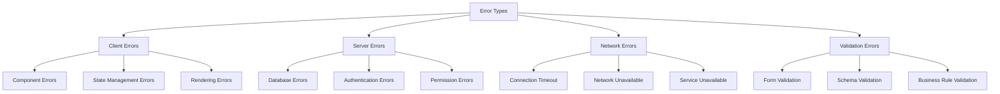

# Error Handling Patterns and Best Practices

## Overview

This document outlines comprehensive error handling patterns, best practices, and implementation guidelines for the Factory Pulse project management system. The error handling strategy focuses on user experience, system reliability, and developer productivity.

## Error Handling Architecture

### Error Classification



### Error Severity Levels

```typescript
enum ErrorSeverity {
  LOW = 'low',           // Minor UI issues, non-blocking
  MEDIUM = 'medium',     // Feature degradation, workarounds available
  HIGH = 'high',         // Major functionality affected
  CRITICAL = 'critical'  // System unusable, data integrity at risk
}

interface ErrorContext {
  severity: ErrorSeverity;
  category: 'client' | 'server' | 'network' | 'validation';
  component?: string;
  action?: string;
  userId?: string;
  timestamp: string;
  metadata?: Record<string, any>;
}
```

## Error Boundary Implementation

### ProjectErrorBoundary Component

**Location**: `src/components/error/ProjectErrorBoundary.tsx`

```typescript
interface ProjectErrorBoundaryState {
  hasError: boolean;
  error: Error | null;
  errorInfo: ErrorInfo | null;
  errorId: string;
  retryCount: number;
  severity: ErrorSeverity;
}

class ProjectErrorBoundary extends Component<
  ProjectErrorBoundaryProps,
  ProjectErrorBoundaryState
> {
  private retryTimeouts: NodeJS.Timeout[] = [];
  
  constructor(props: ProjectErrorBoundaryProps) {
    super(props);
    this.state = {
      hasError: false,
      error: null,
      errorInfo: null,
      errorId: '',
      retryCount: 0,
      severity: ErrorSeverity.MEDIUM,
    };
  }

  static getDerivedStateFromError(error: Error): Partial<ProjectErrorBoundaryState> {
    const errorId = `ERR_${Date.now()}_${Math.random().toString(36).substr(2, 9)}`;
    const severity = this.assessErrorSeverity(error);
    
    return {
      hasError: true,
      error,
      errorId,
      severity,
    };
  }

  componentDidCatch(error: Error, errorInfo: ErrorInfo) {
    this.setState({ errorInfo });
    
    // Log error with context
    this.logError(error, errorInfo);
    
    // Report to monitoring service
    this.reportError(error, errorInfo);
  }

  private static assessErrorSeverity(error: Error): ErrorSeverity {
    // Database connection errors
    if (error.message.includes('fetch') || error.message.includes('network')) {
      return ErrorSeverity.HIGH;
    }
    
    // Authentication errors
    if (error.message.includes('auth') || error.message.includes('permission')) {
      return ErrorSeverity.HIGH;
    }
    
    // Validation errors
    if (error.message.includes('validation') || error.message.includes('required')) {
      return ErrorSeverity.LOW;
    }
    
    // Component rendering errors
    if (error.stack?.includes('render')) {
      return ErrorSeverity.MEDIUM;
    }
    
    return ErrorSeverity.MEDIUM;
  }

  private handleRetry = () => {
    const { retryCount } = this.state;
    const maxRetries = 3;
    
    if (retryCount >= maxRetries) {
      toast.error('Maximum retry attempts reached. Please refresh the page.');
      return;
    }

    // Exponential backoff: 1s, 2s, 4s
    const delay = Math.pow(2, retryCount) * 1000;
    
    const timeout = setTimeout(() => {
      this.setState({
        hasError: false,
        error: null,
        errorInfo: null,
        retryCount: retryCount + 1,
      });
    }, delay);
    
    this.retryTimeouts.push(timeout);
    toast.info(`Retrying in ${delay / 1000} seconds...`);
  };

  private handleRefresh = () => {
    window.location.reload();
  };

  private handleNavigateHome = () => {
    window.location.href = '/';
  };

  componentWillUnmount() {
    // Clean up timeouts to prevent memory leaks
    this.retryTimeouts.forEach(clearTimeout);
  }

  render() {
    if (this.state.hasError) {
      return (
        <ErrorFallback
          error={this.state.error}
          errorInfo={this.state.errorInfo}
          errorId={this.state.errorId}
          severity={this.state.severity}
          retryCount={this.state.retryCount}
          onRetry={this.handleRetry}
          onRefresh={this.handleRefresh}
          onNavigateHome={this.handleNavigateHome}
        />
      );
    }

    return this.props.children;
  }
}
```

### Error Fallback UI

```typescript
interface ErrorFallbackProps {
  error: Error | null;
  errorInfo: ErrorInfo | null;
  errorId: string;
  severity: ErrorSeverity;
  retryCount: number;
  onRetry: () => void;
  onRefresh: () => void;
  onNavigateHome: () => void;
}

const ErrorFallback: React.FC<ErrorFallbackProps> = ({
  error,
  errorId,
  severity,
  retryCount,
  onRetry,
  onRefresh,
  onNavigateHome,
}) => {
  const getErrorMessage = () => {
    switch (severity) {
      case ErrorSeverity.CRITICAL:
        return "A critical error occurred. The system is temporarily unavailable.";
      case ErrorSeverity.HIGH:
        return "An error occurred that affects core functionality.";
      case ErrorSeverity.MEDIUM:
        return "Something went wrong, but you may be able to continue.";
      case ErrorSeverity.LOW:
        return "A minor issue occurred.";
      default:
        return "An unexpected error occurred.";
    }
  };

  const getRecoveryOptions = () => {
    const options = [];
    
    if (retryCount < 3) {
      options.push(
        <Button key="retry" onClick={onRetry} variant="default">
          Retry ({3 - retryCount} attempts left)
        </Button>
      );
    }
    
    options.push(
      <Button key="refresh" onClick={onRefresh} variant="outline">
        Refresh Page
      </Button>
    );
    
    if (severity >= ErrorSeverity.HIGH) {
      options.push(
        <Button key="home" onClick={onNavigateHome} variant="secondary">
          Go to Dashboard
        </Button>
      );
    }
    
    return options;
  };

  return (
    <div className="min-h-[400px] flex items-center justify-center p-8">
      <Card className="w-full max-w-md">
        <CardHeader>
          <div className="flex items-center space-x-2">
            <AlertTriangle 
              className={`h-6 w-6 ${
                severity === ErrorSeverity.CRITICAL ? 'text-red-500' :
                severity === ErrorSeverity.HIGH ? 'text-orange-500' :
                'text-yellow-500'
              }`} 
            />
            <CardTitle>Error Occurred</CardTitle>
          </div>
        </CardHeader>
        <CardContent className="space-y-4">
          <p className="text-sm text-muted-foreground">
            {getErrorMessage()}
          </p>
          
          <div className="text-xs text-muted-foreground">
            Error ID: {errorId}
          </div>
          
          {process.env.NODE_ENV === 'development' && error && (
            <details className="text-xs">
              <summary className="cursor-pointer">Technical Details</summary>
              <pre className="mt-2 p-2 bg-muted rounded text-xs overflow-auto">
                {error.stack}
              </pre>
            </details>
          )}
          
          <div className="flex flex-col space-y-2">
            {getRecoveryOptions()}
          </div>
          
          <div className="text-xs text-muted-foreground">
            <p>If the problem persists:</p>
            <ul className="list-disc list-inside mt-1 space-y-1">
              <li>Check your internet connection</li>
              <li>Try refreshing the page</li>
              <li>Contact support with Error ID: {errorId}</li>
            </ul>
          </div>
        </CardContent>
      </Card>
    </div>
  );
};
```

## Service Layer Error Handling

### Database Error Handling

```typescript
class DatabaseErrorHandler {
  static handle(error: any): never {
    // PostgreSQL error codes
    switch (error.code) {
      case '23505': // unique_violation
        throw new ValidationError('A record with this identifier already exists');
      
      case '23503': // foreign_key_violation
        throw new ValidationError('Referenced record not found');
      
      case '23502': // not_null_violation
        throw new ValidationError('Required field is missing');
      
      case '23514': // check_violation
        throw new ValidationError('Invalid value provided');
      
      case '42501': // insufficient_privilege
        throw new PermissionError('You do not have permission to perform this action');
      
      case '08006': // connection_failure
        throw new NetworkError('Database connection failed');
      
      case '57014': // query_canceled
        throw new TimeoutError('Operation timed out');
      
      default:
        // Log unknown errors for investigation
        console.error('Unknown database error:', error);
        throw new SystemError('An unexpected database error occurred');
    }
  }
}

// Custom error classes
class ValidationError extends Error {
  constructor(message: string, public field?: string) {
    super(message);
    this.name = 'ValidationError';
  }
}

class PermissionError extends Error {
  constructor(message: string) {
    super(message);
    this.name = 'PermissionError';
  }
}

class NetworkError extends Error {
  constructor(message: string) {
    super(message);
    this.name = 'NetworkError';
  }
}

class TimeoutError extends Error {
  constructor(message: string) {
    super(message);
    this.name = 'TimeoutError';
  }
}

class SystemError extends Error {
  constructor(message: string) {
    super(message);
    this.name = 'SystemError';
  }
}
```

### Service Method Error Wrapping

```typescript
import { handleDatabaseError } from '@/lib/validation/error-handlers';

async function withErrorHandling<T>(
  operation: () => Promise<T>,
  context: { component?: string; action?: string } = {}
): Promise<T> {
  try {
    return await operation();
  } catch (error: any) {
    // Add context to error
    const enhancedError = new Error(error.message);
    enhancedError.name = error.name;
    enhancedError.stack = error.stack;
    (enhancedError as any).context = context;
    (enhancedError as any).originalError = error;
    
    // Handle specific error types using centralized handler
    if (error.name === 'PostgrestError' || error.code) {
      throw handleDatabaseError(error);
    }
    
    if (error.message?.includes('fetch')) {
      throw new NetworkError('Network request failed');
    }
    
    throw enhancedError;
  }
}

// Usage in service methods
export const projectService = {
  async createProject(data: CreateProjectData): Promise<Project> {
    return withErrorHandling(
      async () => {
        const { data: project, error } = await supabase
          .from('projects')
          .insert(data)
          .select()
          .single();
        
        if (error) throw handleDatabaseError(error);
        return project;
      },
      { component: 'projectService', action: 'createProject' }
    );
  },
  
  async updateProject(id: string, data: UpdateProjectData): Promise<Project> {
    return withErrorHandling(
      async () => {
        const { data: project, error } = await supabase
          .from('projects')
          .update(data)
          .eq('id', id)
          .select()
          .single();
        
        if (error) throw handleDatabaseError(error);
        return project;
      },
      { component: 'projectService', action: 'updateProject' }
    );
  },
};
```

## Hook-Level Error Handling

### useProjects Hook Error Management

```typescript
export function useProjects() {
  const [error, setError] = useState<Error | null>(null);
  const [retryCount, setRetryCount] = useState(0);
  
  const queryClient = useQueryClient();
  
  const projectsQuery = useQuery({
    queryKey: ['projects'],
    queryFn: () => projectService.fetchProjects(),
    retry: (failureCount, error) => {
      // Don't retry permission errors
      if (error instanceof PermissionError) return false;
      
      // Don't retry validation errors
      if (error instanceof ValidationError) return false;
      
      // Retry network errors up to 3 times
      if (error instanceof NetworkError && failureCount < 3) return true;
      
      return false;
    },
    retryDelay: (attemptIndex) => Math.min(1000 * 2 ** attemptIndex, 30000),
    onError: (error: Error) => {
      setError(error);
      
      // Show user-friendly error message
      if (error instanceof NetworkError) {
        toast.error('Connection failed. Retrying...');
      } else if (error instanceof PermissionError) {
        toast.error('You do not have permission to view projects');
      } else {
        toast.error('Failed to load projects');
      }
    },
  });

  const createProjectMutation = useMutation({
    mutationFn: projectService.createProject,
    onSuccess: (newProject) => {
      queryClient.setQueryData(['projects'], (old: Project[] = []) => [
        newProject,
        ...old,
      ]);
      toast.success('Project created successfully');
    },
    onError: (error: Error) => {
      if (error instanceof ValidationError) {
        toast.error(`Validation error: ${error.message}`);
      } else if (error instanceof PermissionError) {
        toast.error('You do not have permission to create projects');
      } else {
        toast.error('Failed to create project');
      }
    },
  });

  const updateProjectMutation = useMutation({
    mutationFn: ({ id, data }: { id: string; data: UpdateProjectData }) =>
      projectService.updateProject(id, data),
    onMutate: async ({ id, data }) => {
      // Optimistic update
      await queryClient.cancelQueries(['projects']);
      const previousProjects = queryClient.getQueryData<Project[]>(['projects']);
      
      queryClient.setQueryData<Project[]>(['projects'], (old = []) =>
        old.map(project => 
          project.id === id ? { ...project, ...data } : project
        )
      );
      
      return { previousProjects };
    },
    onError: (error, variables, context) => {
      // Rollback optimistic update
      if (context?.previousProjects) {
        queryClient.setQueryData(['projects'], context.previousProjects);
      }
      
      if (error instanceof ValidationError) {
        toast.error(`Validation error: ${error.message}`);
      } else {
        toast.error('Failed to update project');
      }
    },
    onSuccess: () => {
      toast.success('Project updated successfully');
    },
  });

  const retry = useCallback(() => {
    setError(null);
    setRetryCount(prev => prev + 1);
    projectsQuery.refetch();
  }, [projectsQuery]);

  return {
    projects: projectsQuery.data || [],
    loading: projectsQuery.isLoading,
    error,
    retryCount,
    retry,
    createProject: createProjectMutation.mutate,
    updateProject: updateProjectMutation.mutate,
    isCreating: createProjectMutation.isLoading,
    isUpdating: updateProjectMutation.isLoading,
  };
}
```

## Form Validation Error Handling

### Zod Schema Validation

```typescript
import { z } from 'zod';

const ProjectFormSchema = z.object({
  project_id: z
    .string()
    .min(1, 'Project ID is required')
    .max(50, 'Project ID must be 50 characters or less')
    .regex(/^P-\d{6}\d{2}$/, 'Project ID must follow format P-YYMMDDXX'),
  
  title: z
    .string()
    .min(1, 'Title is required')
    .max(255, 'Title must be 255 characters or less'),
  
  description: z
    .string()
    .max(1000, 'Description must be 1000 characters or less')
    .optional(),
  
  customer_id: z
    .string()
    .uuid('Invalid customer selection')
    .optional(),
  
  priority_level: z
    .enum(['low', 'medium', 'high', 'urgent'], {
      errorMap: () => ({ message: 'Please select a valid priority level' }),
    }),
  
  estimated_value: z
    .number()
    .positive('Estimated value must be positive')
    .max(999999999999.99, 'Estimated value is too large')
    .optional(),
});

type ProjectFormData = z.infer<typeof ProjectFormSchema>;
```

### Form Error Display

```typescript
const ProjectForm: React.FC<ProjectFormProps> = ({ onSubmit, initialData }) => {
  const form = useForm<ProjectFormData>({
    resolver: zodResolver(ProjectFormSchema),
    defaultValues: initialData,
  });

  const handleSubmit = async (data: ProjectFormData) => {
    try {
      await onSubmit(data);
    } catch (error) {
      if (error instanceof ValidationError) {
        // Set field-specific errors
        if (error.field) {
          form.setError(error.field as keyof ProjectFormData, {
            message: error.message,
          });
        } else {
          form.setError('root', { message: error.message });
        }
      } else {
        form.setError('root', { 
          message: 'An unexpected error occurred. Please try again.' 
        });
      }
    }
  };

  return (
    <Form {...form}>
      <form onSubmit={form.handleSubmit(handleSubmit)} className="space-y-4">
        <FormField
          control={form.control}
          name="project_id"
          render={({ field }) => (
            <FormItem>
              <FormLabel>Project ID</FormLabel>
              <FormControl>
                <Input {...field} placeholder="P-250130001" />
              </FormControl>
              <FormMessage />
            </FormItem>
          )}
        />
        
        <FormField
          control={form.control}
          name="title"
          render={({ field }) => (
            <FormItem>
              <FormLabel>Title</FormLabel>
              <FormControl>
                <Input {...field} placeholder="Project title" />
              </FormControl>
              <FormMessage />
            </FormItem>
          )}
        />
        
        {/* Root error display */}
        {form.formState.errors.root && (
          <Alert variant="destructive">
            <AlertTriangle className="h-4 w-4" />
            <AlertDescription>
              {form.formState.errors.root.message}
            </AlertDescription>
          </Alert>
        )}
        
        <Button type="submit" disabled={form.formState.isSubmitting}>
          {form.formState.isSubmitting ? 'Creating...' : 'Create Project'}
        </Button>
      </form>
    </Form>
  );
};
```

## Real-time Error Handling

### Subscription Error Management

```typescript
class RealtimeManager {
  private subscriptions = new Map<string, RealtimeChannel>();
  private reconnectAttempts = new Map<string, number>();
  private maxReconnectAttempts = 5;
  
  subscribeToProjects(
    organizationId: string,
    callback: (payload: any) => void,
    onError?: (error: Error) => void
  ) {
    const channelName = `projects:${organizationId}`;
    
    const channel = supabase
      .channel(channelName)
      .on('postgres_changes', {
        event: '*',
        schema: 'public',
        table: 'projects',
        filter: `organization_id=eq.${organizationId}`,
      }, (payload) => {
        try {
          callback(payload);
        } catch (error) {
          console.error('Error processing real-time update:', error);
          onError?.(error as Error);
        }
      })
      .on('system', {}, (payload) => {
        if (payload.type === 'error') {
          this.handleSubscriptionError(channelName, payload.error, onError);
        }
      })
      .subscribe((status) => {
        if (status === 'SUBSCRIBED') {
          this.reconnectAttempts.set(channelName, 0);
        } else if (status === 'CHANNEL_ERROR') {
          this.handleSubscriptionError(
            channelName, 
            new Error('Channel subscription failed'),
            onError
          );
        }
      });
    
    this.subscriptions.set(channelName, channel);
    return channel;
  }
  
  private handleSubscriptionError(
    channelName: string,
    error: Error,
    onError?: (error: Error) => void
  ) {
    const attempts = this.reconnectAttempts.get(channelName) || 0;
    
    if (attempts < this.maxReconnectAttempts) {
      const delay = Math.pow(2, attempts) * 1000; // Exponential backoff
      
      setTimeout(() => {
        this.reconnectAttempts.set(channelName, attempts + 1);
        // Attempt to resubscribe
        const channel = this.subscriptions.get(channelName);
        if (channel) {
          channel.subscribe();
        }
      }, delay);
      
      console.warn(`Real-time connection error. Retrying in ${delay}ms...`);
    } else {
      console.error('Max reconnection attempts reached for channel:', channelName);
      onError?.(new Error('Real-time connection failed permanently'));
      
      // Show user notification
      toast.error(
        'Real-time updates are unavailable. Please refresh the page.',
        { duration: 10000 }
      );
    }
  }
  
  unsubscribe(channelName: string) {
    const channel = this.subscriptions.get(channelName);
    if (channel) {
      channel.unsubscribe();
      this.subscriptions.delete(channelName);
      this.reconnectAttempts.delete(channelName);
    }
  }
  
  unsubscribeAll() {
    for (const [channelName] of this.subscriptions) {
      this.unsubscribe(channelName);
    }
  }
}
```

## Error Monitoring and Logging

### Error Logging Service

```typescript
interface ErrorLog {
  id: string;
  timestamp: string;
  level: 'error' | 'warn' | 'info';
  message: string;
  stack?: string;
  context: {
    userId?: string;
    component?: string;
    action?: string;
    url: string;
    userAgent: string;
    metadata?: Record<string, any>;
  };
}

class ErrorLogger {
  private logs: ErrorLog[] = [];
  private maxLogs = 100;
  
  log(error: Error, context: Partial<ErrorLog['context']> = {}) {
    const errorLog: ErrorLog = {
      id: `log_${Date.now()}_${Math.random().toString(36).substr(2, 9)}`,
      timestamp: new Date().toISOString(),
      level: 'error',
      message: error.message,
      stack: error.stack,
      context: {
        url: window.location.href,
        userAgent: navigator.userAgent,
        ...context,
      },
    };
    
    this.logs.unshift(errorLog);
    
    // Keep only recent logs
    if (this.logs.length > this.maxLogs) {
      this.logs = this.logs.slice(0, this.maxLogs);
    }
    
    // Send to monitoring service in production
    if (process.env.NODE_ENV === 'production') {
      this.sendToMonitoring(errorLog);
    }
    
    // Log to console in development
    if (process.env.NODE_ENV === 'development') {
      console.error('Error logged:', errorLog);
    }
  }
  
  private async sendToMonitoring(errorLog: ErrorLog) {
    try {
      // Send to external monitoring service (e.g., Sentry, LogRocket)
      await fetch('/api/errors', {
        method: 'POST',
        headers: { 'Content-Type': 'application/json' },
        body: JSON.stringify(errorLog),
      });
    } catch (monitoringError) {
      console.error('Failed to send error to monitoring:', monitoringError);
    }
  }
  
  getLogs(): ErrorLog[] {
    return [...this.logs];
  }
  
  clearLogs() {
    this.logs = [];
  }
}

export const errorLogger = new ErrorLogger();
```

## Best Practices

### Error Handling Guidelines

1. **Fail Fast**: Validate inputs early and provide immediate feedback
2. **Graceful Degradation**: Provide fallback functionality when possible
3. **User-Friendly Messages**: Show clear, actionable error messages
4. **Context Preservation**: Maintain user's work and state when errors occur
5. **Recovery Options**: Always provide ways for users to recover
6. **Centralized Error Handling**: Use `handleDatabaseError` for consistent database error processing

### Implementation Patterns

1. **Error Boundaries**: Wrap components in error boundaries
2. **Retry Mechanisms**: Implement exponential backoff for transient errors
3. **Optimistic Updates**: Update UI immediately, handle failures gracefully
4. **Validation Layers**: Validate at multiple levels (client, server, database)
5. **Monitoring**: Log errors for analysis and improvement
6. **Consistent API**: Use `handleDatabaseError` or `formatDatabaseError` interchangeably for backward compatibility

### Error Handler Usage

```typescript
// Recommended approach - use the centralized error handler
import { handleDatabaseError } from '@/lib/validation/error-handlers';

try {
  const { data, error } = await supabase.from('projects').insert(projectData);
  if (error) throw handleDatabaseError(error);
  return data;
} catch (error) {
  // Error is already formatted with user-friendly message
  toast.error(error.message);
  throw error;
}

// Alternative - both functions are equivalent
import { formatDatabaseError } from '@/lib/validation/error-handlers';
// Use formatDatabaseError(error) - same functionality
```

### Testing Error Scenarios

```typescript
describe('Error Handling', () => {
  it('handles network errors gracefully', async () => {
    // Mock network failure
    jest.spyOn(global, 'fetch').mockRejectedValue(new Error('Network error'));
    
    render(<ProjectTable />);
    
    await waitFor(() => {
      expect(screen.getByText(/connection failed/i)).toBeInTheDocument();
    });
  });
  
  it('shows validation errors for invalid input', async () => {
    render(<ProjectForm />);
    
    const titleInput = screen.getByLabelText(/title/i);
    fireEvent.change(titleInput, { target: { value: '' } });
    fireEvent.blur(titleInput);
    
    await waitFor(() => {
      expect(screen.getByText(/title is required/i)).toBeInTheDocument();
    });
  });
  
  it('recovers from error boundary', async () => {
    const ThrowError = () => {
      throw new Error('Test error');
    };
    
    render(
      <ProjectErrorBoundary>
        <ThrowError />
      </ProjectErrorBoundary>
    );
    
    expect(screen.getByText(/error occurred/i)).toBeInTheDocument();
    
    const retryButton = screen.getByText(/retry/i);
    fireEvent.click(retryButton);
    
    // Should attempt recovery
  });
});
```

This comprehensive error handling system ensures that the Factory Pulse project management system provides a robust, user-friendly experience even when things go wrong.