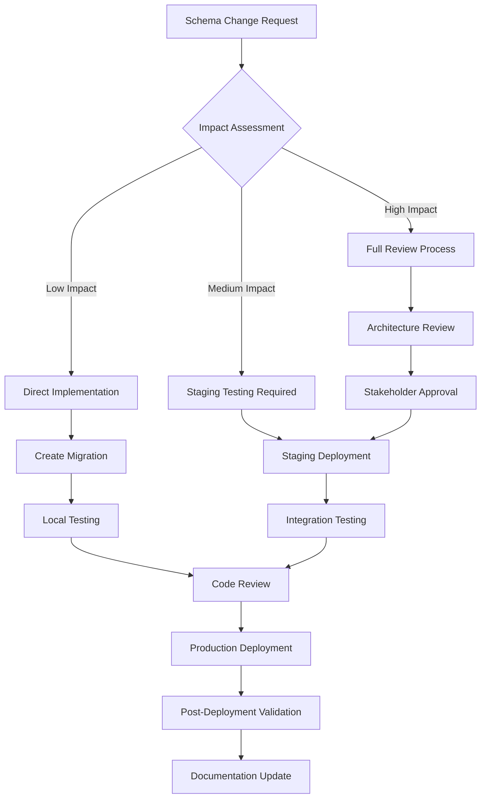

# Maintenance Procedures and Best Practices

## Overview

This document establishes comprehensive maintenance procedures for the Factory Pulse project management system, including schema change management, development best practices, monitoring procedures, and troubleshooting guidelines.

## Schema Change Management Process

### Change Request Workflow



### Impact Assessment Criteria

#### Low Impact Changes
- Adding optional columns
- Adding new indexes
- Updating comments or documentation
- Adding new enum values (at end of list)

#### Medium Impact Changes
- Modifying column types (compatible changes)
- Adding NOT NULL columns with defaults
- Renaming columns (with proper migration)
- Modifying constraints

#### High Impact Changes
- Dropping columns or tables
- Breaking type changes
- Removing enum values
- Major relationship changes
- Performance-critical modifications

### Migration File Standards

**File Naming Convention**:
```
YYYYMMDDHHMMSS_descriptive_name.sql
```

**Migration Template**:
```sql
-- Migration: Add project priority tracking
-- Date: 2025-01-30
-- Author: [Developer Name]
-- Impact: Medium - Adds new column with default value
-- Rollback: Available via down migration

-- Up Migration
BEGIN;

-- Add new column
ALTER TABLE projects 
ADD COLUMN priority_score INTEGER DEFAULT 0 NOT NULL;

-- Add check constraint
ALTER TABLE projects 
ADD CONSTRAINT check_priority_score 
CHECK (priority_score >= 0 AND priority_score <= 100);

-- Create index for performance
CREATE INDEX idx_projects_priority_score ON projects(priority_score);

-- Update existing records based on priority_level
UPDATE projects 
SET priority_score = CASE 
  WHEN priority_level = 'low' THEN 25
  WHEN priority_level = 'medium' THEN 50
  WHEN priority_level = 'high' THEN 75
  WHEN priority_level = 'urgent' THEN 100
  ELSE 0
END;

COMMIT;

-- Rollback instructions (for documentation)
-- DROP INDEX IF EXISTS idx_projects_priority_score;
-- ALTER TABLE projects DROP COLUMN IF EXISTS priority_score;
```

### TypeScript Interface Update Process

**Step 1: Update Database Types**
```bash
# Generate new types from Supabase
npx supabase gen types typescript --local > src/integrations/supabase/types.ts
```

**Step 2: Update Application Types**
```typescript
// src/types/project.ts
interface Project {
  // ... existing fields
  priority_score: number; // New field added
}

// Update related types
type ProjectCreateData = Omit<Project, 'id' | 'created_at' | 'updated_at'>;
type ProjectUpdateData = Partial<ProjectCreateData>;
```

**Step 3: Update Validation Schemas**
```typescript
// src/lib/validation/project-schemas.ts
const ProjectSchema = z.object({
  // ... existing fields
  priority_score: z.number().min(0).max(100).default(0),
});
```

**Step 4: Update Service Layer**
```typescript
// src/services/projectService.ts
export const projectService = {
  async createProject(data: ProjectCreateData): Promise<Project> {
    // Ensure new field is handled
    const projectData = {
      ...data,
      priority_score: data.priority_score ?? 0,
    };
    
    // ... rest of implementation
  },
};
```

**Step 5: Update Components**
```typescript
// Update any components that display or edit the new field
const ProjectForm = () => {
  // Add form field for priority_score
  // Update validation
  // Update submission logic
};
```

### Change Validation Checklist

- [ ] Database migration tested locally
- [ ] TypeScript types updated and validated
- [ ] Validation schemas updated
- [ ] Service layer methods updated
- [ ] Component interfaces updated
- [ ] Tests updated for new fields
- [ ] Documentation updated
- [ ] Rollback plan documented
- [ ] Performance impact assessed
- [ ] Security implications reviewed

## Development Best Practices

### Code Organization Standards

#### File Structure Guidelines

```
src/
├── components/
│   ├── project/
│   │   ├── ProjectTable.tsx          # Main listing component
│   │   ├── ProjectDetail.tsx         # Detail view component
│   │   ├── ProjectForm.tsx           # Form component
│   │   └── __tests__/                # Component tests
│   │       ├── ProjectTable.test.tsx
│   │       └── ProjectForm.test.tsx
│   └── ui/                           # Reusable UI components
├── hooks/
│   ├── useProjects.ts                # Main project hook
│   ├── useProjectReviews.ts          # Review-specific hook
│   └── __tests__/                    # Hook tests
├── services/
│   ├── projectService.ts             # Core project operations
│   ├── cacheService.ts               # Caching logic
│   └── __tests__/                    # Service tests
├── types/
│   ├── project.ts                    # Project-related types
│   ├── review.ts                     # Review-related types
│   └── index.ts                      # Type exports
└── lib/
    ├── validation/
    │   ├── project-schemas.ts        # Zod validation schemas
    │   └── __tests__/                # Validation tests
    └── utils.ts                      # Utility functions
```

#### Naming Conventions

**Components**: PascalCase
- `ProjectTable.tsx`
- `ProjectDetailModal.tsx`
- `WorkflowStepper.tsx`

**Hooks**: camelCase with `use` prefix
- `useProjects.ts`
- `useProjectReviews.ts`
- `useWorkflowStages.ts`

**Services**: camelCase with `Service` suffix
- `projectService.ts`
- `workflowService.ts`
- `cacheService.ts`

**Types**: PascalCase for interfaces, camelCase for files
- `Project` interface in `project.ts`
- `WorkflowStage` interface in `workflow.ts`

#### Code Quality Standards

**TypeScript Configuration**:
```json
{
  "compilerOptions": {
    "strict": true,
    "noImplicitAny": true,
    "noImplicitReturns": true,
    "noUnusedLocals": true,
    "noUnusedParameters": true
  }
}
```

**ESLint Rules**:
```json
{
  "rules": {
    "@typescript-eslint/no-unused-vars": "error",
    "@typescript-eslint/explicit-function-return-type": "warn",
    "react-hooks/exhaustive-deps": "error",
    "react/prop-types": "off"
  }
}
```

### Testing Standards

#### Test Coverage Requirements

- **Components**: Minimum 80% coverage
- **Hooks**: Minimum 90% coverage
- **Services**: Minimum 95% coverage
- **Utilities**: 100% coverage

#### Test Organization

```typescript
// Component test structure
describe('ProjectTable', () => {
  describe('Rendering', () => {
    it('displays projects correctly', () => {});
    it('shows loading state', () => {});
    it('shows empty state', () => {});
  });
  
  describe('Interactions', () => {
    it('handles project selection', () => {});
    it('handles status updates', () => {});
    it('handles sorting', () => {});
  });
  
  describe('Error Handling', () => {
    it('displays error messages', () => {});
    it('provides retry functionality', () => {});
  });
});
```

#### Mock Standards

```typescript
// Service mocks
export const mockProjectService = {
  fetchProjects: jest.fn(),
  createProject: jest.fn(),
  updateProject: jest.fn(),
  deleteProject: jest.fn(),
};

// Data mocks
export const createMockProject = (overrides: Partial<Project> = {}): Project => ({
  id: 'test-id',
  project_id: 'P-250130001',
  title: 'Test Project',
  status: 'active',
  priority_level: 'medium',
  created_at: '2025-01-30T00:00:00Z',
  updated_at: '2025-01-30T00:00:00Z',
  organization_id: 'org-id',
  ...overrides,
});
```

### Performance Monitoring

#### Key Performance Indicators (KPIs)

**Database Performance**:
- Query execution time < 100ms for simple queries
- Query execution time < 500ms for complex joins
- Connection pool utilization < 80%
- Cache hit ratio > 90%

**Frontend Performance**:
- First Contentful Paint < 1.5s
- Largest Contentful Paint < 2.5s
- Cumulative Layout Shift < 0.1
- First Input Delay < 100ms

**API Performance**:
- Response time < 200ms for cached data
- Response time < 1s for database queries
- Error rate < 1%
- Availability > 99.9%

#### Monitoring Setup

**Database Monitoring**:
```sql
-- Query performance monitoring
SELECT 
  query,
  calls,
  total_time,
  mean_time,
  rows
FROM pg_stat_statements 
WHERE query LIKE '%projects%'
ORDER BY total_time DESC
LIMIT 10;

-- Index usage monitoring
SELECT 
  schemaname,
  tablename,
  indexname,
  idx_scan,
  idx_tup_read,
  idx_tup_fetch
FROM pg_stat_user_indexes
WHERE tablename = 'projects'
ORDER BY idx_scan DESC;
```

**Application Monitoring**:
```typescript
// Performance monitoring service
class PerformanceMonitor {
  static measureQuery<T>(
    queryName: string,
    queryFn: () => Promise<T>
  ): Promise<T> {
    const startTime = performance.now();
    
    return queryFn().finally(() => {
      const duration = performance.now() - startTime;
      
      if (duration > 1000) {
        console.warn(`Slow query detected: ${queryName} took ${duration}ms`);
      }
      
      // Send metrics to monitoring service
      this.recordMetric('query_duration', duration, { query: queryName });
    });
  }
  
  static recordMetric(
    name: string,
    value: number,
    tags: Record<string, string> = {}
  ) {
    // Send to monitoring service (e.g., DataDog, New Relic)
    if (process.env.NODE_ENV === 'production') {
      // Implementation depends on monitoring service
    }
  }
}
```

### Data Consistency Monitoring

#### Automated Consistency Checks

```sql
-- Check for orphaned projects (missing organization)
SELECT COUNT(*) as orphaned_projects
FROM projects p
LEFT JOIN organizations o ON p.organization_id = o.id
WHERE o.id IS NULL;

-- Check for invalid workflow stage references
SELECT COUNT(*) as invalid_stage_refs
FROM projects p
LEFT JOIN workflow_stages ws ON p.current_stage_id = ws.id
WHERE p.current_stage_id IS NOT NULL AND ws.id IS NULL;

-- Check for constraint violations
SELECT COUNT(*) as invalid_status
FROM projects
WHERE status NOT IN ('active', 'on_hold', 'delayed', 'cancelled', 'completed');

-- Check for data type inconsistencies
SELECT COUNT(*) as invalid_priority
FROM projects
WHERE priority_level NOT IN ('low', 'medium', 'high', 'urgent');
```

#### Consistency Monitoring Script

```typescript
// scripts/check-data-consistency.ts
interface ConsistencyCheck {
  name: string;
  query: string;
  threshold: number;
  severity: 'low' | 'medium' | 'high' | 'critical';
}

const consistencyChecks: ConsistencyCheck[] = [
  {
    name: 'Orphaned Projects',
    query: `
      SELECT COUNT(*) as count
      FROM projects p
      LEFT JOIN organizations o ON p.organization_id = o.id
      WHERE o.id IS NULL
    `,
    threshold: 0,
    severity: 'critical',
  },
  {
    name: 'Invalid Stage References',
    query: `
      SELECT COUNT(*) as count
      FROM projects p
      LEFT JOIN workflow_stages ws ON p.current_stage_id = ws.id
      WHERE p.current_stage_id IS NOT NULL AND ws.id IS NULL
    `,
    threshold: 0,
    severity: 'high',
  },
  // ... more checks
];

async function runConsistencyChecks() {
  const results = [];
  
  for (const check of consistencyChecks) {
    try {
      const { data, error } = await supabase.rpc('execute_sql', {
        sql: check.query,
      });
      
      if (error) throw error;
      
      const count = data[0]?.count || 0;
      const passed = count <= check.threshold;
      
      results.push({
        ...check,
        count,
        passed,
        timestamp: new Date().toISOString(),
      });
      
      if (!passed) {
        console.error(`Consistency check failed: ${check.name} (${count} violations)`);
        
        // Send alert for critical issues
        if (check.severity === 'critical') {
          await sendAlert({
            title: `Critical Data Consistency Issue: ${check.name}`,
            message: `Found ${count} violations (threshold: ${check.threshold})`,
            severity: check.severity,
          });
        }
      }
    } catch (error) {
      console.error(`Failed to run consistency check: ${check.name}`, error);
      results.push({
        ...check,
        error: error.message,
        passed: false,
        timestamp: new Date().toISOString(),
      });
    }
  }
  
  return results;
}

// Run checks daily
if (process.env.NODE_ENV === 'production') {
  setInterval(runConsistencyChecks, 24 * 60 * 60 * 1000); // Daily
}
```

## Troubleshooting Guide

### Common Issues and Solutions

#### Database Connection Issues

**Symptoms**:
- "Connection refused" errors
- Timeout errors
- "Too many connections" errors

**Diagnosis**:
```sql
-- Check active connections
SELECT count(*) as active_connections
FROM pg_stat_activity
WHERE state = 'active';

-- Check connection limits
SELECT setting as max_connections
FROM pg_settings
WHERE name = 'max_connections';

-- Check for long-running queries
SELECT 
  pid,
  now() - pg_stat_activity.query_start AS duration,
  query
FROM pg_stat_activity
WHERE (now() - pg_stat_activity.query_start) > interval '5 minutes';
```

**Solutions**:
1. **Connection Pool Optimization**:
   ```typescript
   const supabase = createClient(url, key, {
     db: {
       schema: 'public',
     },
     auth: {
       persistSession: false,
     },
     global: {
       headers: { 'x-my-custom-header': 'my-app-name' },
     },
   });
   ```

2. **Query Optimization**:
   - Add appropriate indexes
   - Optimize JOIN operations
   - Use LIMIT for large result sets
   - Implement pagination

3. **Connection Management**:
   - Implement connection pooling
   - Close unused connections
   - Monitor connection usage

#### Real-time Subscription Issues

**Symptoms**:
- Updates not received in real-time
- Subscription connection drops
- High memory usage

**Diagnosis**:
```typescript
// Check subscription status
const channel = supabase.channel('projects');
console.log('Channel state:', channel.state);

// Monitor subscription events
channel.on('system', {}, (payload) => {
  console.log('System event:', payload);
});
```

**Solutions**:
1. **Subscription Management**:
   ```typescript
   useEffect(() => {
     const subscription = subscribeToProjects(organizationId, handleUpdate);
     
     return () => {
       subscription.unsubscribe();
     };
   }, [organizationId]);
   ```

2. **Error Handling**:
   ```typescript
   const subscription = supabase
     .channel('projects')
     .on('postgres_changes', {}, handleChange)
     .on('system', {}, (payload) => {
       if (payload.type === 'error') {
         console.error('Subscription error:', payload.error);
         // Implement reconnection logic
       }
     })
     .subscribe();
   ```

#### Performance Issues

**Symptoms**:
- Slow page loads
- High memory usage
- Unresponsive UI

**Diagnosis Tools**:
```typescript
// Performance monitoring
const observer = new PerformanceObserver((list) => {
  for (const entry of list.getEntries()) {
    if (entry.entryType === 'measure') {
      console.log(`${entry.name}: ${entry.duration}ms`);
    }
  }
});
observer.observe({ entryTypes: ['measure'] });

// Memory usage monitoring
const memoryInfo = (performance as any).memory;
if (memoryInfo) {
  console.log('Memory usage:', {
    used: memoryInfo.usedJSHeapSize,
    total: memoryInfo.totalJSHeapSize,
    limit: memoryInfo.jsHeapSizeLimit,
  });
}
```

**Solutions**:
1. **Query Optimization**:
   - Use selective field loading
   - Implement proper pagination
   - Add database indexes
   - Cache frequently accessed data

2. **Component Optimization**:
   - Use React.memo for expensive components
   - Implement virtual scrolling for large lists
   - Optimize re-renders with useMemo and useCallback
   - Lazy load components

3. **Bundle Optimization**:
   - Code splitting
   - Tree shaking
   - Minimize bundle size
   - Optimize images and assets

### Error Boundary Integration Patterns

#### Component-Level Error Boundaries

```typescript
// Wrap individual components
const ProjectTableWithErrorBoundary = () => (
  <ProjectErrorBoundary>
    <ProjectTable />
  </ProjectErrorBoundary>
);

// Wrap page-level components
const ProjectsPageWithErrorBoundary = () => (
  <ProjectErrorBoundary>
    <ProjectsPage />
  </ProjectErrorBoundary>
);
```

#### Route-Level Error Boundaries

```typescript
// App.tsx
function App() {
  return (
    <Router>
      <Routes>
        <Route
          path="/projects"
          element={
            <ProjectErrorBoundary>
              <ProjectsPage />
            </ProjectErrorBoundary>
          }
        />
        <Route
          path="/projects/:id"
          element={
            <ProjectErrorBoundary>
              <ProjectDetailPage />
            </ProjectErrorBoundary>
          }
        />
      </Routes>
    </Router>
  );
}
```

#### Global Error Boundary

```typescript
// main.tsx
ReactDOM.createRoot(document.getElementById('root')!).render(
  <React.StrictMode>
    <ProjectErrorBoundary>
      <App />
    </ProjectErrorBoundary>
  </React.StrictMode>
);
```

### Maintenance Schedules

#### Daily Tasks
- [ ] Check error logs
- [ ] Monitor performance metrics
- [ ] Verify backup completion
- [ ] Check system health

#### Weekly Tasks
- [ ] Run data consistency checks
- [ ] Review performance trends
- [ ] Update dependencies (security patches)
- [ ] Clean up old logs

#### Monthly Tasks
- [ ] Full system performance review
- [ ] Database maintenance (VACUUM, ANALYZE)
- [ ] Security audit
- [ ] Documentation updates
- [ ] Dependency updates (minor versions)

#### Quarterly Tasks
- [ ] Major dependency updates
- [ ] Architecture review
- [ ] Performance optimization
- [ ] Security penetration testing
- [ ] Disaster recovery testing

### Emergency Procedures

#### System Outage Response

1. **Immediate Response** (0-15 minutes):
   - Assess impact and scope
   - Check system status dashboard
   - Notify stakeholders
   - Begin investigation

2. **Investigation** (15-60 minutes):
   - Check error logs
   - Verify database connectivity
   - Check external service status
   - Identify root cause

3. **Resolution** (60+ minutes):
   - Implement fix or workaround
   - Test functionality
   - Monitor system stability
   - Document incident

#### Data Corruption Response

1. **Immediate Actions**:
   - Stop all write operations
   - Assess corruption scope
   - Notify development team
   - Begin data recovery process

2. **Recovery Process**:
   - Restore from latest backup
   - Replay transaction logs
   - Verify data integrity
   - Resume normal operations

3. **Post-Incident**:
   - Conduct root cause analysis
   - Update backup procedures
   - Implement additional safeguards
   - Document lessons learned

This comprehensive maintenance framework ensures the long-term stability, performance, and reliability of the Factory Pulse project management system.