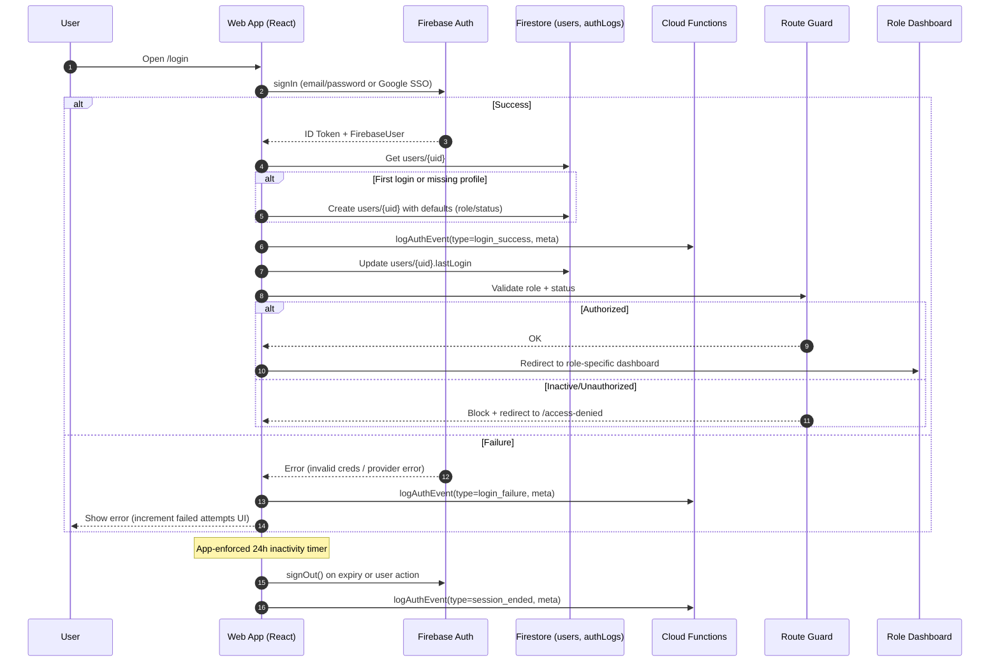
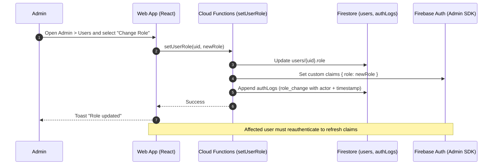

## Sequence Diagrams: Authentication & Role Management

### 1) Login, Session, and RBAC Redirect

```mermaid
sequenceDiagram
    autonumber
    participant U as User
    participant W as Web App (React)
    participant FA as Firebase Auth
    participant FS as Firestore (users, authLogs)
    participant CF as Cloud Functions
    participant RG as Route Guard
    participant D as Role Dashboard

    U->>W: Open /login
    W->>FA: signIn (email/password or Google SSO)
    alt Success
        FA-->>W: ID Token + FirebaseUser
        W->>FS: Get users/{uid}
        alt First login or missing profile
            W->>FS: Create users/{uid} with defaults (role/status)
        end
        W->>CF: logAuthEvent(type=login_success, meta)
        W->>FS: Update users/{uid}.lastLogin
        W->>RG: Validate role + status
        alt Authorized
            RG-->>W: OK
            W->>D: Redirect to role-specific dashboard
        else Inactive/Unauthorized
            RG-->>W: Block + redirect to /access-denied
        end
    else Failure
        FA-->>W: Error (invalid creds / provider error)
        W->>CF: logAuthEvent(type=login_failure, meta)
        W-->>U: Show error (increment failed attempts UI)
    end

    Note over W: App-enforced 24h inactivity timer
    W->>FA: signOut() on expiry or user action
    W->>CF: logAuthEvent(type=session_ended, meta)

```

### 2) Admin Role Change Flow (Custom Claims + Audit)

```mermaid
sequenceDiagram
    autonumber
    participant A as Admin
    participant W as Web App (React)
    participant CF as Cloud Functions (setUserRole)
    participant FS as Firestore (users, authLogs)
    participant FA as Firebase Auth (Admin SDK)

    A->>W: Open Admin > Users and select "Change Role"
    W->>CF: setUserRole(uid, newRole)
    CF->>FS: Update users/{uid}.role
    CF->>FA: Set custom claims { role: newRole }
    CF->>FS: Append authLogs (role_change with actor + timestamp)
    CF-->>W: Success
    W-->>A: Toast "Role updated"
    Note over W,FA: Affected user must reauthenticate to refresh claims
```
