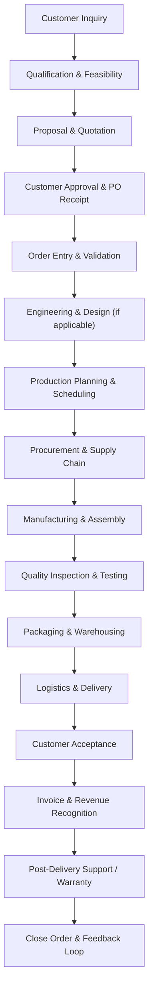
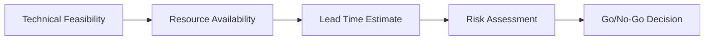
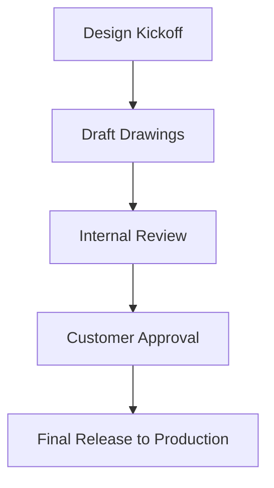
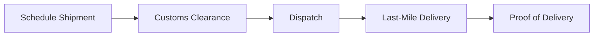
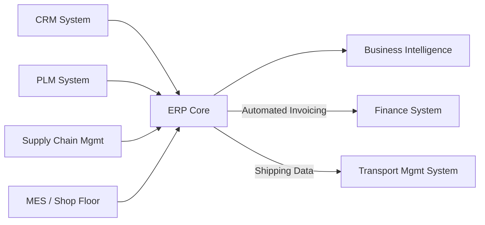

I'm ready to help you optimize your sales order workflow from customer inquiry to delivery. However, I don't currently have access to the image you mentioned. Since we're in a text-based environment, I can't view or analyze uploaded files or images directly.

That said, I can still provide a **comprehensive, industry-best-practice workflow** for managing sales orders in an **engineering services and manufacturing company**, based on global operations experience. Once you describe your current process or share key steps, I can tailor this further.

Below is a proposed end-to-end workflow in Markdown format with Mermaid diagrams. You can later compare this with your existing flow and identify gaps or improvement areas.

---

# 🌐 End-to-End Sales Order Management Workflow  
**Global Operations Director | Engineering & Manufacturing Sector**

This document outlines a robust, scalable, and compliant sales order lifecycle management process, designed for companies delivering engineered-to-order (ETO), made-to-order (MTO), or configured products and services.

---

## 🔁 Overview: Sales Order Lifecycle

---

## 🧩 Detailed Workflow Stages

### 1. **Customer Inquiry**
- Capture via CRM (e.g., Salesforce, HubSpot)
- Channels: Web form, email, phone, portal
- Assign lead owner (Sales Engineer or Account Manager)

> ✅ *Best Practice:* Use AI-powered tools to auto-classify inquiries by product line, region, and complexity.

---

### 2. **Qualification & Feasibility Assessment**
- Validate technical requirements
- Preliminary design review (Engineering)
- Capacity and resource check (Operations)
- Risk assessment (Compliance, Export Control)

> 📌 *KPI:* Response time < 48 hrs

---

### 3. **Proposal & Quotation**
- Generate BoM (Bill of Materials) or BoQ (Bill of Quantities)
- Costing: Material, Labor, Overhead, Logistics
- Include terms: Payment, Delivery, Warranty
- Approval workflow: Sales → Finance → Legal

> 🔐 *Control:* Role-based pricing access; audit trail

---

### 4. **Customer Approval & Purchase Order Receipt**
- Track PO issuance timeline
- Validate PO against quote (scope, price, T&Cs)
- Flag discrepancies immediately

> 📂 *Document Control:* Store PO, quote, correspondence in ERP/PLM

---

### 5. **Order Entry & Validation**
- Input into ERP (e.g., SAP, Oracle, NetSuite)
- Cross-check: credit hold, contract status, compliance
- Auto-generate internal sales order number

> ⚠️ *Gate:* No production until order is “Released”

---

### 6. **Engineering & Design (ETO/MTO)**
- Release drawings, specifications, change orders
- ECN (Engineering Change Notice) management
- Collaboration with R&D if customization required

> 🛠️ *Tool Integration:* PLM (Product Lifecycle Management) + ERP sync

---

### 7. **Production Planning & Scheduling**
- Master Production Schedule (MPS)
- Material Requirements Planning (MRP)
- Work Center load balancing
- Lead time buffer for engineering delays

> 📊 *Output:* Detailed work orders, routing, due dates

---

### 8. **Procurement & Supply Chain**
- Issue purchase orders to vendors
- Monitor supplier performance (OTD, quality)
- Manage long-lead items proactively
- Dual sourcing for critical components

> 🌐 *Visibility:* Supplier portal for delivery tracking

---

### 9. **Manufacturing & Assembly**
- Shop floor control system (MES)
- Track labor, machine time, yield
- Real-time production dashboards

> 🧪 *Control:* In-process inspections at key milestones

---

### 10. **Quality Inspection & Testing**
- IQC (Incoming Quality Control)
- In-process checks
- Final inspection per customer specs
- FAT (Factory Acceptance Test) for large systems

> 📑 *Output:* Certificate of Conformance (CoC), test reports

---

### 11. **Packaging & Warehousing**
- Custom packaging per destination (climate, transport mode)
- Labeling: barcodes, HS codes, safety markings
- Inventory staging for shipment

> 🌍 *Compliance:* UN packaging standards, REACH, RoHS

---

### 12. **Logistics & Delivery**
- Choose mode: air, sea, road, rail
- Book freight forwarder (internal or 3PL)
- Share tracking link with customer
- Export documentation (commercial invoice, packing list, CoO)

> 📞 *Proactive Alert:* Notify customer 48h before delivery

---

### 13. **Customer Acceptance**
- On-site installation support (if needed)
- SAT (Site Acceptance Test)
- Sign-off from customer

> 📝 *Document:* Signed acceptance certificate uploaded to CRM/ERP

---

### 14. **Invoice & Revenue Recognition**
- Match delivery to contract terms (e.g., FOB, CIF)
- Generate invoice (automated from ERP)
- Recognize revenue per IFRS 15 / ASC 606

> 💰 *Control:* No invoice without delivery proof and acceptance

---

### 15. **Post-Delivery Support**
- Handover to Service Team
- Provide manuals, training, spare parts list
- Warranty registration
- Monitor for early failures

> 🛎️ *SLA:* Define response times for support tickets

---

### 16. **Close Order & Feedback Loop**
- Final financial reconciliation
- Internal review: lessons learned
- Request customer feedback (NPS or CSAT)
- Update knowledge base and templates

> 🔄 *Continuous Improvement:* Feed insights into sales, engineering, and ops

---

## 🧭 Governance & KPIs

| Process Area      | Key Performance Indicator    | Target   |
| ----------------- | ---------------------------- | -------- |
| Quote-to-Order    | Average cycle time           | < 7 days |
| Order Fulfillment | On-Time Delivery (OTD)       | ≥ 98%    |
| Quality           | First Pass Yield             | ≥ 95%    |
| Customer          | NPS                          | > 50     |
| Finance           | DSO (Days Sales Outstanding) | < 45     |

---

## 🛠️ System Integration Architecture

> ✅ *Single Source of Truth:* ERP as central hub

---

## ✅ Recommendations for Global Scalability

1. **Standardize Processes** across regions with localization for compliance.
2. **Digitize Workflows** using low-code approval systems (e.g., Power Automate, Appian).
3. **Empower Local Hubs** with regional procurement and light assembly.
4. **Implement CPQ Tools** (Configure-Price-Quote) for complex engineering offers.
5. **Adopt Predictive Analytics** for demand forecasting and risk mitigation.
6. **Train Cross-Functional Teams** (Sales, Eng, Ops) on end-to-end ownership.

---

## 📎 Next Steps

Please provide:
- Your current workflow (text description or flowchart)
- Pain points (e.g., delays, errors, miscommunication)
- Systems in use (ERP, CRM, etc.)
- Product type (standard, ETO, MTO)

I’ll then **map your current state**, identify **gaps**, and deliver a **customized future-state workflow** with ROI estimates.

Let me know how you'd like to proceed!